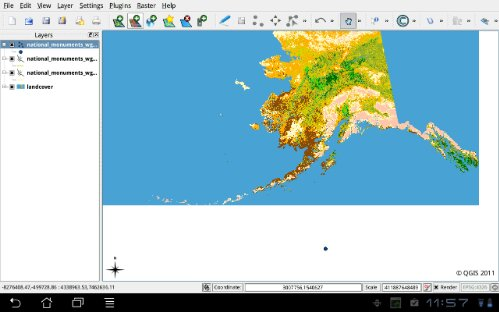

Just a quick screenshot to show that qgis on android is now a working reality. Tomorrow I’ll make a video and so on. The major missing thing now is reading shp files ad maybe spatialite… maybe tomorrow. Now it’s sunday 😉  
Ciao
test it now: 
### _Related_
