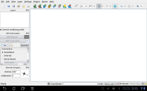

After implementing [GPS support for QGIS on Android](</01/31/qgis-on-android-gets-gps-support/index.html> "QGIS on Android gets GPS support") I’ve implemented a plugin that reads the internal compass readings and shows the value in a small dock widget.   
All theese new features are available in the master-alpha4 version and the nightly.  
Hope you enjoy
### _Related_
