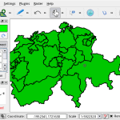
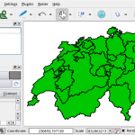

At FOSSGIS I was asked to try to install qgis on a very small android phone, I think it was a 3.2″ screen. the install went smoothly after making some space but then the problems came because of the small screen.  
Eventually I thought about setting a smaller font size to make the UI scale more, the problem was that it was impossible to get to the size setting because the UI was to big.  
As a workaround I created a QGIS.conf file with this content  
`[General] IconSize=32  
fontPointSize=4`and pushed it to the device using the [android debug bridge](<https://developer.android.com/guide/developing/tools/adb.html>) like this:  
`adb push myQGISConfigFile.conf /data/data/org.qgis.qgis/files/Settings/QuantumGIS/QGIS.conf`  
On the next start the whole gui was nice and small and fitted the screen.  
Here some screenshots from my Samsung galaxy 9000 with 4″ screen and a video demonstrating digitising (with pen and fingers), GPS, compass and zooming on the phone.  
   

This video shows QGIS on a Samsung I9000 Galaxy S Android smartphone with 4.0″ screen. the point size in settings->option->general is set to 4



[https://vimeo.com/39473397](<https://vimeo.com/39473397>)

### _Related_
