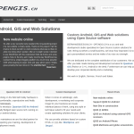

So, after a very succesful rainy weekend the long-standing project of a new website is finally reality. Thanks to this project I had the chance to check out with no client constrains what was out there to allow me doing what I wanted. After an in-depth review I decided to use WordPress with the customized Shell-lite theme and some plugins.  
Now, to the why, well I really love the way WordPress has evolved from a simple blogging platform to a much more powerful CMS while keeping its super slick and easy admin panel. Simply great, possibly the best I know of.  
The [shell-lite theme](<https://wordpress.org/extend/themes/shell-lite>) is a GPLv3 parent theme that I liked from the beginning on for its slick typography and simple almost black and white design, kudos to the developers. I created a child theme to change some things in the home and in the archives pages and inserted a [Featured articles widget](<https://wordpress.org/extend/plugins/featured-articles-lite/>) with a custom theme to my new home.  
What I still need to do Is to translate the site using [wp-i18n](<https://wordpress.org/extend/plugins/wp-i18n/>) and upload the new logo as soon as I get it. As well I want to see If I’m happy with wp-touch as a mobile front end or if I’ll implement a new theme for it. We’ll see.  
In any case I think that it is pretty amazing to what result you can come in about 20 hours of development.  
Enjoy and let me know if you find any issues.  
ciao  

### _Related_
