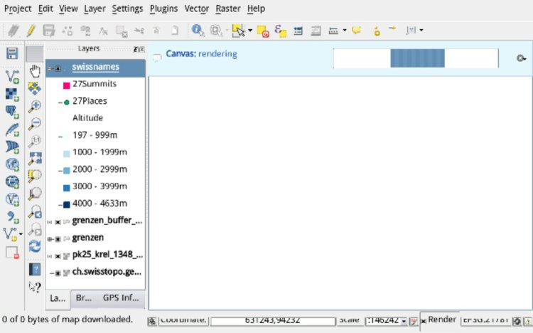
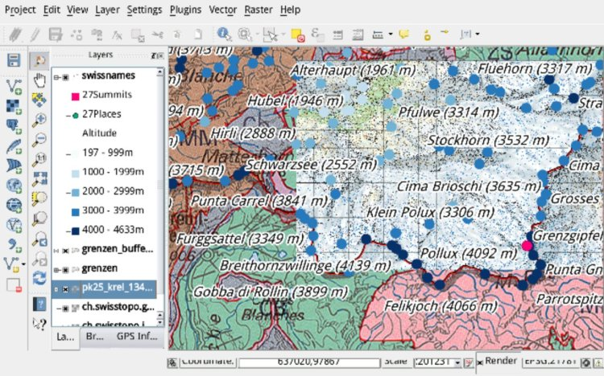
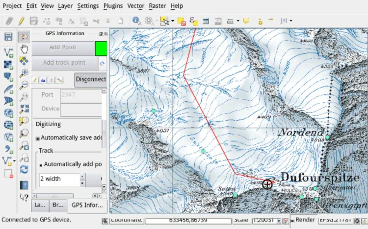

After two very android QGIS centric weeks I’m very happy to point you to last night nightly build that includes a lot of new improvements, better stability and of course all the super cool features of the freshly released QGIS 2.0.  
So, go ahead, get the [installer](<https://android.qgis.org/get/qgis.apk>), get the latest nightly and let me know how it goes.  
There are two known issues that I’m still working on (beside python support):  
– There is no styling UI, but if you load an already styled project all works nice.  
– When digitizing, don’t use the enter button in the android keyboard to confirm the attributes form but just close the keyboard and use QGIS ok button.  
So, enjoy it, let me know how it goes, remember it’s alpha and maybe [buy me a glass of wine](<https://mobile.paypal.com/ch/cgi-bin/webscr?cmd=_express-checkout-mobile&useraction=commit&token=EC-19J240533K830045G#m>) 🙂  
  
  

### _Related_
