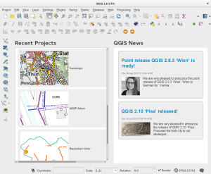

Whenever you start QGIS you basically do it because?  
Right, because you need to do GIS work. Ah, how I love rhetorical questions to start a post.  
And most of the time one continues to work on a QGIS project which he has prepared before. For me 99% of the time, I start QGIS, move the mouse to the top left over „Project“ go to „Recent Projects“ and select the one I want. If I am lucky my hand is stable enough to hover „Recent Projects“ and not „New From Template“ which I actually never use.  
No longer!  
At OPENGIS.ch we just introduced a nice „Welcome Page“ to QGIS which lists the recently used projects. With a screenshot next to it!  
That’s how my QGIS looks at start right now:  
  
Instead of the filename it will show the project title if one is defined.  
And you get some recent information about the QGIS project just next to it.  
I would never want to miss this feature again.  
… Coming soon to a QGIS near you …
### _Related_
