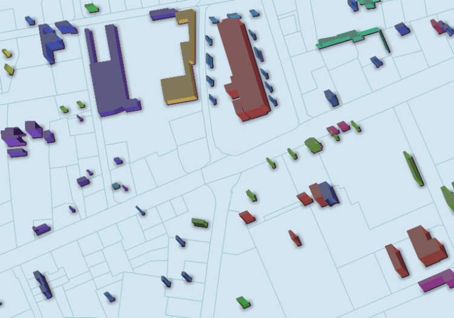

QGIS has a great variety of rendering possibilities from categorization to data defined settings which allows to make awesome cartographic products. It also features some extensions like qgis2threejs and globe that make it possible to explore the third dimension. While these extensions are great tools they have their limitations like they do not fully integrate with the styling system or cannot be used in print composers.  

Mockup of a possible rendering result with a combination of classify and 2.5D effect
This project aims to improve the internal possibilities of QGIS to give an oblique view 3D effect based on a height attribute and an angle while fully preserving all the possibilities which the QGIS styling offers. But it doesn’t stop there, the whole rendering is built in a modular way so you can use all of its parts for countless other possibilities.  
_Funds are already available for a major part of this project thanks to[ADUGA](<https://www.aduga.org/>) and the [Regional Council of Picardy](<https://www.picardie.fr/>). For the missing pieces we would like to ask the community to help us to create the required extensions to include these amazing new functionalities into QGIS._
## Geometry modifiers
Every building exists of the parts: floor, walls and roof. To get a nice effect can paint a shadow on the floor, then draw the walls for the buildings and finally paint the roof.  
The wall as well as the roof geometries are nothing but modified versions of the source geometry. The roof is a translated version of it, the walls a 2 dimensional extrusion (the area between footprint and translated roof outline).  
A new possibility to define a _geometry modifier_ will be introduced. For every symbol layer in the layer styling it will be possible to define an expression that transforms the geometry before it is being painted.
## Rendering order
Because buildings which are further apart from the camera need to be painted first and buildings closest to the camera last it is required that we can control the order in which features are rendered. It will be possible to define an expression (or simply a field) in which features are rendered. For this use-case this will be based on the geometry but you may use this to control the rendering order of any kind of layer. Or if you are a plugin author you can just send any feature request with an _order by_ to the layer.  
_It is planned that for best compatibility this will be implemented in a provider independent way. Due to performance considerations we plan to add the possibility to delegate this job to the database in the future and will keep this in mind during the implementation._
## Expressions
A series of expressions will need to be developed  
**Translation of a geometry**
    
    geometry translate( geometry, x, y )
**Extrusion of a 2D geometry**
    
    geometry extrude( geometry, x, y )
**Evaluation of a string as expression**
    
    expression eval( string )
**Degrees to radians**
    
    float radians( float )
**Extract the individual points of a linestring**
    
    point pointn( linestring, index )
**Azimuth of a line segment**
    
    float azimuth( point1, point2 )
**Order a multipolygon by centroid (to render the walls of a building in the appropriate sequence)**
    
    multipolygon multipolygon_order_by_centroid( multipolygon )
## Style variables
To make it easy to configure the style a new possibility to assign style variables will be introduced. This will make it possible to specify an expression which will define the height of individual buildings one single time on the style dialog and then reference and use this variable from various places within the rendering system.
## Detailed specification
We have written a document that contains more detailed specifications for the individual parts. If you would like to get access to this, please contact us and we will send you a digital copy of it.
### _Related_
