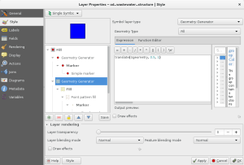

December traditionally is an amazing time since the weather is usually quite forgiving to long working hours.  
Therefore the first parts of our [recent crowdfunding project for 2.5D render](</11/02/qgis-crowdfunding-2-5d-rendering/index.html>)ing have been merged into QGIS master and will be shipped with QGIS 2.14.  
It’s something of the sort of development that we really, really, really like here at OPENGIS.ch: an implementation that adds enormous flexibility and enables the user to use QGIS in ways that we never thought of.  
**Say hello to geometry generators.**  
Geometry generators allow to use expression syntax to generate a geometry on the fly during the rendering process. The resulting geometry does not have to match with the original geometry type and you can add several differently modified symbol layers on top of each other.
### Examples
  

### How to use it
It couldn’t be easier to use. Open the symbology dialog. Choose _geometry generator_ as symbol layer type. Choose what kind of symbol you would like to generate, write your expression and style it in whatever way you like.  
  

### It’s your turn
Show the world what you can do with it.
### Thanks
  - ADUGA
  - Regional Council of Picardy
  - Ville de Nyon
  - Wetu GIT cc
  - All other crowdfunders

Special thanks to Nicolas Rochard and for the help to bring this project into shape. And to Nyall Dawson for his invaluable inputs throughout the planning and reviewing process.  

### _Related_
