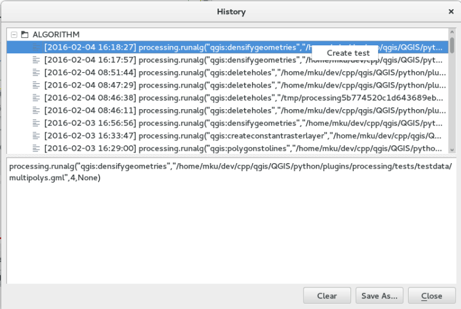

**Processing just got a new testing framework to improve the long-term stability of this important plugin. And you can help to improve it, even if you are not a software developer!**  
This is yet another piece in our never-stopping crusade to improve the stability and quality of the best desktop GIS on the market.
## Processing
You probably know [processing](<https://docs.qgis.org/2.0/de/docs/user_manual/processing/index.html>). If you don’t: processing is the number one plugin to enable after every QGIS installation. It offers a very wide variety of geo-algorithms from generic one to very task-specific tools and allows building models and to completely automate workflows this way.  
Processing is being improved consistently and gets better with every release. But like always in software development, there is a risk, that an improvement can have undesired side-effects which break previously working parts of an application.
## Unit Testing and Continuous Integration
A bit more over a year ago (when working still as a freelancer) I started a [crowdfunding initiative for automated testing](<https://blog.vitu.ch/10102014-1046/crowdfunding-initiative-automated-testing>), a technique in software engineering also known as continuous integration. With every single change a developer does to an application, a number of functions – so called unit tests – are run and their outcome is compared to a known-good control dataset. This way side-effects can be detected early on and fixed before they get deployed to productive environments.  
This has been an amazing story of success. Since it has been put into place a lot of new unit tests have been added to a lot of QGIS functionality. A lot of bugs have been discovered by some servers that consistently test all the cool new stuff that comes in. Meanwhile we arrived at a point where we even test meta-quality of our codebase that makes the life for plugin developers easier: are new functions available from python? And do they come with documentation?  
  
However, until now processing was excluded from these checks. But no longer.  
To demonstrate the importance of this, take the intersection algorithm. Some months ago it started to fail in certain scenarios, caused by an update on the geometry engine. A totally unrelated change suddenly made the intersection algorithm behave differently. It just produced faulty results. The only thing was a small warning in the message log, a well-hidden place where you normally don’t check for warnings.  
A small numbers of tests are already in place and make sure that the following algorithms run properly:
  - Centroid
  - Delete Holes
  - Intersection
  - Densify
  - Polygons to lines

If these unit tests had already been in place, this problem would have triggered an alarm right away. No longer, as of now, at least this same problem will not happen again!  
But as you can see, there is only a small number of all the algorithms in processing being tested right now. Is your favorite one not yet included? **That’s where you come in**. That’s where the whole community of QGIS can help to make QGIS incredibly rock-freakin‘-solid!
## Help making it better
The tests are based on a very simple infrastructure.
  - A number of test datasets against which an algorithm can be run (e.g. intersection)
  - A simple description of which algorithm to run with which parameters (e.g. the layers polys.gml and multipolys.gml)
  - An expected result dataset (what you produce)

    
      - name: Intersection (Collection Fallback)
        algorithm: qgis:intersection
        params:
          INPUT:
            name: multipolys.gml
            type: vector
          INPUT2:
            name: polys.gml
            type: vector
        results:
          OUTPUT:
            name: expected/intersection_collection_fallback.shp
            type: vector
The first piece is already in place. The test datasets have been carefully developed to contain all kind of different geometries and attributes. This ensures that the tested algorithms are robust against all kind of side-effects.  
Creating the other pieces couldn’t be easier
  1. Make sure you have [a copy](<https://help.github.com/articles/fork-a-repo/>) of the [QGIS git repository](<https://github.com/qgis/QGIS>).
  2. Choose an algorithm to test. Check the [algorithm_test.yaml](<https://github.com/qgis/QGIS/blob/master/python/plugins/processing/tests/testdata/algorithm_tests.yaml>) file that it’s not yet in place.
  3. Open a test dataset in your local QGIS copy: python/plugins/processing/tests/testdata
  4. Run the algorithm and redirect the result to python/plugins/processing/tests/testdata/expected . Preferably in gml format.
  5. Manually check, that the result you receive is correct and that there have been no errors. **This step is important!**
  6. Open the Processing menu entry _History_.
  7. Right click the entry and click on _Create Test_.
  8. You will see a yaml specification that describes your algorithm. If it looks good, copy it to the end of python/plugins/processing/tests/testdata/algorithm_test.yaml .
  9. [Request that your test is integrated](<https://help.github.com/articles/using-pull-requests/>). It will automatically be run on our test infrastructure. If it is good, it should be integrated shortly.

## What has been done
As a by-product of this development, a couple of things have been developed and fixed.
  - Implementation of a qgis.testing python module. This comes with some nice pieces which can be used by every python plugin for creating its own unit tests. It comes with a [mock iface](<https://www.toptal.com/python/an-introduction-to-mocking-in-python>) and a method to compare vector layers with control over attribute and geometry comparison.
  - Too many copies of a mock iface are already floating around in different plugin projects. Help making this one the best and only one!
  - Several fuzzy comparison options have been implemented (epsilon for geometries coords, epsilon for attributes…).
  - QgsVectorFileWriter is now able to produce geometry collections as output. While we cannot represent them in QGIS, a processing algorithm can now create such an output (a number of file formats support this. Shapefiles don’t.).
  - A crash has been fixed that surfaced when running certain algorithms with null geometries.
  - Some improvements have been brought to gdal, mostly concerning the geojson driver

  
**Thank you Victor Olaya, Michael Kirk, Alex Bruy, Martin Dobias**
### _Related_
