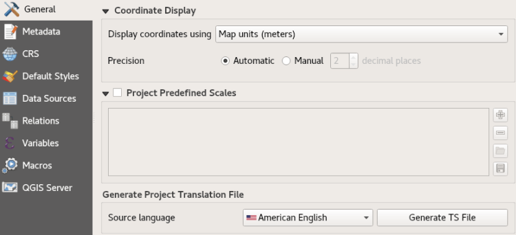
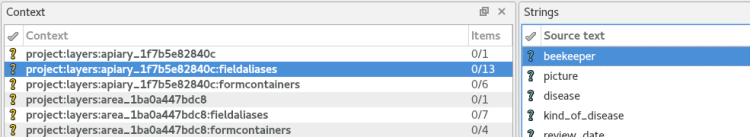
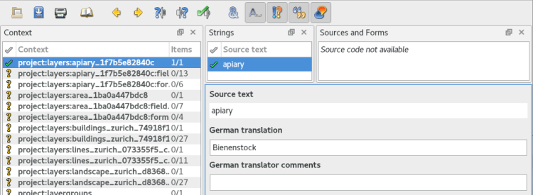
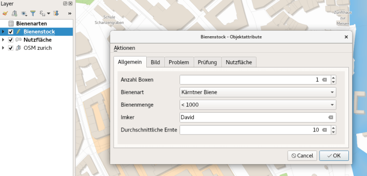
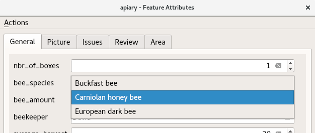
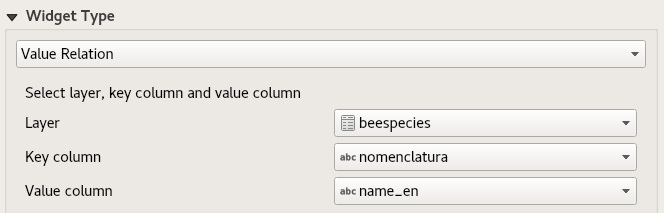
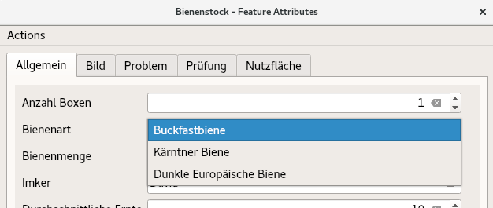

_**QGIS is a real cosmopolitan. Born in Alaska sixteen years ago, it has spread all over the world since. Thanks to its open source mentality, it finds not only in economically strong countries big usergroups. No question, that beside all the developers, there is a bunch of brave translators giving everything to make and keep QGIS multilingual. It’s translated in over forty languages – even to Mandarin Chinese and Esperanto. Not only the application, but also its plugins.**_  
_**And since the feature-loaded long term release 3.4.0 even the QGS-Projects themselves. Thanks to the friendly support of[QGIS Usergroup Switzerland](<https://www.qgis.ch/en>) and the [QGEP Project](<https://www.qgis.ch/en/projects/qgep-waste-water-module>).**_
# How it comes
Plugins are often shipped with pre-configured project files. To provide them in the users individual language, you’ve been required to translate the project manually in the properties and store it separately. When you needed to change something, you have been coerced to update every single file. This is a big effort and fault-prone. So there appeared the idea to have translation files for each required language, and when the user opens the only one project, it will be translated to his specific language. And that’s, what this new functionality does.
# How it’s done
Like QGIS and the plugins, the projects are translated with the Qt translation process. Means, it makes the translation according to a Qt Compiled Translation Source File (.qm file). When the user opens a project, QGIS checks for a .qm file laying in the same folder like the .qgs file, having the same name like the .qgs file and having the language-code as postfix of the users language (the language configured in the QGIS settings).  
So when the user opens a project named „citybees.qgs“ that is originally in English, but his QGIS language is German, it checks for a file named „citybees_de.qm“. The project’s layer names, field-aliases, container names and much more will be translated to German and the project will be automatically stored as „citybees_de.qgs“. So the user has his German project version and can use and edit it like he wishes. Super easy.
# Start from the beginning
Swiss people love honey and so they are diligent beekeepers. So, let’s assume you want to provide a project about beekeeping in cities to your Swiss customers. Because in Switzerland people talk four different languages, you need to have the project multilingual in German, French and Italian. We skip Romansh, not because it’s less important or in the Romansh speaking parts are no cities, but because QGIS does not support Romansh (if you’ll propose this one day, you will have my vote).  
Anyway. Let’s see what you have to do, to deliver the projects with the .qm file for German, French or Italian.
## 1\. Create the project
You create your project about beekeeping and store it as „citybees.qgs“. You don’t have to care about languages at the moment. You name everything in your language. Assumed it’s English, you name the layers „apiary“ and „area“ and the fields „fid“, „bee-species“, „beekeeper“ and so on.  
On changes you will edit always this project and no translated projects.
## 2\. Generate Ts File
In the project properties in the section _**General**_ there is the part to generate a translation source file. First, you select the source language, to have this information in programs you’ll edit the file (like Qt Linguist or Transifex) afterwards. Per default the language of your QGIS is selected here.  
  
When pressing _**Generate TS File**_ you will find in your projects folder the new file „citybees.ts“.  
**_But wait a minute, why are we generating a .ts file when we need a .qm file?_**  
The .ts file is the translation source file and it’s the uncompiled .qm file. The .qm file contains compact binary format code Qt can make the translation of programs with, but you and your brave translator cannot read it. So you create a .ts file looking like this:
    
    <!DOCTYPE TS>
    <TS sourcelanguage="en_US">
     <context>
      <name>project:layers:apiary__offline__1f89f4fd_49da_4eb9_90b3_1f7b5e82840c</name>
      <message>
       <source>apiary</source>
       <translation type="unfinished"/>
      </message>
     </context>
     <context>
      <name>project:layers:apiary__offline__1f89f4fd_49da_4eb9_90b3_1f7b5e82840c:fieldaliases</name>
      <message>
       <source>fid</source>
       <translation type="unfinished"/>
      </message>
     </context>
     <context>
      <name>project:layers:apiary__offline__1f89f4fd_49da_4eb9_90b3_1f7b5e82840c:fieldaliases</name>
      <message>
       <source>bee_species</source>
       <translation type="unfinished"/>
      </message>
     </context>
     <context>
      <name>project:layers:apiary__offline__1f89f4fd_49da_4eb9_90b3_1f7b5e82840c:fieldaliases</name>
      <message>
       <source>beekeeper</source>
       <translation type="unfinished"/>
      </message>
     </context>
    [...]
You see it’s simple XML code that contains mainly untranslated text in the `<source>` element and empty space for the translated text in the `<translation>` element.  
You could enter your translations directly in this file using the text editor and then build the .qm file with the command `lrelease`, but it’s preferable to use tools like _**Qt Linguist**_ orweb-based services like _**Transifex**_ or _**Weblate**_.
## 3\. Translate your File in Qt Linguist
You open _**Qt Linguist**_ an you select the target language of the .qm file you want to build in the end. Let’s choose German.  
The file opens and you see a list of entries described by the _**Context**_. The context is, where the strings are located in the QGIS project.  
  
The string „beekeeper“ stays in the context _**project:layers:apiary_1f7b5e82839c:fieldaliases**_ and this means it’s a _**field or alias**_ of the layer **_apiary_1f7b5e82839c_** in the project.  
The translation is done simply over the graphical interface. To confirm your translation you can set the check mark.  

## 4\. Finally build your .qm file
You compile the translation – means build a .qm file – by simply select _**Release as…**_ in the Qt Linguist and store it as „citybees_de.qm“.  
  
_**And now your customer will be able to open your project in German 🙂**_
# What’s translated
Most of the needed parameters like layer names and fields are translated. There could be still some strings in your use case that are not like for example action titles or labels. But the solution is designed, that it’s extendable for more project parameters (see the next chapter). So don’t worry if you will find parameters that cannot be translated yet. They possibly will be in the future.
## Translatable strings:
  - layer names
  - layer group names
  - form attributes like tab titles and group box titles
  - relation names
  - field names and aliases
  - value relations

_With field names and aliases it has a special behavior: while we should not translate the field names itself because they can be used as identification, the aliases are translated only. In case there is no alias in the original project, the translation of the field name would be written as an alias in the translated project. The field name stays the same. So you can just generate and translate without the fear of overwriting field names._
## Content translation
There is a possibility to have a translation of the content as well. In particular using the _**value relation widget**_.  
Let’s assume, you want to have the values in the field _**bee_species**_ translated as well. Means the following bee species should be German:  
– European dark bee  
– Carniolan honey bee  
– Buckfast bee  
  
You can solve this by using the value relation widget. Means you create a non geometrical layer „beespecies“ and enter the following values:
nomenclatura | name_en | name_de | name_fr | name_it  
---|---|---|---|---  
Apis mellifera mellifera | European dark bee | Dunkle Europäische Biene | abeille noire | ape nera  
Apis mellifera carnica | Carniolan honey bee | Kärntner Biene | abeille carniolienne | ape carnica  
Apis mellifera | Buckfast bee | Buckfastbiene | abeille Buckfast | ape Buckfast  
And configure the field _**bee_species**_ of _**apiary**_ as _**value relation****widget**_ :  

### And now comes the magic:
When you create the .ts file it includes not only the field name _**bee_**__**species**_ but also the referenced value _**name_en**_ :
    
     <context>
      <name>project:layers:apiary__offline__1f89f4fd_49da_4eb9_90b3_1f7b5e82840c:fields:bee_species:valuerelationvalue</name>
      <message>
       <source>name_en</source>
       <translation type="unfinished"/>
      </message>
     </context>
When you now „translate“ the _**name_en**_ to _**name_de**_ the field is referenced to the German values of the entry:  

# Getting technical
Let’s have a quick look into the source code, shall we?
## Generate Ts File
When you press the _**Generate Ts File**_ button in the project properties, in the background happens the following:  
First QGIS scans for the translatable strings in the currently loaded project and collects everything in a _**QgsTranslationContext**_ object. This object contains the filename of the .ts file and all the collected translatable strings.  
The strings are collected by firing a signal called _**requestForTranslatableObjects**_ delivering the _**QgsTranslationContext**_. Every object that contains translatable strings connects a slot registering the strings in the received  _**QgsTranslationContext**_ :
    
    void registerTranslatableObjects( QgsTranslationContext *translationContext )
    {
      const QList<QgsLayerTreeLayer *> layers = mRootGroup->findLayers();
      for ( const QgsLayerTreeLayer *layer : layers )
      {
        translationContext->registerTranslation( QStringLiteral( "project:layers:%1" ).arg( layer->layerId() ), layer->name() );
    [...]
This will be a growing list of strings as new features are added and missing bits are discovered.
## Translate by QTranslator
The translation is made using the _**QTranslator**_. It’s loaded with the .qm file on reading the project and on loading of every single translatable string, it’s called to translate:
    
    QString layername = mTranslator->translate( QStringLiteral( "project:layers:%1" ).arg( node.namedItem( QStringLiteral( "id" ) ).toElement().text() ), node.namedItem( QStringLiteral( "layername" ) ).toElement().text(), disambiguation, n );
# That’s it
I hope you liked reading and if you have questions or inputs, feel free to add a comment.  
Enjoy this cosmopolitious feature! 🙂
### _Related_
