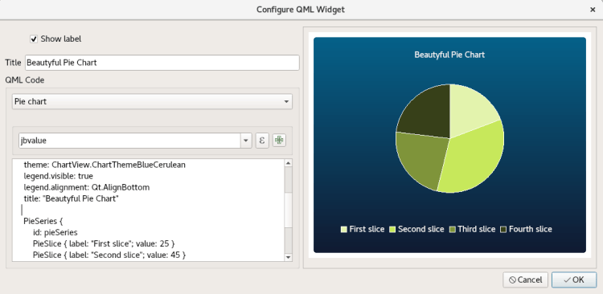
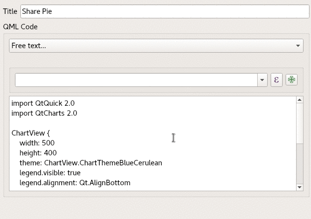
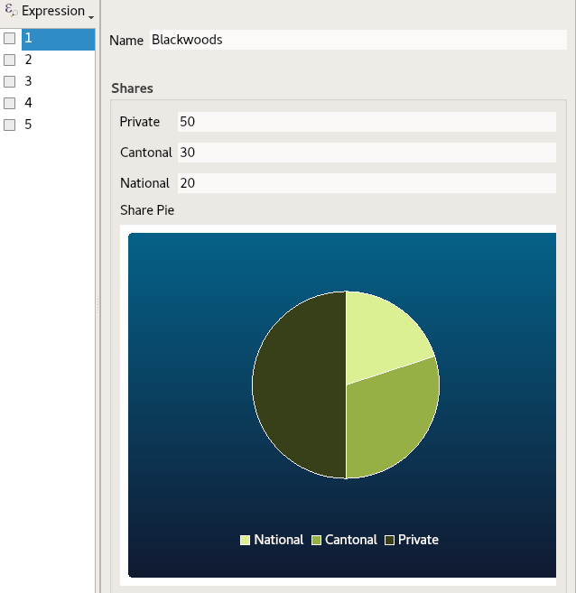

_**Individuality is the definition of freedom. And freedom is the fundamental requirement of man’s mind. QGIS possibly cannot give you all the freedom you require in life. But at least a lot of freedom in how you manage your work. QGIS 3.4.0 LTR was released last week and it comes loaded with features supporting big freedom in the configuration of your projects. Let’s focus on the QML Widget. QML is the smart casual look of widgets. With the help of some simple code, you will be able to visualize your data in the attribute form like never before. You can display beautiful charts, complex JSON data, and fancy colored unicorns.**_
# How it’s done
Let’s start with an example. In the _Attribute Form_ configuration in the _Layer Properties_ you have first to activate the _drag and drop designer_. Not only can you drag the _field-_ and _relation-items_ from the _available widget list_ to the _form layout list_ , but also a _**QML Widget**_. When you drop this item, it creates an « instance » of a _QML Widget_. This means, you can drag and drop as many _QML Widgets_ as you like to have on your form and configure each of them individually.
> QML (Qt Modelling Language) is a user interface specification and programming language. It allows developers and designers alike to create highly performant, fluidly animated and visually appealing applications. QML offers a highly readable, declarative, JSON-like syntax with support for imperative JavaScript expressions combined with dynamic property bindings. _Source:[Qt documentation](<https://doc.qt.io/qt-5/qmlapplications.html>)_
It’s a bit like an HTML page on the attribute form but very well integrated with Qt.  
On dropping the item, the configuration dialog pops up. After closing you can come back to it by double-clicking the item in the form layout list, like you do it with containers and tabs. If your don’t know QML that much yet, the default snippets from the drop-down can create an example of a rectangle, a pie chart or a bar chart. This could help you to create your own widget. On the right you can see a preview of your widget in real time. There are powerful layout possibilities to design it according to your ideas. For more information about it see the [QML layout part of the Qt documentation](<https://doc.qt.io/qt-5.11/qml-qtcharts-chartview.html>).  
  
But a chart makes no sense if there is no data. Of course, you can enter the data directly into your QML code, but most likely you need the data of the features to be visualized. This brings us to _**expressions**_. You can use them like you are used to in _Default Values_ ,_Constraints_ and _Display Messages_. You’ll find the well-known expression builder widget in this configuration as well.
## Using expressions
So let’s assume we want to visualize who holds what share of a forest. These forests are owned by the country (national), the canton (cantonal) or private. To keep it simple we have three attributes for that: `national_share`,`cantonal_share` and `private_share`.  
After creating the default pie chart you will find this snippet in the QML code text area:
    
    PieSeries {
        id: pieSeries
        PieSlice { label: "First slice"; value: 25 }
        PieSlice { label: "Second slice"; value: 45 }
        PieSlice { label: "Third slice"; value: 30 }
    }
Let’s set the field expressions into the _PieSlice-values_. Just select them in the expression widget and add them with the `+` into the chart.  
  
As you can see the expressions in the code are wrapped inside `expression.evaluate("<expression>")`. This means there are no limits in using expressions.  
You are open to use more complex expressions like e.g. for the title property of the pie chart:
    
    title: expression.evaluate("CASE WHEN @layer_name LIKE \"forest\" THEN \"Forest\" ELSE @layer_name END")
Or in case the task with forest shares would be solved with relations to other layers by filling up a model with the children and the children’s share. This is possible by using expressions with the help of the expression function`relation_aggregate`.  
More information about expressions can be found in the [QGIS Documentation](<https://docs.qgis.org/testing/en/docs/user_manual/working_with_vector/expression.html>).  
Back to our example. The result will look like this on the attribute form. It visualizes the share values in the pie chart.  
  
The visualization is not (yet) updated in real time when the values change. But this would be a nice thing to have in the future… If you would like to support this, please [contact us](</contact/index.html>).
# And that’s it
I hope you liked reading and you will enjoy using it to make beautiful widgets and forms. If you have questions or inputs, feel free to add a comment.  
… and in case you still asking where the promised unicorns are. Well you have to wait for the part 2 of this article 😉  

### _Related_
