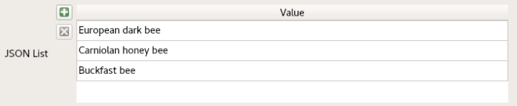
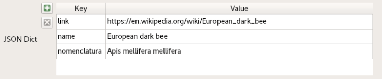
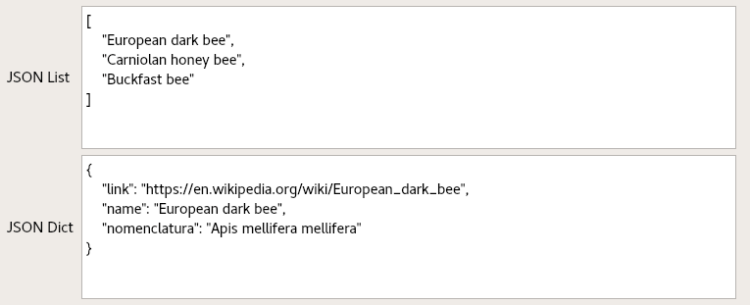
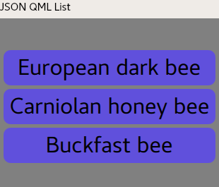
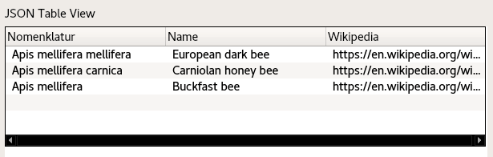
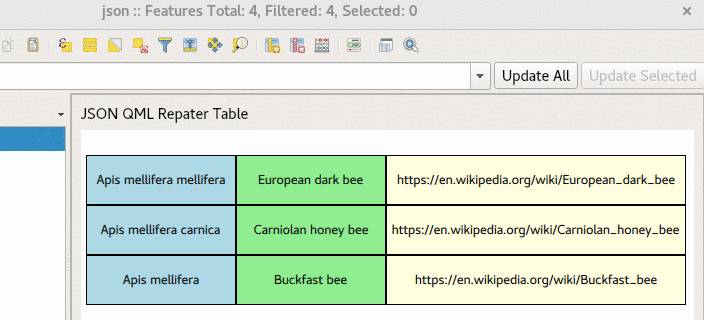
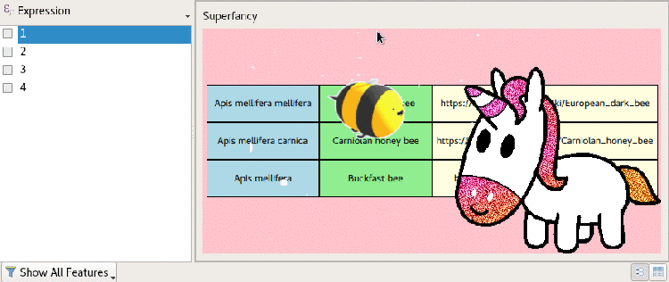

_**As promised some time ago in “[The new QML widgets in QGIS – When widgets get unbridled](</06/qml-widgets-qgis/index.html>)” we still owe you some fancy unicorns, but first let’s have a look at another nice feature that has been introduced in QGIS 3.4 LTR, the reading of [PostgreSQL JSON and JSONB types](<https://www.postgresql.org/docs/11/static/datatype-json.html>).**_  
With JSON you have a lot of possibilities for storing unstructured data. In our case, it’s mainly interesting when the data are stored as an array or a JSON object. Let’s have a look at two examples.
# Visualize Postgres JSON data with common widgets
With the usual QGIS widgets “List” and “Key/Value” you are able to display JSON arrays and simple JSON objects.
## JSON array as List
    
    [
        "European dark bee",
        "Carniolan honey bee",
        "Buckfast bee"
    ]

## Simple JSON object as Key/Value
    
    {
        "nomenclatura":"Apis mellifera mellifera",
        "name":"European dark bee",
        "link":"https://en.wikipedia.org/wiki/European_dark_bee"
    }
### 
Or of course both as plain text in the “Text Edit” widget:  

# Say hi to Postgres JSON in QML widget
Probably, your JSON data does not look really nice with the aforementioned widgets, luckily since QGIS 3.4, you are free to create your own QML widget. Since QGIS already loads the JSON data into structures that are supported by QML, we can use all the JSON data within the QML code.  
Let’s assume you have the JSON array from above and you like the elegance of the blue of Jacques Majorelle. You create your personal list widget by adding the JSON field as an expression:
    
    import QtQuick 2.0
    Rectangle {
        width: 310; height: 250; color: "grey"
        Column {
            anchors.horizontalCenter: parent.horizontalCenter
            anchors.verticalCenter: parent.verticalCenter
            spacing: 5
            Repeater {
                model:expression.evaluate("\"jvalue\"")
                Rectangle {
                    color: "#6050dc"
                    width: 300; height: 50; radius: 10.0
                    Text {
                        anchors.centerIn: parent
                        font.pointSize: 24
                        text: modelData
                    }
                }
            }
        }
    }
You will have your very personal list:  
  
JSON also allows storing more complex data, like for example a list of objects. In that case, you will reach the limits of the common QGIS widgets.  
Let’s assume you have a table looking like this:
nomenclatura | name | link  
---|---|---  
Apis mellifera mellifera | European dark bee | https://en.wikipedia.org/wiki/European_dark_bee  
Apis mellifera carnica | Carniolan honey bee | https://en.wikipedia.org/wiki/Carniolan_honey_bee  
Apis mellifera | Buckfast bee | https://en.wikipedia.org/wiki/Buckfast_bee  
In JSON it would be stored like this:
    
    [
        {"nomenclatura":"Apis mellifera mellifera","name":"European dark bee","link":"https://en.wikipedia.org/wiki/European_dark_bee"},
        {"nomenclatura":"Apis mellifera carnica","name":"Carniolan honey bee","link":"https://en.wikipedia.org/wiki/Carniolan_honey_bee"},
        {"nomenclatura":"Apis mellifera","name":"Buckfast bee","link":"https://en.wikipedia.org/wiki/Buckfast_bee"}
    ]
With the QML Widget you can use the QML TableView to visualize:
    
    import QtQuick 2.0
    import QtQuick.Controls 1.4
    TableView {
        width: 600
        model: expression.evaluate("\"jvalue\"")
        TableViewColumn {
            role: "nomenclatura"
            title: "Nomenclature"
            width: 200
        }
        TableViewColumn {
            role: "name"
            title: "Name"
            width: 200
        }
        TableViewColumn {
            role: "link"
            title: "Wikipedia"
            width: 200
        }
    }
  
Or, even more powerful, you can create your super individual table using the model and create each row by using a QML [Repeater](<https://doc.qt.io/qt-5/qml-qtquick-repeater.html>).  
Additionally, you can use a lot of fancy stuff like:
  - mouse interaction
  - animation
  - opening an external link
  - … and so on

  
The QML code for that looks like this.
    
    import QtQuick 2.0
    Rectangle {
        width: 610; height: 500
        Column {
            anchors.horizontalCenter: parent.horizontalCenter
            anchors.verticalCenter: parent.verticalCenter
            Repeater {
                model: expression.evaluate("\"jvalue\"")
                Row {
                    id: theRow
                    height: mouseArea1.containsMouse || mouseArea2.containsMouse || mouseArea3.containsMouse ? 70 : 50;
                    Rectangle { color: "lightblue";
                                border.width: 1
                                width: 150; height: parent.height
                                Text { anchors.centerIn: parent
                                       font.pointSize: 10; text: modelData.nomenclatura }
                                MouseArea {
                                    id: mouseArea1
                                    anchors.fill: parent
                                    hoverEnabled: true
                                }
                    }
                    Rectangle { color: "lightgreen";
                                border.width: 1
                                width: 150; height: parent.height
                                Text { anchors.centerIn: parent
                                       font.pointSize: 10; text: modelData.name }
                                MouseArea {
                                    id: mouseArea2
                                    anchors.fill: parent
                                    hoverEnabled: true
                                }
                    }
                    Rectangle {
                                id: linkField
                                color: "lightyellow";
                                border.width: 1
                                width: 300; height: parent.height
                                Text { anchors.centerIn: parent
                                       font.pointSize: 10; text: modelData.link }
                                MouseArea {
                                    id: mouseArea3
                                    anchors.fill: parent
                                    hoverEnabled: true
                                    onPressed: linkField.state = "PRESSED"
                                    onReleased: linkField.state = "RELEASED"
                                    onClicked: Qt.openUrlExternally(modelData.link)
                                }
                                states: [
                                    State {
                                        name: "PRESSED"
                                        PropertyChanges { target: linkField; color: "green"}
                                    },
                                    State {
                                        name: "RELEASED"
                                        PropertyChanges { target: linkField; color: "lightyellow"}
                                    }
                                ]
                                transitions: [
                                    Transition {
                                        from: "PRESSED"
                                        to: "RELEASED"
                                        ColorAnimation { target: linkField; duration: 1000}
                                    },
                                    Transition {
                                        from: "RELEASED"
                                        to: "PRESSED"
                                        ColorAnimation { target: linkField; duration: 1000}
                                    }
                                ]
                    }
                }
            }
        }
    }
# And that’s it
I hope you liked reading and you will enjoy using it to make beautiful widgets and forms. If you have questions or inputs, feel free to add a comment.  
… and in case you still asking where the promised unicorns are. Here’s is a super-fancy implementation 😉  

### _Related_
