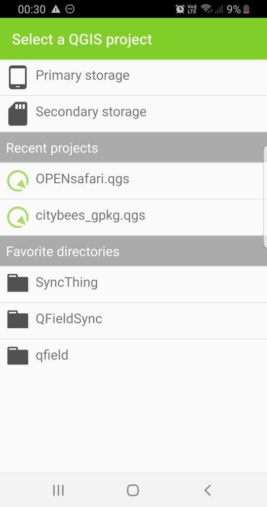
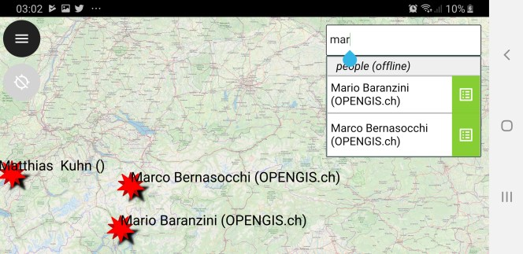

We are really happy to announce the fifth and (hopefully) last 1.0 release candidate in QField’s history! This means that QField 1.0 is closer than ever.
Get it while it’s hot on the Playstore (<https://qfield.org/get>) or on [GitHub](<https://github.com/opengisch/QField/releases>)
Thanks to all the feedback by the fantastic community we were able to fix plenty of bugs, address performance issues and even add some super cool new features.
New file selector
Among the new features, the most important is the flashy new file selector with favorite directories (long press on a folder to add it to the favorites and longpress on the favorites list to remove it) and an automatic list of the last three opened projects that will save you heaps of time while looking for your projects. 
Another lifesaver is the newly added support for pasting text from the clipboard in the search bar. Finally, we added a smart and unobtrusive “rate this app” dialog to make it easier for you to give QField the ★★★★★ you always wanted to give it 🙂
Search functionality
List of improvements since RC3
  - New Custom file selector ([#476](<https://github.com/opengisch/QField/pull/476>))
  - Favorite directories in file selector ([#507](<https://github.com/opengisch/QField/pull/507>))
  - Recent projects in file selector ([#499](<https://github.com/opengisch/QField/pull/499>))
  - Ripple effect in file selector ([#505](<https://github.com/opengisch/QField/pull/505>))
  - Smart unobtrusive “rate this app” dialog ([#510](<https://github.com/opengisch/QField/pull/510>))
  - clear value in date/time if invalid when losing focus ([#464](<https://github.com/opengisch/QField/pull/464>))
  - fix crash when switching layer ([#498](<https://github.com/opengisch/QField/pull/498>))
  - Respect DPI in multiline fontsize
  - Value Map compatibility with QGIS 2 and lazy loading for performance improvements
  - Use external valuemap model
  - allow to copy text from clipboard in search bar
  - respect keep scale option in locator
  - optimize scale when searching points ([#472](<https://github.com/opengisch/QField/pull/472>))
  - add frame to search results
  - Update to Qt 5.12.1 (for android 6+)

You can easily install QField using the Playstore (<https://qfield.org/get>), find out more on the documentation site ([https://qfield.org](<https://qfield.org/>)), watch some demo videos on our channel (<https://qfield.org/demo>) and report problems to our issues tracking system (<https://qfield.org/issues>). Please note that the Playstore update can take some hours to roll out and if you had installed a version directly from [GitHub](<https://github.com/opengisch/QField/releases>), you might have to uninstall it to get the latest playstore update.
QField, like QGIS, is an open source project. Everyone is welcome to contribute making the product even better – whether it is with financial support, [enthusiastic programming](<https://github.com/opengisch/QField>), [translation](<https://www.transifex.com/opengisch/qfield-for-qgis/>) and [documentation work](<https://www.qfield.org/docs/index.html>) or [visionary ideas](<https://github.com/opengisch/QField/issues>).
If you want to help us build a better QField or QGIS, or need any services related to the whole QGIS stack don’t hesitate to [contact us](</%23contact.html>).



[https://vimeo.com/323697787](<https://vimeo.com/323697787>)

### _Related_
