Last Thursday around half past six in the evening. Striking many Geo-scientist found the way to the Spitalgasse in Bern. The reason was the 26th GeoBeer event taking place at [ImpactHub](<https://bern.impacthub.net/>).  
[GeoBeer](<https://www.geobeer.ch>) is a quarterly meeting of people interested in geography, GIS, cartography and the latest technologies. It’s hosted every time by someone else. This time by us, OPENGIS.ch.
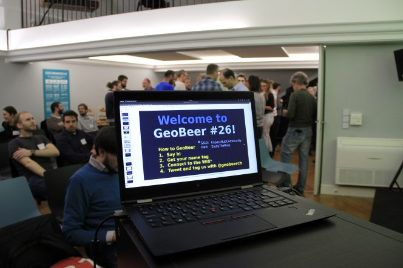
Right after the arriving, the organizers of GeoBeer Switzerland showed us some funny statistics about the GeoBeer participants since the very first GeoBeer event six years ago.   
Marco Bernasocchi then welcomed everyone and introduced our company. We had three speakers this time. [Marcus Hudritsch](<https://www.bfh.ch/ti/de/ueber-das-ti/personen/5b7eblnby2di/>) of the [Berner Fachhochschule](<https://twitter.com/bfh_hesb>) started by presenting the implementation of the visualization of historical buildings, that do not exist anymore in reality. But still, do in virtual reality… No sorry, it’s augmented reality. Marcus Hundritsch explained to us clearly the difference between AR and VR and presented some projects they made. [Pascal Bourquin](<https://twitter.com/BourquinPascal>) changed perspective completely by telling us about his project (La Vie en Jaune) to cover all the hiking trails of Switzerland – he logs every trail done on a [map with photographs](<https://map.lavieenjaune.ch/>). The final speaker was [Daniele Viganò](<https://twitter.com/dani_viga>) from the [Global Earthquake Model Foundation](<https://twitter.com/gem_devs>) talking about their challenges of calculating a global model of earthquake hazard, risk and exposure.
  - 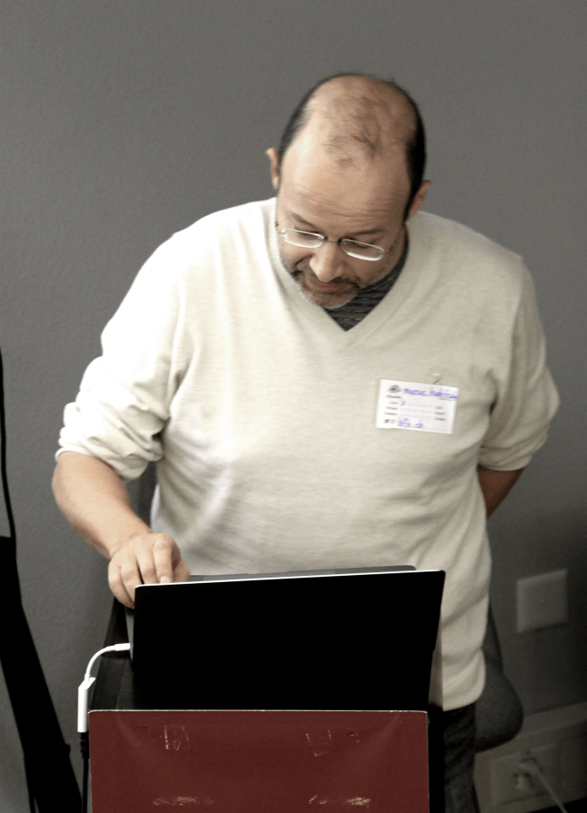
  - 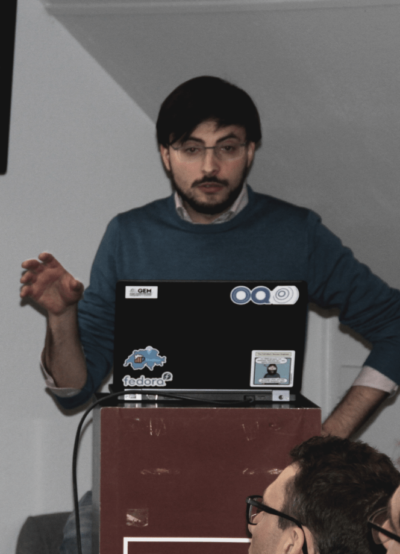
  - 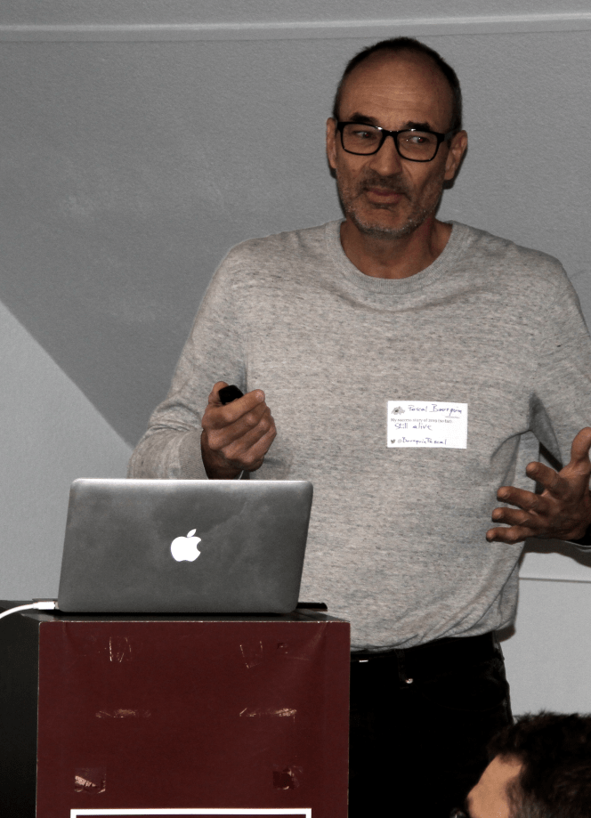

After such interesting talks, everybody’s tummy started roaring and the yummy [apéro riche](<https://energy-kitchen.ch/>)started and of course: The drinking, talking, socializing, networking. 
Bottles of the SpatiAle brewed by the OPENGIS.ch-team itself were offered as well as three more kinds of craft-beer brewed by their brewing-coach [Thurtalbräu](<https://www.thurtalbraeu.ch/>). There were a lot of interesting and funny chats, nice meet-agains and get-to-know-each-others. 
Thanks for coming, everyone, and see you on the next GeoBeer!
  - 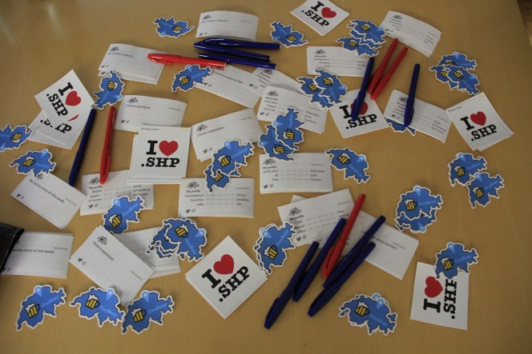
  - 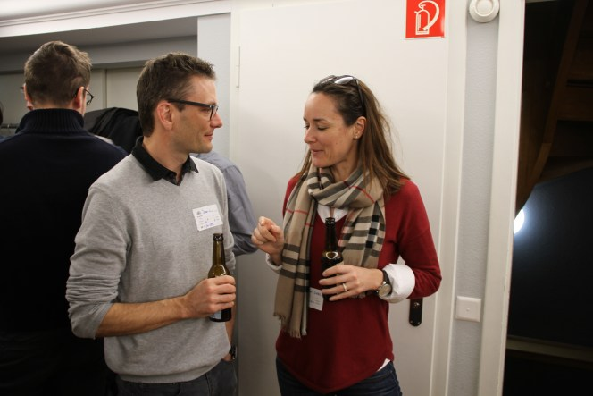
  - 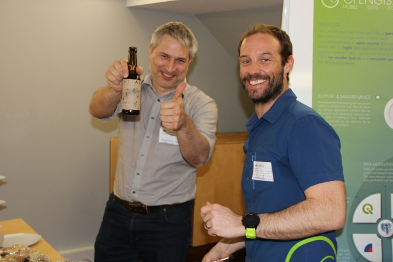
  - 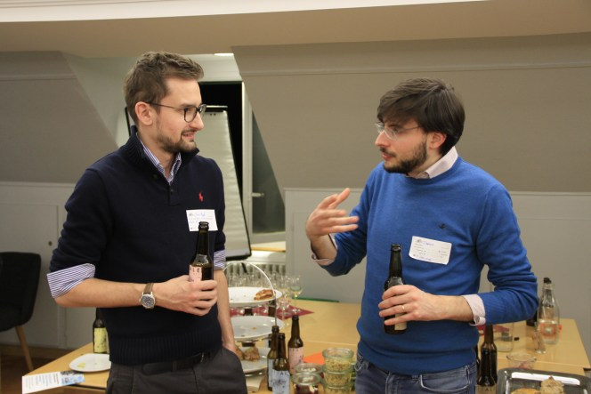
  - 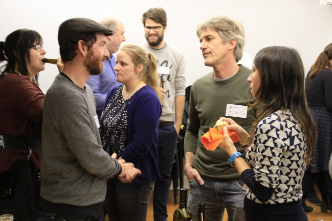
  - 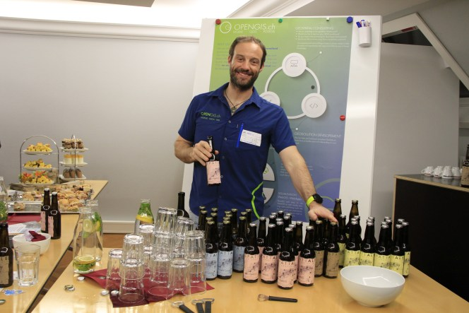
  - 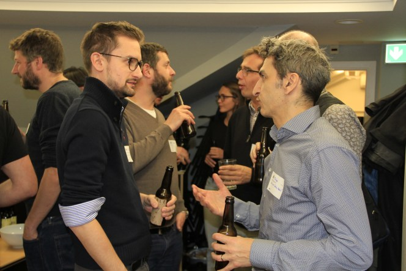
  - 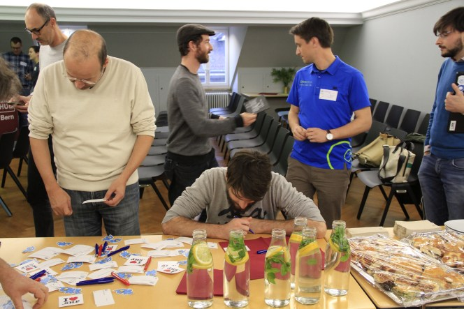
  - 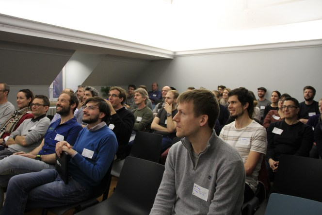
  - 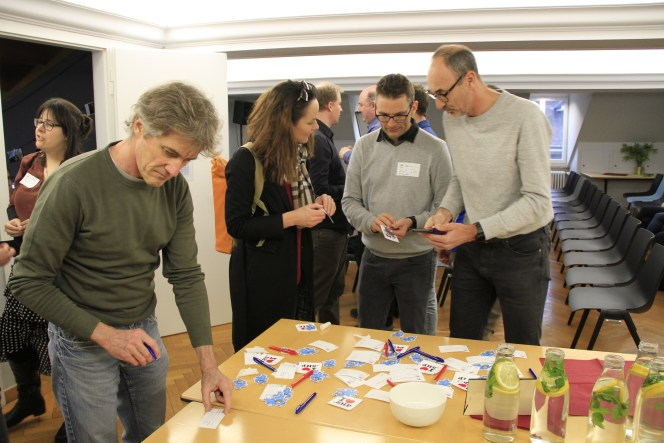
  - 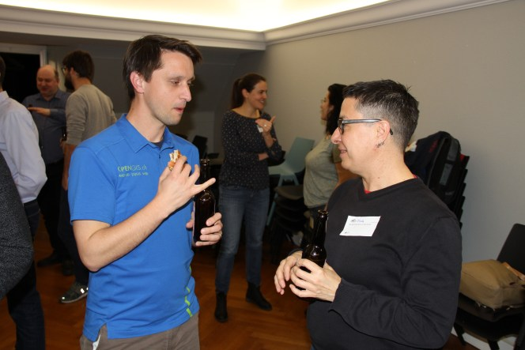
  - 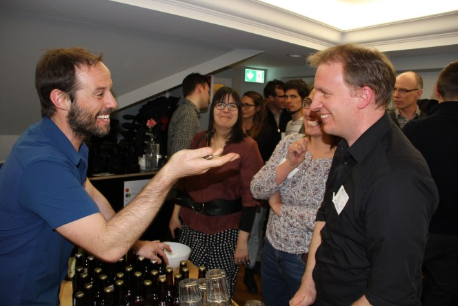
  - 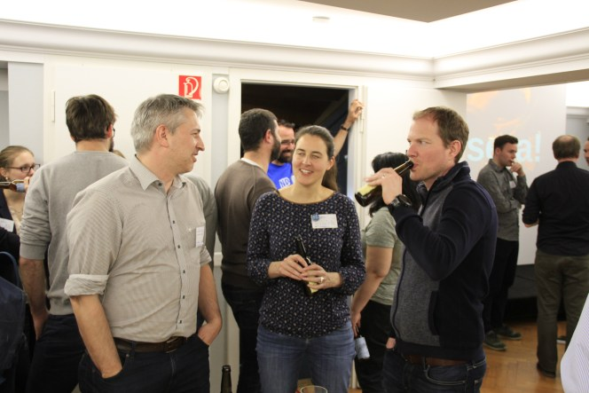
  - 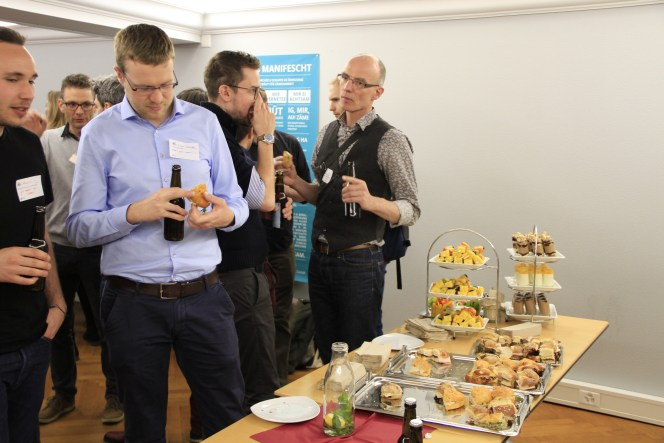
  - 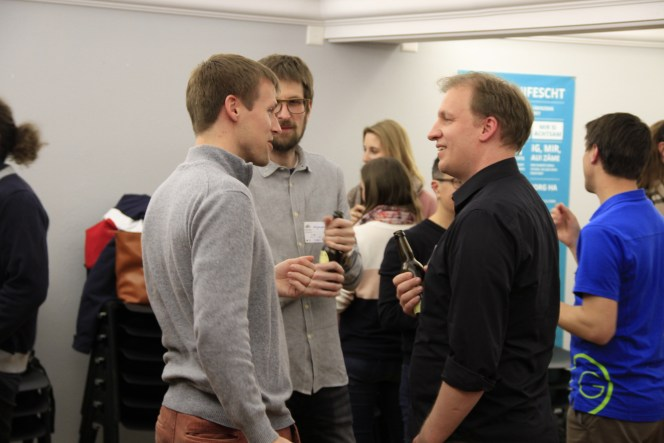
  - 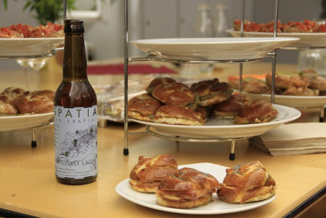

### _Related_
