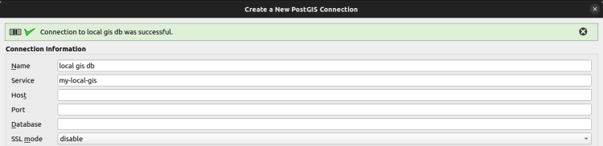
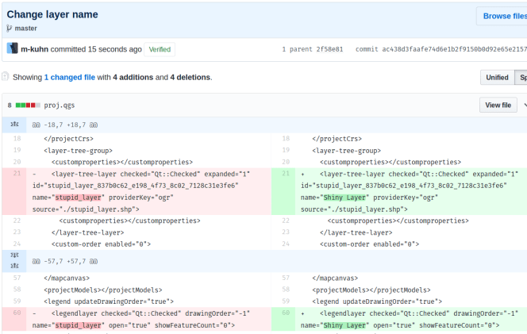

We often have QGIS project files that are part of a customer project. To be able to manage versions of these project files or have multiple people working on it, they are managed inside a git repository.
This is however not easy, because with every save of a project file, thousands of lines change, even if the real change is minimal. Like a change of a layer name.

This blows up the git repository for no reason. And worse: it makes it impossible to review changes, because the signal to noise ratio is horrible.
OPENGIS.ch has just released a shiny jewel to make your life easier. The [Trackable QGIS Projects plugin](<https://github.com/opengisch/qgis_trackable_project_files>) will automatically rewrite the saved project into a much more stable format.

Just download the plugin, install it and you are done. No user interface available, no configuration needed.  

### _Related_
