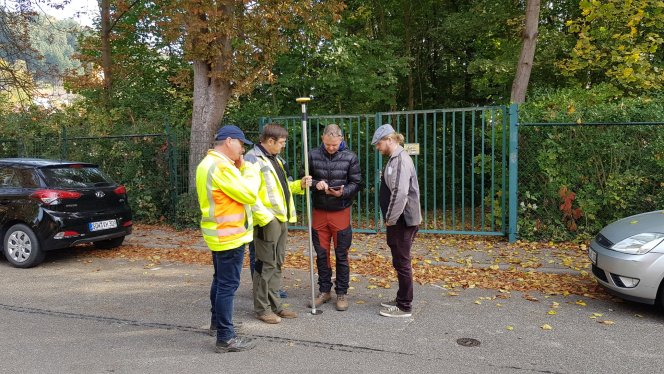

Do you want to win a [QField jump-start package](</qfield-training/index.html>) worth 550€? 
We are launching the [#**MyQField**](<https://twitter.com/hashtag/MyQField?src=hash>) challenge. Follow us on Twitter and show us how you use [@**QFieldForQGIS**](<https://twitter.com/QFieldForQGIS>) by tagging your tweets with [#**MyQField**](<https://twitter.com/hashtag/MyQField?src=hash>) and [#**dataisoutside**](<https://twitter.com/hashtag/dataisoutside?src=hash>). The tweet with most likes and retweets by 24.4.19 wins the training!  

### Rules
  - You need to follow [@**OPENGISch**](<https://twitter.com/OPENGISch>) and [@**QFieldForQGIS**](<https://twitter.com/QFieldForQGIS>)
  - Likes count single, retweet count double
  - You can participate multiple times
  - We will count on 24.4.19 at 20:00 CET
  - The prize is a [half day jump-start package](</qfield-training/index.html>) worth 550€

  - Risk assessment
  - Location tracking
  - Cadastral surveying
  - Assets management

Fine boring prints: 
  - Recourse to the courts is not permitted
  - There will be no correspondence regarding the competition
  - No cash payouts can be made
  - Participants have no enforceable claims to the transfer, payment or exchange of winnings

> Want to win a [@QFieldForQGIS](<https://twitter.com/QFieldForQGIS?ref_src=twsrc%5Etfw>) jump-start package worthed 495€?  
> we are launching the [#MyQField](<https://twitter.com/hashtag/MyQField?src=hash&ref_src=twsrc%5Etfw>) challenge. Follow us and show us how you use [@QFieldForQGIS](<https://twitter.com/QFieldForQGIS?ref_src=twsrc%5Etfw>) by tagging your tweets with [#MyQField](<https://twitter.com/hashtag/MyQField?src=hash&ref_src=twsrc%5Etfw>) and [#dataisoutside](<https://twitter.com/hashtag/dataisoutside?src=hash&ref_src=twsrc%5Etfw>)  
>   
> The tweet with most likes and retweets by 24.4.19 wins the training! [pic.twitter.com/pjCkazptbQ](<https://t.co/pjCkazptbQ>)
> — OPENGIS.ch (@OPENGISch) [April 10, 2019](<https://twitter.com/OPENGISch/status/1115978883759837184?ref_src=twsrc%5Etfw>)
### _Related_
