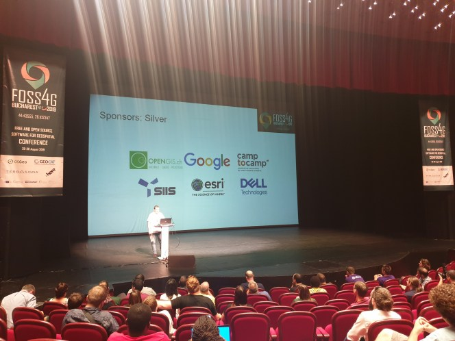

It’s been almost 2 weeks since FOSS4G 2019 has crossed the finishing line. And it was a truly inspiring event with many participants from all cultures and interests.

We do not need to repeat that the local organizers did a great job. That we had an awesome night in a truly impressive parliament building. That there have been so many wonderful people with brilliant ideas.  
And also that there were [too many good presentations in parallel](<https://talks.2019.foss4g.org/bucharest/schedule/>) to go and see them all live.
So we will just repeat that thanks to a quiet but highly efficient group of people of the [CCC Video Operation Center](<https://c3voc.de/>) all talks were not only streamed live but are also available online now. For example ours which are listed below.
## Our talks
[**QGIS on the road**](<https://media.ccc.de/v/bucharest-517-qgis-on-the-road>)  
 _A 95 minutes introduction to QGIS. A tale about Maya the beekeeper and how she uses QGIS to grow her honey bees._
**[Field data collection strategies using QField and QGIS](<https://media.ccc.de/v/bucharest-262-field-data-collection-strategies-using-qfield-and-qgis>)** ([slides](</wp-content/uploads/2019/10/qfield_data_collection_strategies.pdf>))  
_You want to go out on your own or send a team with QField installed on their tables. This talk covers the basics of different strategies from a simple one-person side project to a full-grown enterprise-level solution with Q/A and data archiving._
**[Complying with administrative data model requirements like INSPIRE, a Swiss perspective](<https://media.ccc.de/v/bucharest-359-complying-with-administrative-data-model-requirements-like-inspire-a-swiss-perspective>)** ([slides](</wp-content/uploads/2019/10/complying_with_admin_data_models.pdf>))  
_The European Union and Switzerland have common challenges when it comes to geodata._
**[Custom workflows in QGIS thanks to Python – a non-technical introduction](<https://media.ccc.de/v/bucharest-182-custom-workflows-in-qgis-thanks-to-python-a-non-technical-introduction>)** ([slides](</wp-content/uploads/2019/10/qgis_and_python.pdf>))  
_It’s no secret, QGIS is good. And it’s even better if served with Python. This talk offers a gentle introduction to the added value by using Python._
**[PyQGIS the](<https://media.ccc.de/v/bucharest-182-custom-workflows-in-qgis-thanks-to-python-a-non-technical-introduction>)[comfortable](<https://media.ccc.de/v/bucharest-183-pyqgis-the-comfortable-way-tricks-to-efficiently-work-with-python-and-qgis>)[ way](<https://media.ccc.de/v/bucharest-182-custom-workflows-in-qgis-thanks-to-python-a-non-technical-introduction>)** ([slides](</wp-content/uploads/2019/10/comfortable_python.pdf>))  
_It’s no secret, QGIS is good. And it’s even better if served with Python. This talk offers_ tricks to efficiently work with Python and QGIS
**[QGIS is dead, long live QGIS! – the very best new features of QGIS 3.x](<https://media.ccc.de/v/bucharest-185-qgis-is-dead-long-live-qgis-the-very-best-new-features-of-qgis-3-x>)** ([slides](</wp-content/uploads/2019/10/qgis_is_dead_long_live_qgis.pdf>))  
_QGIS has gone a long way. QGIS 3 has been more than just a regular update. It’s therefore impossible to mention it all, so this talk covers a selection of the most mind-blowing new features. Presented by the QGIS Co-Chair himself._
**[It’s open source, how could that possibly go wrong!?](<https://media.ccc.de/v/bucharest-411-it-s-open-source-how-could-that-possibly-go-wrong->)** ([slides](</wp-content/uploads/2019/10/its_open_what_can_go_wrong.pdf>))  
_Do you wonder if it’s worth going open source with your business? Here are all the reasons why you should definitely NOT do it. A quick reality check if it’s worth it for you or not._
**[GIS Migration Paths – Tools and strategies to move to open source GIS](<https://media.ccc.de/v/bucharest-224-gis-migration-paths-tools-and-strategies-to-move-to-open-source-gis>)** ([slides](<https://gitpitch.com/marioba/gis_migration_talk#/>))  
_Including open source components in GIS, environments is super trendy. If you want to migrate your GIS system to open source, here you have some questions to consider and get a number of lessons learnt for free._
## Sponsoring FOSS4G
We have [supported FOSS4G 2019 as a silver sponsor](<https://2019.foss4g.org/sponsors-2/our-sponsors/>). For us, the whole FOSS4G stack and environment is the basic building block of what we work and live for every day. We couldn’t do what we do if there were not all the other people, organizations and projects out there who make the whole FOSS4G ecosystem what it is: _a possibility to build a future in which we benefit all from one another and collaboratively tackle the big challenges of our time_. And ultimately, the FOSS4G conference is the place where this vision takes shape.

  
  

### _Related_
