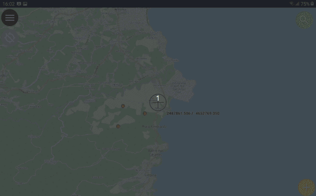
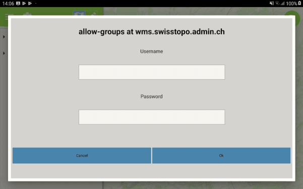

After an intensive testing period, we are proud to announce the release of **QField 1.2**
As usual, [get it on play store](<https://play.google.com/store/apps/details?id=ch.opengis.qfield>) or [download it from GitHub.](<https://github.com/opengisch/QField/releases/tag/v1.2.0>)
## QField Crowdfunding Campaign
Before digging into all the new goodness that you will find in QField 1.2, let’s get some big « Thanks » out. What QField currently is was mostly possible **thanks to customer projects** of which the outcome could be mutualized. Thanks a lot to all of you that agreed open source is all about making things possible together! 
Over the years at OPENGIS.ch we have also **donated an unimaginable amount of hours** to make QField the project you have grown to love and this makes us very proud!
To keep the momentum we now rely on all QField users to help us move one step further. Therefore we created a **crowdfunding campaign for improved camera support**. As well as another round of **general polishing and bug-fixing**.
If you like QField, now is the time to show some love and **[support our crowdfunding campaign](<https://opengis.ch/qfield-love/>)**.
## New features
This new release comes with exciting new features and also contains some first usability enhancements. More of that later.
### Value relation widget

If you need to choose the type of a material of the manhole you are inspecting or to select the owner of the parcel which you are drawing, that’s when you want a **combo box with available values**. This has been possible in QField for a long time, but was hard to set up. Since this release it’s much easier thanks to the integration of value relation widgets.
Not only do they make configuration easier, they also allow for a completely new functionality: managing **multiple selections**. This will offer a checkbox for every possible value from the list and you are free to save any combination of values.
### Authentication dialog for protected services

Just as well as we love open source, we love open data. But not all data are meant for public and some deserve protection. Even more you don’t want to allow everyone to edit your data.
QField will now **show an authentication dialog** , whenever one of your**WMS, WFS, WFS-T or Postgres layers** requires a login.
### Improved snapping support in expressions
One of the main reasons for **QField’s incredible versatility** is the **use of**[**expressions**](<https://docs.qgis.org/2.8/en/docs/user_manual/working_with_vector/expression.html>) everywhere. We have just added yet another piece to that: when you snap to a feature, **all the snapping details** **are available for your new feature**. With this in place, if you add a new signpost on a street, you can fill in the `street_id` attribute automatically.
As a nice little extra, the Z (and M) values of snapping results are automatically applied to the new vertices and points.
## Usability enhancements and Bugfixes
We also started to improve on the usability of the user interface. We are working on this with a usability expert to get the user interface to be even more appealing and user-friendly.
This is just the start, stay tuned for **more usability improvements** which are inbound.
As usual, a number of additional bugs have also been corrected, most notably the checkbox widget is now behaving as expected.
## Latest Qt 5.13 and Arm64-v8a support
According to Google guidelines, we added support for the Arm64-v8a architecture and while we were at it, we also migrated to the shiny new Qt 5.13 and it’s next-gen menu system. 
For this release, we did not upload any x86 packages to the play store since it would have forced us to also have to upload an x86_64 package. If you need the x86 package, you can find it on [Github](<https://github.com/opengisch/QField/releases/download/v1.2.0/qfield-v1.2.0-x86.apk>). Obviously, in future releases we’ll add those to the play store as well.
### _Related_
