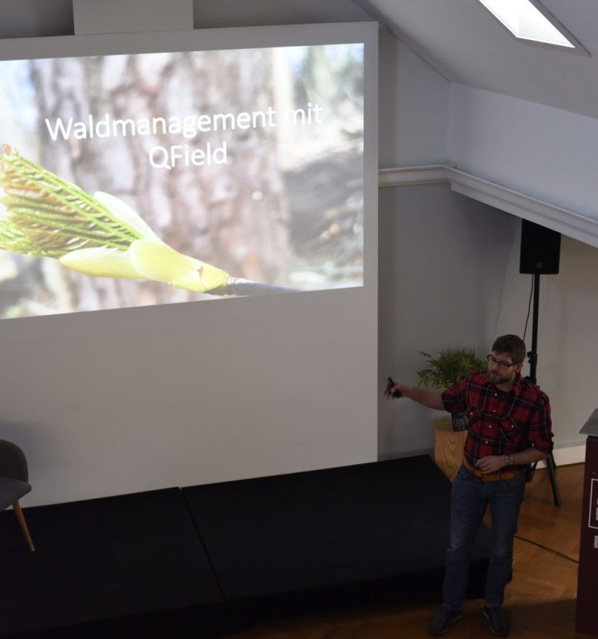
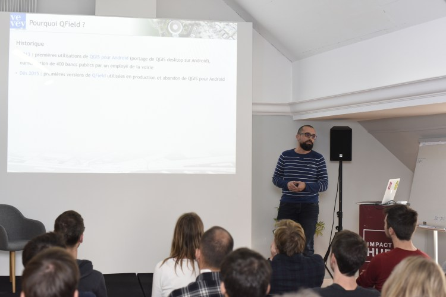
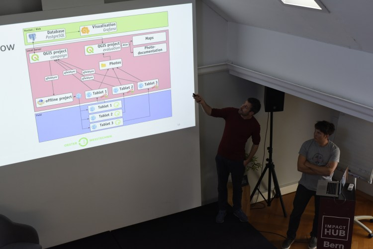
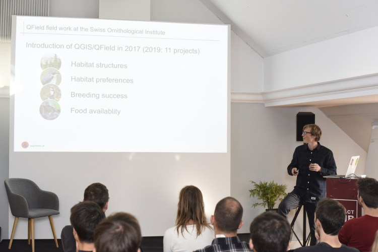

## A huge success 
At the end of 2019, we organised the first QField user day in Bern. Around 40 participants from Switzerland and neighbouring countries joined the packed event with use case **presentations by various power users of QField**.
## Fantastic use-case presentations
After a brief introduction by Matthias, Samuel Wechsler from the **Swiss Ornithological Institute** showed how they _make their teams fly with QField_ to be more effective in protecting the Swiss bird fauna and its habitat. Next on the podium was one of the earliest QField pioneers, Daniel Gnerre from the **city of Vevey** telling the audience how the city thoroughly uses QField to collect and update data on just about anything and how they integrated QField in their geospatial infrastructure.
After a short break, Philipp Eigenmann showed us how he uses QField to **manage the forest** he and his team are responsible for. Finally, Samuel Oester and Till Weber from **Oester Messtechnik** presented _Gasbusters – Chasing gas with QField_ explaining how they used QField in over 200 soil **gas leaks campaigns** measuring over 39’000 points to be then visualised on maps and with Grafana.
  - Forest management in northern Switzerland with QField
  - The city of Vevey is a precursor in pushing QField
  - Oester Messtechnik presenting their workflow
  - The Swiss Ornithological Institute is leveraging QField in multiple projects to protect habitats and fauna

You can find all the [slides and some videos of the presentations](</cloud.opengis.ch/index.php/s/Rp4EAwkx75TPR8Q>) online.
## Open discussion
A user day wouldn’t be a user day if there was no space for discussion. After the fantastic presentations, we launched an **open discussion on the future of QField** and how to sustainably maintain its growth rate and quality thanks to [financially] committed users. The discussion showed us a lot of willingness and commitment to help QField keep its **incredible innovation level and its market leader position as reference GIS fieldwork app**. This obviously gave us a lot of ideas and motivation and made us enjoy the closing beers even more 🙂
We would like to extend again a warm **thank you to all the speakers and participants**. We’re definitely looking forward to the next QField user day!
## What’s next?
On **11.03.2020** , just before the QGIS hackfest in Den Bosch (NL), [**we’ll lead a full-day workshop**](<https://landgoed.it/trainingen/QField>)**in the awesome**[**GeoFort**](<https://www.geofort.nl/en/>). Don’t worry, the workshop will be in English.
QField is growing steadily, **plenty of new features** (including [native cloud synchronisation](<https://qfield.cloud/>)) are planned with the next releases of QField. We’d like to thank again all organisations, companies and individuals that actively use QField and that invest in making QField even better. 
If you feel QField misses something you need or would like to support the project, don’t hesitate [to get in touch with us.](</contact/index.html>)
### _Related_
