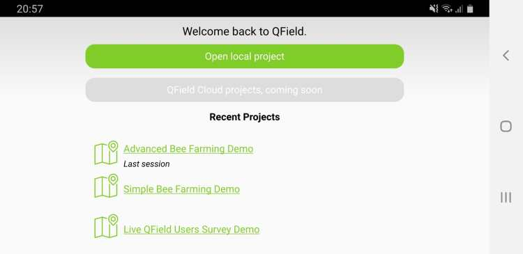
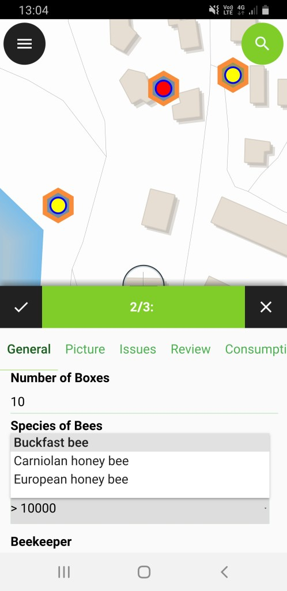
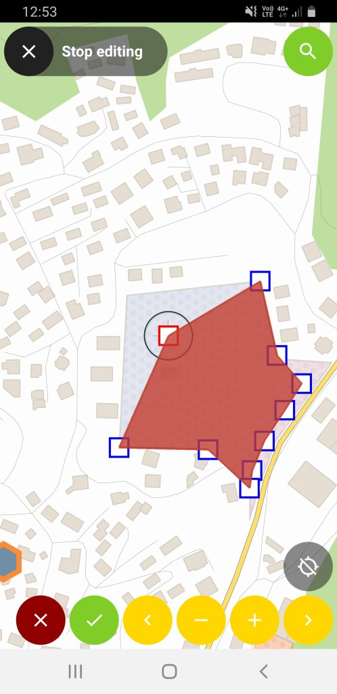
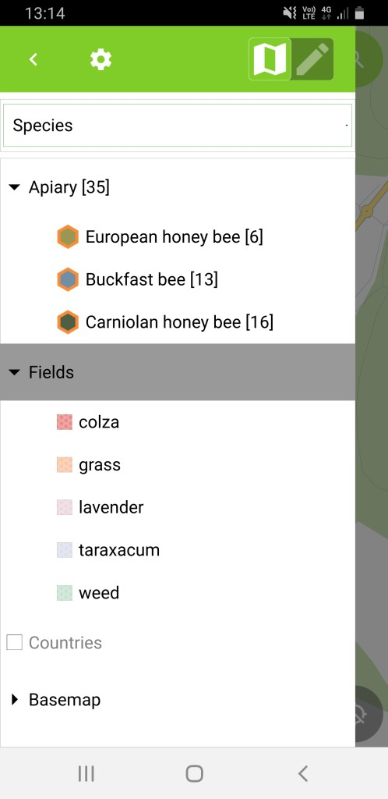

What a year’s start! After a very packed December publishing all the [QGIS on the road videos](</2019/04/25/qgis-on-the-road-lausanne/index.html>) and quietly releasing **QField 1.3 – Ben Nevis** we could have gone and relaxed over the holidays. But since we love QField so much we immediately started working on the next iteration. Now, after an intensive testing period, we are proud to announce the release of **QField 1.4 – Olavtoppen**. 
Olavtoppen!? yes, the highest point of Bouvet Island, the remotest island on Earth. And sure enough, QField would follow you there!
As usual, [get it on play store](<https://play.google.com/store/apps/details?id=ch.opengis.qfield>) or [download it from GitHub.](<https://github.com/opengisch/QField/releases/tag/v1.4.4>)
## QField Crowdfunding Campaign
Before digging into all the new goodness that you will find in QField 1.4, let’s get a big « Thanks » out to everybody who supported our **crowdfunding campaign for improved camera support** and all our**customers** that agreed to open source the work we did for them. 
If you like QField, want a new feature or would like to support the project, don’t hesitate [to get in touch with us.](</contact/index.html>)
## Usability enhancements
In QField 1.2 we started to improve on the usability of the user interface. We are constantly working on this with a usability expert to get the user interface to be even more appealing and user-friendly. 
Besides lots of clean-up and polishing, QField received two major improvements, a portrait mode and a new welcome screen with recent projects.
### Welcome screen with recent projects
QField is all about efficiency. While favourites folders in the file selector already give a great productivity boost, very often we work with the same 3-4 projects. This is why we redesigned the welcome screen to list the last five project used. And if you look carefully you might get a hint of what will be coming soon…

### Portrait mode
QField now flawlessly works in portrait mode. We heard you say you needed a comfortable way to work in portrait mode, especially on smartphones. QField forms and button placements are now optimized to be easy to use with your thumbs.
  - Optimised forms
  - Buttons align at the bottom
  - Roomy legend

## New features
We keep on listening to your feedback and prioritize new features based on it. We did implement some minor features like allowing hiding legend nodes and printing to PDF using the current extent. But this time’s superstars are three highly expected features: **Splitting** of geometries, **compass** integration and, yes you guessed right, **native camera** and gallery app support!
### Split Features

A new editing tool is available that allows for splitting existing features. This adds an even more powerful operation to an already impressive geometry editing tools set.
### Compass integration
A long-awaited feature! QField now shows you on-screen in which direction you are looking, walking, driving, flying or warping direction. This makes it much easier and more pleasant to navigate in the field.

### Native Camera and Gallery
It is now possible to use your favourite camera app so that you have more control over how pictures are taken. It is also possible to select pictures which are already on your device by using the new gallery selector.
**Pro Tip** : You can use any camera app. For example, you can use the [open camera app](<https://play.google.com/store/apps/details?id=net.sourceforge.opencamera>) to create geotagged photos if your preinstalled system camera doesn’t save positioning information in EXIF data. 
**Pro Tip 2** : You can use an image annotation app to add notes, sketches, drawings and so on to your images and then choose them from QField via the _add from gallery_ button.
### Antenna Height Correction
For high precision measurements, it’s possible to compensate your altitude by a fixed antenna height. This will then automatically adjust all the digitised altitude values.
### JPEG 2000
Support for JPEG 2000 raster datasets was added. This lossy format offers a compression rate at par with proprietary formats like ECW or Mr SID. 
**Pro Tip** : save your base maps in JPEG 2000 to save storage.
## New Languages
Thanks to the hard work of our community, QField is now also available in Turkish and Japanese.
## New packages
You say: wow that’s a lot! We say: there is more 🙂  
We have upgraded our whole building infrastructure so that you can comfortably get even more QField goodness without having to uninstall your production ready QField.
### Automated master builds
After each pull request is merged into our master code, a new package is created and automatically published on the playstore in a dedicated app called [QField for QGIS – Unstable (Early Access)](<https://play.google.com/store/apps/details?id=ch.opengis.qfield_dev>). Installing this app will allow you to always have the latest build of QField for testing and giving feedback. On your device, this app is completely separated from the production-ready QField and has a distinctive black icon so that you do not confuse it.
### Pull request builds
QField is an extremely active project, and as you see we develop multiple functionalities and fixes at the same time. If you’re particularly interested in one of this, our continuous integration fairy builds and publishes new packages automatically at each commit directly to the pull request you are interested in. To see what we are currently working on, have a look at the [pull request overview page](<https://github.com/opengisch/qfield/pulls/>). 
### Experimental Windows builds
Last but definitely not least, we’ve set up an Azure CI infrastructure to build QField for windows. For now, we still consider this experimental but we already had some very successful testing. If you are interested in testing out QField for windows you can get it [here](</download.opengis.ch/qfield/ci-builds/win/index.html>), remember it is experimental so don’t use it in production yet and give us as much feedback as possible 🙂
## What’s next?
As you can imagine we’ve had a very busy start of 2020, but even more is to come soon with the next releases of QField. We’d like to thank again all companies and individuals that actively use QField and that invest in making QField even better. If you feel QField misses something you need or would like to support the project, don’t hesitate [to get in touch with us.](</contact/index.html>)
### _Related_
