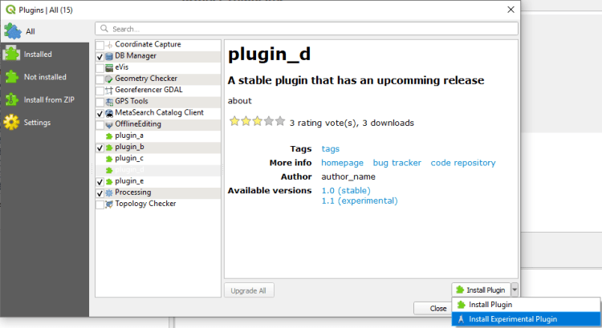

Lors de l’assemblée générale de 2020, le groupe d’utilisateurs QGIS Suisse a accepté la proposition d’amélioration du gestionnaire d’extensions. Ainsi, dans la version 3.14, il sera possible d’installer au choix la version stable ou expérimentale d’un plugin.

Cette fonctionnalité permettra d’améliorer la collaboration entre les développeurs et les utilisateurs d’un plugin. Les utilisateurs pourront facilement basculer entre la version d’un plugin utilisé en production et une version expérimentale pour tester les fonctionnalités à venir.
Jusque là, il était nécessaire soit de configurer un dépôt d’extension dédié, soit d’installer les versions expérimentales manuellement à partir d’un fichier zip.
Pour tester cette fonctionnalité, assurez-vous d’avoir activé l’option « afficher les extensions expérimentales » et d’utiliser une version de développement (Nightly build) de QGIS récente.
Nous remercions chaleureusement le groupe d’utilisateurs QGIS Suisse d’avoir financé cette amélioration ! 
### _Related_
