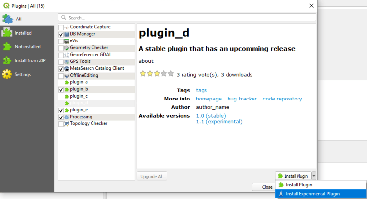

An der QGIS Generalversammlung 2020 hat die QGIS Anwendergruppe Schweiz den Förderantrag zur Verbesserung des Plugin Managers gutgeheissen. Darum wird es ab der Version 3.14 möglich sein, pro Plugin zu entscheiden, ob die stabile oder die experimentelle Version installiert werden soll.

Diese Funktionalität erlaubt es, die Zusammenarbeit zwischen Entwicklern und Anwendern eines Plugins zu verbessern. Die Anwender können jederzeit zwischen einer Version des Plugins, das in Produktion benutzt wird und einer experimentellen Version von kommenden Funktionen umschalten.
Bis jetzt war es nötig, dafür Plugins von einer zip Datei zu installieren oder sämtliche installierten Plugins in der experimentellen Version.
Um diese Funktionalität zu testen, muss die Option „Auch experimentelle Erweiterungen anzeigen“ aktiviert werden und eine aktuelle Entwicklerversion von QGIS (Nightly build) installiert werden.
Wir bedanken uns herzlich bei der Anwendergruppe Schweiz für die Finanzierung dieser neuen Funktionalität.
### _Related_
