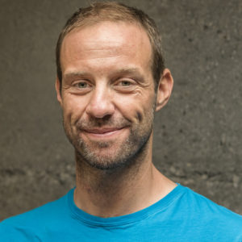

> Serving as a pragmatic community conciliator – collecting thoughts from people with differing opinions and trying to find the high road through difficult issues – I want to focus my and the community’s energies on our core product, QGIS.
> Marco Bernasocchi · QGIS.org Chair 
OPENGIS.ch has always been dedicated to sustaining QGIS’ [technological](</la-nostra-iniziativa-di-sostenibilita-qgis/index.html>) and [economical](<https://qgis.org/en/site/about/sustaining_members.html>) well-being, supporting it with endless hours of internally funded QA, infrastructure works and developments.
Today we are very proud to announce that our commitment has grown even more as one of our founders and CEO Marco Bernasocchi was elected Chair of the QGIS.org association.

With over 15 years of involvement with QGIS (he started working with QGIS 0.6) and two years serving as vice-chair, Marco will serve for the next two years as Chairperson of the QGIS.org association.
Understanding the importance of the role trusted him, Marco would like to thank the QGIS community for the trust and appreciation. Marco is looking forward to intensifying work with the PSC and the fantastic QGIS community to push QGIS even further.
We wish Marco and the rest of the elected PSC two very successful years full of QGIS awesomeness.
Rock on QGIS! – read more at [QGIS Annual General Meeting – 2020](<https://blog.qgis.org/2020/05/06/qgis-annual-general-meeting-2020/>)
### Marco’s vision for QGIS.org:
I want to help QGIS and it’s community thrive under the value proposition of:
> Making the most amazing opensource GIS that provides users with value and that meets their needs by providing great functionality and usability, being cost-effective whilst being actively supported by a vibrant and knowledgeable community.
Sharing our work under an open-source license is part of the approach by which we achieve that value proposition as it allows broad collaboration with our developers and users community.
I see FOSS as a very socially responsible way to develop software, but even more, I see the immense technological advantage that writing open-source code brings. This is why I want our focus to be on allowing both pragmatic and ideological views to respectfully coexist and enrich each other.
One of my main motivations to be part of the PSC and to make myself available as project Chair is to help QGIS keep this incredible growth rate by being even more attractive to new community members, sponsors and large/corporate users. To achieve this, the key is maintaining the **right balance between sustainable processes** (that guarantee the great quality QGIS has been known for) **and an interesting and motivating grassroots project** to ensure that QGIS remains an attractive project for volunteers to contribute to and help QGIS and its community to **grow to become even more the reference** [Open Source] GIS project.
### _Related_
