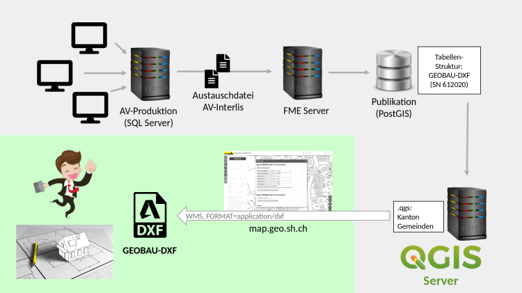
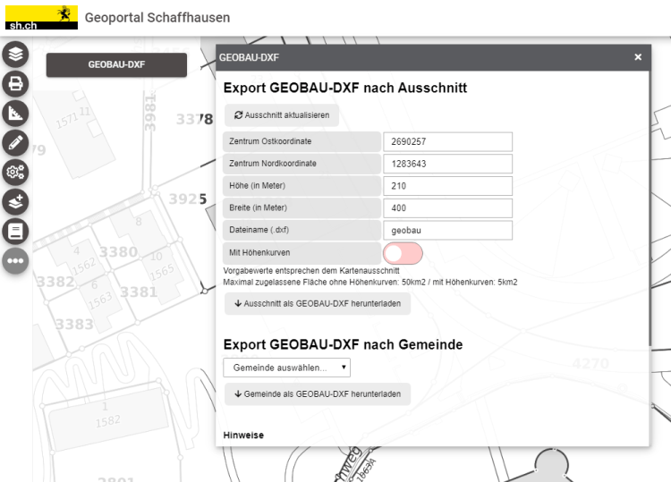

Everyone knows QGIS is on the desktop and [mobile devices](<https://qfield.org/>). Many know QGIS is on the web with QGIS server through OGC services. Some know QGIS server has its own extension to generate PDFs. But did you know that QGIS server can also produce DXF files?
## DXF
DXF files are mainly used for interchanging CAD drawings, vector geometries with styles and attributes. With a couple of compromises, these files can be imported and exported to and from QGIS.
Due to their heavy use of CAD software, architects work a lot with DXF files. For example, for the Swiss Cadastral Survey (Amtliche Vermessung, Mensuration Officielle) there is a standard with the name GEOBAU-DXF that defines layer names and structure of this file. Architects often request this format from cantonal government agencies when planning construction work.
In the canton of Schaffhausen, there are over 100 downloads per month and it’s by far the most demanded format. These files were produced semi-automatically through a separate application and the customers got the data by mail with a link to a zip file. The time between order and delivery was about 20 minutes. With the renewal of the cantonal SDI, including QGIS server for handling OGC services, the situation changed and an update to this process was required.
## Optimize the process
For the canton of Schaffhausen, the goal was to find a solution with existing components of the new SDI, completely based on machine-to-machine communication and to make the turnaround time for the customer as fast as possible. As soon as they realized QGIS server is also able to deliver DXF, this seemed to be the best approach to fulfil their needs concerning the download of GEOBAU-DXF. And, with the help of OPENGIS.ch, it was a full success.
In the cantonal infrastructure, the data is available in a Postgres database, which is regularly filled through an ETL workflow. On top of this database, the canton created a QGIS project with symbology, labelling and layers that reflect the GEOBAU-DXF standard.

With this project published on a QGIS server, it was quickly possible to generate a DXF file, but some improvements were still required in QGIS 3.10.
  - Label alignment was not preserved
  - Altitudes (Z values) of coordinates were not properly exported
  - Symbols were defined inline and not in blocks
  - When a layer could have mixed geometry types (points, lines and polygons) there were problems with missing objects and wrong symbology

The Canton Shaffausen already had a [support and maintenance](</qgis-support-wartung/index.html>) contract in place with us and used this contract to kick off the development as well as requesting an additional dedicated development contract with specific goals. A couple of iterations later these enhancements were released with the next QGIS versions and are now available for everyone.
As a side effect, the DXF code has been cleaned up. This is now in a much more solid and modular state (it would, for example, be straightforward to expose it as processing algorithm now). Another nice improvement was that QGIS WMS server is now able to handle multiple layers with the same name, merging them to a single layer. This can be interesting if you have to expose the same layer multiple times with points, lines and polygons.
Meanwhile in Schaffhausen, the service is running in production and architects can happily obtain DXF-GEOBAU files by choosing the area of interest on the web map and download the file in no time.
To try it out, head over to the [geoportal of the canton of Schaffhausen](<https://map.geo.sh.ch/>), click the three-dots menu and choose GEOBAU-DXF.

Or directly use the following download sample link to generate a GEOBAU-DXF file: [https://wfs.geo.sh.ch/dxfgeobau?SERVICE=WMS&VERSION=1.3.0&REQUEST=GetMap&LAYERS=dxfgeobau&STYLES=&CRS=EPSG%3A2056&BBOX=2690035,1283484,2690299,1283694&WIDTH=1042&HEIGHT=811&FORMAT_OPTIONS=MODE:SYMBOLLAYERSYMBOLOGY;SCALE:500;NO_MTEXT:TEXT&FILE_NAME=geobau.dxf&FORMAT=application/dxf](<https://wfs.geo.sh.ch/dxfgeobau?SERVICE=WMS&VERSION=1.3.0&REQUEST=GetMap&LAYERS=dxfgeobau&STYLES=&CRS=EPSG%3A2056&BBOX=2690035,1283484,2690299,1283694&WIDTH=1042&HEIGHT=811&FORMAT_OPTIONS=MODE:SYMBOLLAYERSYMBOLOGY;SCALE:500;NO_MTEXT:TEXT&FILE_NAME=geobau.dxf&FORMAT=application/dxf>)
### _Related_
