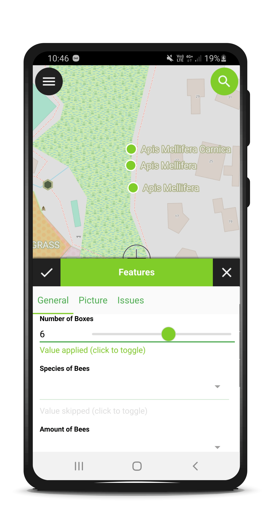
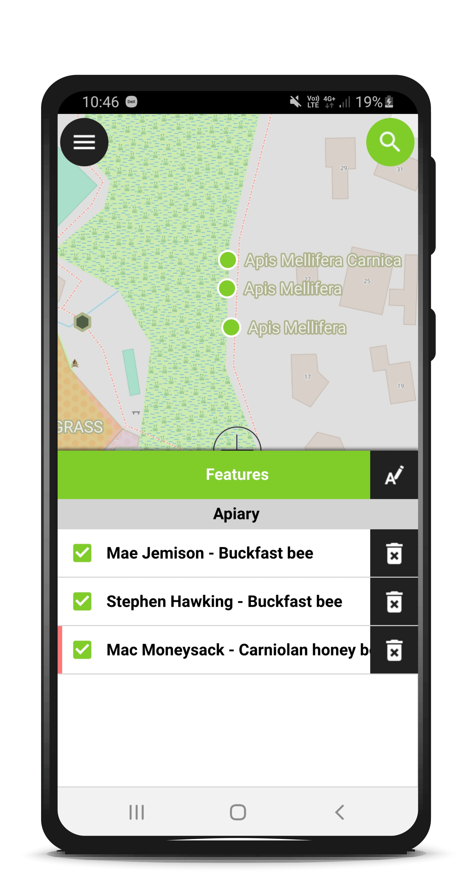
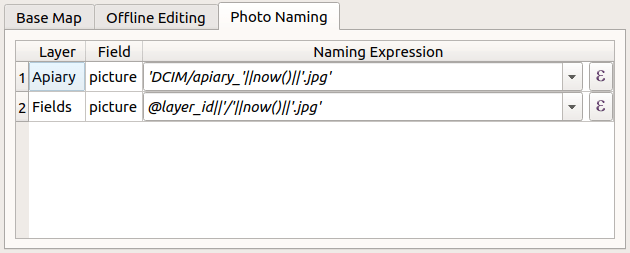

**Editing multiple features at the same time, support for stylus pens, dynamic configuration of image names and much more.**  
**QField 1.6 Qinling 秦岭 comes packed with awesome new features and an improved user experience.**
We have been very busy over the last few months working on a new and shiny QField release. We have added many new features that increase efficiency on the field or allow for new workflows. In parallel, we have also been working on ironing out a series of issues and improving the overall user experience to make the app as pleasurable to use as possible. The result is QField 1.6 which has been published now.
Enough of the highlevel talking, let’s see what has been done.
## Multi editing
Do you recall Geography lesson 101, Toblers first law? _Everything is related to everything else. But near things are more related than distant things._
Very often there are similar objects nearby which share a property, tree species tend to group, human created objects like street light types or street paint markings tend to be of the same type at the same location.
With QField 1.6 it is now much easier to select a couple of features and change an attribute with very few taps. Identify a feature, long press an identify results, select more features and click the edit attributes button.

## Stylus support
Sometimes it is just too cold to be working with fingers (although of course you can get capacitive gloves too). Or you just prefer to be working with a pen. QField 1.6 comes with support for stylus pens. If your device ships with one, give it a try.
## Lock geometries
For some scenarios, especially in asset management, you only need to change attributes of existing objects and never add new features, delete features or change geometries. This can be configured through QFieldSync and set in the layer properties.
## Image name configuration
Did you ever want to have the file names of your pictures to match the feature id, the layer name or any free text? The expression based configuration in QFieldSync offers now complete freedom in naming your images.

## Legend and UX and legacy code
Didn’t expect to read UX and legacy code in one single title?
QML is the technology on which the QField user interface is built. QML ships a lot of user interface elements in a library called “Quick Controls”. A long time ago already it received an update from version 1 to version 2. Up to recently we still have been using some elements from version 1, which had an effect on high resolution displays not being able to properly display everything. To workaround that we introduced a lot of band aids, to improve the situation. We are very happy, that by migrating the legend and few other remaining elements to Quick Controls 2 in version 1.6, we have been able to completely drop this code.
## Topological editing
QGIS can detect shared boundary by the features, so you only have to move a common vertex once, and QGIS will take care of updating the neighboring ones. So does his little college QField since this release.
## Fast editing mode
For the real adventurers who know what they are doing this release brings the fast editing mode. In this mode, the features will automatically be stored on every change. The user interface is lighter and it combines perfectly with the topological editing.
## Unter the hood
We have brought the whole technology stack up to speed with modern requirements. Proj and GDAL have been updated to recent versions. This helped to mitigate a couple of issues with coordinate transformations that were [completely misplaced](<https://github.com/opengisch/QField/issues/1072#issue-642290346>). It also paves the path for a future with datum corrections and always more important high precision measurements.
## Known Issues
Unfortunately, we are experiencing a crash on startup with 32 bit devices. These devices are not that common any more, but if you have a device that is already a couple of years old it’s very well possible that it comes with a 32 bit cpu builtin. Despite the team’s hard efforts to isolate the reason, we were not able to find out what it was yet. Because of this we will not be able to update to 1.6 for these devices at the moment. We still hope that we will find a solution for this but don’t know yet when this will be.
We have updated [proj](<https://proj.org/>) to version 6. This brings plenty of bug fixes with coordinate handling. Among other things it adds support for using datum grids (gsb files) for very precise transformations, it is not yet possible to install those on the device. You will get an information message in the about dialog if your project happens to fall into this category. In this case, as a workaround switch the CRS of the project to a CRS with a known conversion that works without grid files.
## What will the future bring
You guessed it already, we are not tired and have plenty of things stacked for the future. Prepare for more exciting updates for attribute forms and also for [QFieldCloud](<https://qfield.cloud/>) which is right now being tested in our R&D labs.
Also keep an eye on the [@QFieldForQgis Twitter account](<https://twitter.com/qfieldforqgis>) to stay updated. 
## Open Source
QField is an open source project. This means that whatever is produced is available free of charge. To anyone. Forever. This also means that everyone has the chance to contribute. You can write code, but you don’t need to. You can also help [translating the app to your language](<https://www.transifex.com/opengisch/qfield-for-qgis/dashboard/>) or help out [writing documentation or case studies](<https://github.com/opengisch/QField-docs>) or by sponsoring a new feature.
## Thanks to sponsors
Various organisations have helped to make this new release become a reality. Without the support of people in organisations who believe in the future of QField and open source tool for geospatial in general. The whole team behind QField would like to thank you with a big applause!
### _Related_
