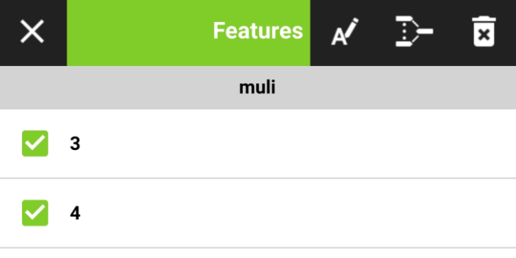
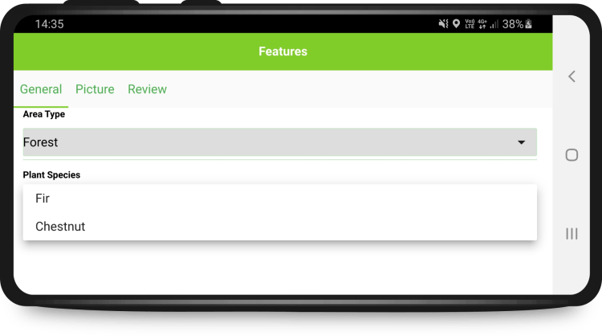
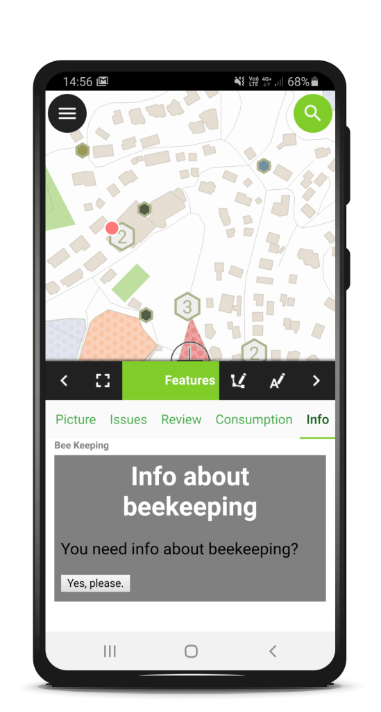

**Be ready for the cold weather with a smooth coordinate search, filters in the value relation widget, fancy new QML and HTML widgets, enhanced geometry editing functionalities and an expandable legend. Right when Autumn starts, QField 1.7 Rockies hits the stage.**
As usual get it now on the [play store](<https://play.google.com/store/apps/details?id=ch.opengis.qfield>) or on [github](<https://github.com/opengisch/QField/releases>)!
The days are getting shorter and the wind blows colder. It’s always good to be in a good company outside while getting your mapping work done. QField will be your reliable companion.
We know, QField 1.6 Qinling has only been out two months and with its amount of new features and stability improvements, it would have deserved a longer primetime. But we just couldn’t withhold you all the new great stuff we’ve been building lately. 
So let’s welcome QField 1.7 Rockies. And yes, we mean THE [Rockies](<https://en.wikipedia.org/wiki/Rocky_Mountains>), where QField is looking for plenty of new buddies.
Let’s have a look.
## Merging features
Splitting of a feature has been possible for quite some time. Now the merging of features of multipolygon-layer is possible as well. Select them and merge them – easy like that. The first selected feature gets the new geometry and keeps its attributes.

## Filters in the Value Relation Widget
The value relation widgets provide an easy selection of a related feature. Often it’s used for lookup tables but sometimes the related tables contain a lot of entries and the list of the possible values is long.
Using filters in the value relation drop-down can increase the efficiency in selecting the correct value. It can be configured by expressions in QGIS, so it’s possible to have the content of the drop down depend on the values entered previously in other fields.

In the screenshot above there is a Map Value Widget with “forest” and “meadow” as values. On selecting “forest”, only the trees appear in the Field “Plant Species”. On selecting “meadow” there would be listed flowers instead.
## Go to coordinates in the Search
The search has not only been improved in its appearance, but it’s handling is much more comfortable with a button to clear the text and easy opening and closing.
Additionally, we added the possibility to jump to coordinates. Searching a place you know the coordinates of is now super simple. And this means that digitizing that precise geometry with known coordinates is finally possible.

## QML and HTML Widget
You might remember when we introduced the [QML widget in QGIS](</2018/11/06/qml-widgets-qgis/index.html>). Now it’s in QField as well. And it’s not alone. HTML widgets are supported too.
This provides a lot of possibilities to display information with texts, images and charts and it even allows you interaction.  
Do you need help setting up complex forms? Don’t hesitate to [get in touch with us](</qgis-support/index.html>)!
  - 
  - 

##   
Expandable legend icons
The legend items are now expandable and collapsible.
Wait a minute… Wasn’t this possible before? Yes. It was possible in earlier versions. But why it’s announced here as a new feature?
Because now it is built in a future proof manner thanks to all the people and organisations who care for QField and bought [a support contract with the sustainability initiative](</qgis-support/index.html>) or committed to a [recurring sponsorship](<https://github.com/sponsors/opengisch>).
Some technical background: As you may be aware QField uses QGIS under the hood and QGIS uses Qt under the hood. Qt is currently used in version 5. Qt 5 is not that young any more and has a lot of functionality which is no longer supported by Qt. The old legend was based on the tree view, a deprecated module. Using it had some implications like the suboptimal support of HiDPI. Furthermore, these deprecated modules will disappear in the soon-to-come Qt 6.
As you can see, keeping QField at the quality we and you expect requires a lot of maintenance work. It is of utmost importance and only possible thanks to sponsoring since paying for fixing already existing features is less attractive for most people.
## What will the future bring
In the last weeks, we have been highly busy on coding, testing and promoting [QFieldCloud](<https://qfield.cloud/>) and we are very happy to be able to announce it very soon. So be prepared.
Also, keep an eye on the [@QFieldForQgis](<https://twitter.com/qfieldforqgis>) and [@QFieldCloud](<https://twitter.com/qfieldcloud>) twitter accounts to stay updated.
## Open Source
QField is an open source project. This means that whatever is produced is available free of charge. To anyone. Forever. This also means that everyone has the chance to contribute. You can write code, but you don’t need to. You can also help [translating the app to your language](<https://www.transifex.com/opengisch/qfield-for-qgis/dashboard/>) or help out [writing documentation or case studies](<https://github.com/opengisch/QField-docs>) or by sponsoring a new feature.
## And now…
… enjoy QField 1.7 Rockies and have a nice autumn!
### _Related_
