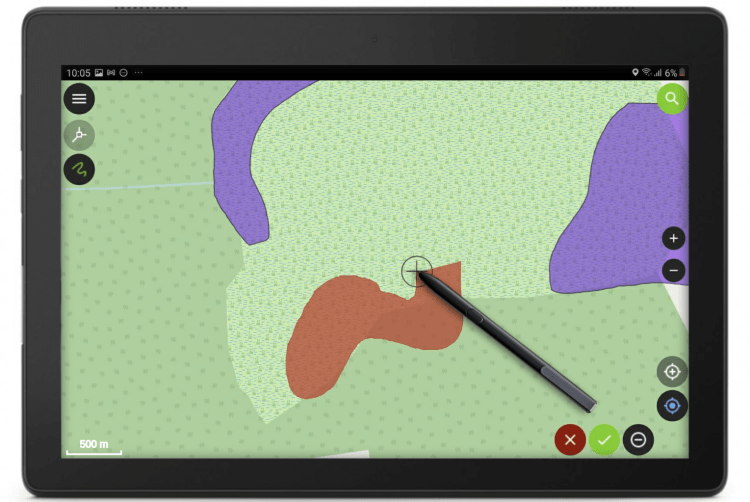

**Get fieldwork smoothly and nimbly done despite the ice and snow outside. Collect accurate data with freehand digitizing and improved form widgets, use the data from your external GNSS receivers without any third-party apps and enjoy the pleasant usability of QField 1.8 Selma.**
This year started off hi-speed for us. There’s been already a lot of coding, designing and teaching, and we’ve thrown ourselves into these things we love to do. And we published another QField release last week that I completely forgot to announce in this blog. But here it is. It’s QField 1.8, Selma. And it’s packed with cool features. 
Let’s have a look.
## Freehand drawing
This might be a feature that brings a lot of fun and professionalism to your work. The freehand digitizing mode allows the user to “draw” lines and polygons with the stylus pen. The mode is available for adding line/polygon features as well as for the ring tool of the geometry editor.

Together with the powerful options in the topological editing where you can snap to existing features and avoid overlaps, it’s very convenient to digitize complex shapes.
## Zoom in and out
Speaking of fun. One day, a guy from the QGIS community asked us if we could implement the functionality to zoom in and zoom out like he is able to do with an app called Maps from a company named Google. I didn’t know what he meant, but he explained: Single finger double tap-and-hold zoom gesture (which allows you to zoom smoothly from anywhere on the screen). Wow! Didn’t know it before, but it’s super neat! So we made it available in QField as well.

If you are used to it, it’s quite easy. But for beginners it can be a bit difficult. So for people who are not that deft – and to keep the UX self-explanatory and simple – we also added two buttons + / – to zoom in and zoom out with just one finger. So now even a clumsy pirate with a hook instead of a hand can collect data with QField 🙂
## Powerful Relation Reference Widget
Let’s be a little bit more serious and talk about how powerful the relation reference widget has become.
### View and Edit selected feature
The intuitive eye icon next to the widget lets you open the form of the referenced parent feature to view and edit it.
### Autocomplete mode
When auto-complete is enabled, you can easily perform a search in all available parent features.

With space-separated input, you can search for the beginning of multiple words in the display name of the parent features. So in this example searching for “Ma” will find the name “Mae” and “Marie” and using the second word “buck” it finds the Buckfast bees – so the entries containing both values will be listed on top.
## Integration of external GNSS receivers
In case you wondered, why we did not release 1.8 Selma earlier? Because we wanted to have it feature loaded and rocket proof. And one of this cool feature is the integration of external GNSS receivers.
QField can receive and decode NMEA sentences received via Bluetooth from an external GNSS receiver (such as an EMLID Reach RS2) without the need for any third party app.

Search for paired Bluetooth devices in the device settings, connect to the external device and receive the GNSS information.
## Select vertical grid shift files
In the QField settings, you can select a grid file on your mobile device by placing it in a directory named `QField/proj` in the main folder of the internal storage to increase the vertical location accuracy.
## Postgres Config File
If you once started using PostgreSQL configuration files, you don’t want to live without them anymore. And when you use it on your PC, I’m sure you want to use it on your mobile device as well.
Define Postgresql services in a pg_service.conf file and use it on QField by placing it directly in a directory named `QField` in the main folder of the internal storage.
## Add reload data button
The layer properties have been polished and in addition, you will find a button to reload the layer data. This is especially useful if you use WFS layers from which you need to get updates.

## Register extra fonts
Also, you can add `TTF` and `OTF` font files into a directory named `QField/fonts` at the main folder of the internal storage to use the nice fonts you like.

How beautiful is that!
## Support of new raster file formats
By the way: Many new raster file formats are supported – most notably [COG](<https://www.cogeo.org/>). While not yet supported as remote format streamed directly from the web, it is also a high performance format if used locally
## What about the cloud?
You might be one of these people eagerly waiting and always receiving the same message: Keep calm, it’s coming soon. Sorry for that. But when we do something, we do it right. And we prefer to have a stable solution than to publish half baked stuff. We are still highly busy coding, testing and promoting [QFieldCloud](<https://qfield.cloud/>). It’s announced for this spring / early summer. 
Also, keep an eye on the [@QFieldForQgis](<https://twitter.com/qfieldforqgis>) and [@QFieldCloud](<https://twitter.com/qfieldcloud>) twitter accounts to stay updated.
## We ♥ our Beta Testers
The Beta Testers are our secret heroes. They report bugs and inconveniences before the normal users are bothered with them. Thanks to the Beta Testers QField is so stable. And at this point we would like to say: Thank you, test heroes!
And what do the beta testers get in return? Well, they can be the very first to try out the great new features. This is exciting and fun. So don’t hesitate. Join the beta.

In the Play Store you should find this section under the “QField for QGIS” app listing. Enjoy the feature frenzy and report the problems at [qfield.org/issues](<https://qfield.org/issues>)
## And if you wondered…
… why this release is called “Selma”. It’s of course because of the Mount Selma in Australia… And because it’s the name of my beloved cat. That’s her – Selma Eulenkopf – staring at me while I’m coding QField.

### _Related_
