Today, on QField’s 10th anniversary, we’re extremely proud to publish the results of over [18 months](<https://github.com/opengisch/qfieldcloud/graphs/contributors>) of development and give you [the source code of QFieldCloud](<https://github.com/opengisch/qfieldcloud/pull/3>) to go and make your awesome adaptations, solutions, and hopefully contributions 🙂
If you want to quickly try it out, head to [https://qfield.cloud](<https://qfield.cloud/>) where our hosted solution is running and secure yourself a spot in the beta program.
QFieldCloud’s unique technology allows your team to focus on what’s important, making sure you efficiently get the best field data possible. Thanks to the tight integration with the leading GIS fieldwork app QField, your team will be able to start surveying and digitising data in no time.
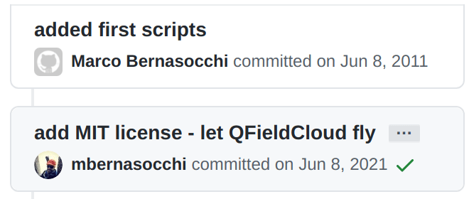After 10 years of [OPENGIS.ch](</index.html>) giving to the QGIS community, here is our latest present. Happy birthday #fieldmapping with QGIS <https://github.com/opengisch/qfieldcloud/pull/3>
What a journey it was and what plans do we already have… It has now been 10 years since I [pushed the first scripts](<https://github.com/qgis/QGIS-Android/commit/664145015f31783a5687807a7b77049d4e6938c9>) to build Quantum GIS for Android and it is incredible what we’ve been able to achieve thanks to a vibrant community, sponsors and especially our [fantastic team](</index.html#team>).
At [OPENGIS.ch](</index.html>) we strongly believe in [giving back](</i-nostri-valori/index.html#give-back>). We live from open-source projects and are deeply committed to sustaining their technological and [economic](<https://www.qgis.org/en/site/about/sustaining_members.html#list-of-current-sustaining-members>) [well-being](<https://www.osgeo.org/sponsors/>). We also believe everyone should have access to the best possible tools and knowledge. By committing ourselves to develop open-source applications, we give everyone access to powerful tools to plan, review and mitigate geospatial issues.
That is why we are even more thrilled to have created and open-sourced a professional data and team management solution for the best [QGIS fieldwork app](<https://qfield.org/>) and would like to share a bit of the history of how we revolutionised field work by creating QField for QGIS.
## Prehistory – QGIS for Android is born
Stone-, bronze-, iron-age, you get it, the beginnings of field mapping in the QGIS world were pretty rough around the edges. It all started thanks to me [being accepted](</2011/04/25/gsoc-2011-im-in/index.html>) in the Google Summer of Code 2011 programme with the “QGIS mobile” [submission](<https://issues.qgis.org/projects/qgis/wiki/QGIS_Mobile_GSoC_2011>). In the following 3 months, I’d try, with the help of my mentors Pirmin Kalberer and Marco Hugentobler, to get Quantum GIS to run on my tablet.
### The first start
> Hi all, it is a pleasure to announce that I finally got Quantum GIS to start on an android (3.2) tablet (Asus transformer). I tested as well on a Samsung Galaxy phone with cyanogen mod 7 RC1 and it works well (with the obvious screen size limitations).  
> Qgis still doesn’t load many elements, but the GUI is there and the rest should be only minor issues. I’ll post more as soon as I make further developments. Meanwhile, if you want to test the apk, you can download it from my GitHub [here](<https://github.com/downloads/mbernasocchi/qgis-android/Qgis-debug.apk>). For building your own, have a look at [qgis wiki](<https://qgis.org/wiki/QGIS_Mobile_GSoC_2011>)
> [https://www.opengis.ch/2011/08/17/qgis-on-android/](</2011/08/17/qgis-on-android/index.html>)
The first ever video about QGIS on Android
### A proper GUI
> See my last posts. In short, I managed to get qgis packaged as an APK and to properly run with only one major problem. The map canvas is always black. I’ll investigate this till Tuesday.  
> Cheers
> [https://www.opengis.ch/2011/08/18/qgis-on-android-has-a-proper-gui/](</2011/08/18/qgis-on-android-has-a-proper-gui/index.html>)
After 3 months of intensive work, QGIS for android finally has a a proper GUI
### Blazing fast startup
> Hi, I just managed to create an APK with all the resources needed by qgis …
> The only inconvenience at the moment is that at the first startup the app shows a black screen while it’s copying the files for about **30 to 60sec** so just be patient and remember that the whole app will take up to 230MB (it installs on external storage by default)
> [https://www.opengis.ch/2011/08/19/qgis-on-android-has-complete-gui-and-supports-translations/](</2011/08/19/qgis-on-android-has-complete-gui-and-supports-translations/index.html>)
### A working reality
I still remember the feeling that day when after almost 3 months, of fighting with shell scripts, patching of build systems, debugging via ADB, writing C++ in Java wrappers and so on, my Quantum GIS test project was suddenly running on my tablet… I Was so happy I just went running in the mountains :). 
> Just a quick screenshot to show that qgis on android is now a working reality. Tomorrow I’ll make a video and so on. The major missing thing now is reading SHP files ad maybe spatialite… maybe tomorrow. Now it’s Sunday ?
> [https://www.opengis.ch/2011/08/21/qgis-android-works-2/](</2011/08/21/qgis-android-works-2/index.html>)
  - 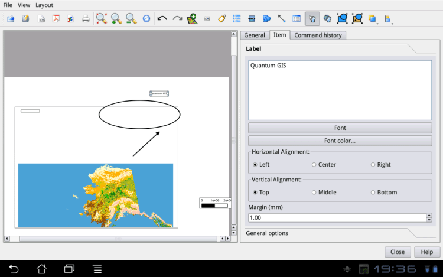First data is shown on the print composer
  - 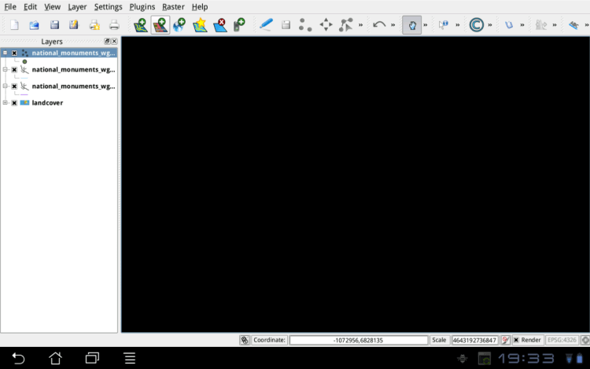Map canvas still had some glitches
  - 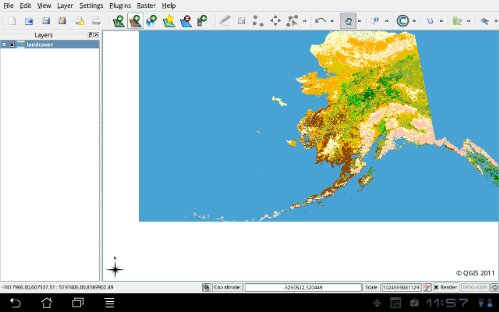Finally a map is rendered in the canvas

### GSoC 2011 results
At the end of the Google Summer of code, I received my MSc in geoinformatics and left for 3 Months to Indonesia working as a consultant/developer for the World-bank Global Facility for Disaster Reduction and Recovery.
> So, it is over, after 3 months of working on QGIS for android as a Google Summer of Code project it is now time to wrap up what I did and didn’t do.  
> First of all a QGIS android app exists now and it has many features including:  
> – reading/writing projects  
> – raster support  
> – spatialite support  
> – WMS support  
> – (apparent – untested) WFS and Postgres support  
> – partial shape files support (string attributes still crash the app)  
> – Fully functional GUI (SymbologyV2 doesn’t work yet)  
> – (all?) core C++ plugins beside globe (any takers? ?)  
> Furthermore, I created a series of build scripts that make it easier to set up a dev environment.  
> Unfortunately, I didn’t manage to implement live GPS tracking and a larger GUI optimisation, but all in all, I’m very happy with the results and seeing that few peoples are already testing it. Soon ill publish a video.  
> cheers
> [https://www.opengis.ch/2011/08/24/gsoc-2011-final-report/](</2011/08/24/gsoc-2011-final-report/index.html>)
Quantum GIS for Android was a reality and I was fully committed to keeping working on it. Turns out I wasn’t wrong 🙂
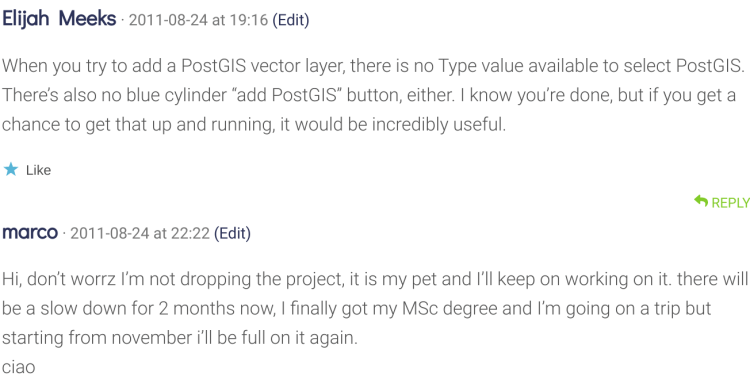A commitment is a commitment 🙂
## Classical – QGIS for Android grows
The Next Era of QGIS for android is what could be seen as the time of great knowledge enhancement, philosophical musings and the rise of the first great features including:
  - [GPS support](</2012/01/31/qgis-on-android-gets-gps-support/index.html>) including [external GPS](</2012/05/01/qgis-on-android-using-external-gps-receivers/index.html>)
  - [Compass support](</2012/02/01/qgis-gets-compass-support/index.html>)
  - [Right-click support](</2012/02/16/qgis-on-android-gets-right-click-support/index.html>)
  - [Pinch zooming, tap zooming and panning](</2012/03/01/qgis-for-android-gets-pinch-zooming/index.html>)
  - [armeabi-v7a optimizations](</2012/02/23/qgis-for-android-alpha-6/index.html>)
  - [the 3.2″ screen experiment](</2012/03/30/qgis-on-android-phone/index.html>)
  - [Extreme environment testing](</2012/05/12/qgis-4200m/index.html>)

## Middle Ages – QGIS Mobile
The dark ages, times of instability, change and some setbacks. Sounds terrifying, it was not at all, on the contrary it was a very formative period that apexed with the fantastic release of QGIS 2.0 for android.
### The QML app experiment
From the beginning on, the idea behind QGIS for android was to eventually ditch the GUI and build a dedicated one for touch devices. The [https://web.archive.org/web/20120826232000/https://rcarrillo.org/” target=”_blank”>Google Summer of code 2012](<https://web.archive.org/web/20120826232000/https://rcarrillo.org/>) by Ramon Carrillo mentored by myself set off to do that. Unfortunately, the project encountered some roadblocks and never took off as expected, but it did lay some ideas and [code](<https://github.com/rcarrillo/Quantum-GIS/commits/mobileapp-qml>) for the future.
  - 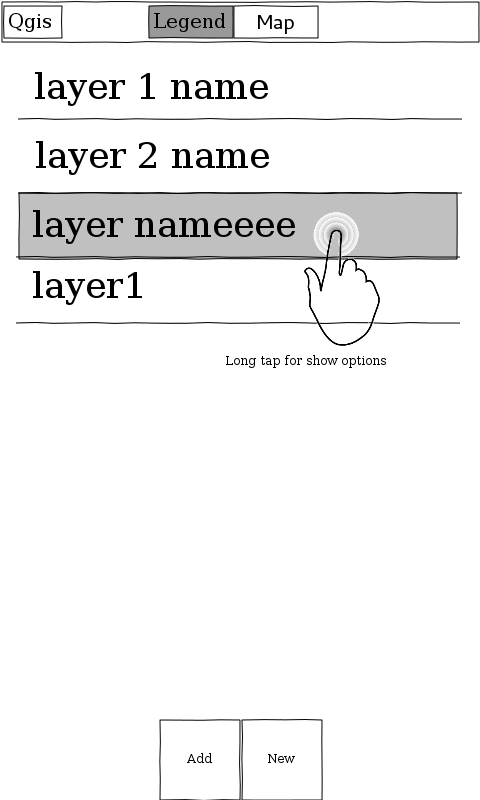UX mockup for the first QML based app
  - UX mockup for the first QML based app
  - 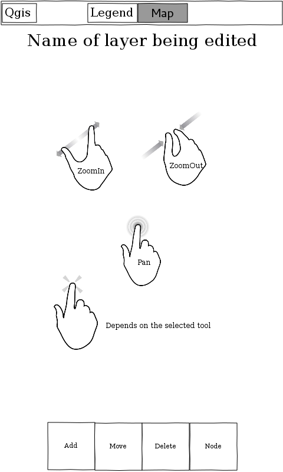UX mockup for the first QML based app
  - 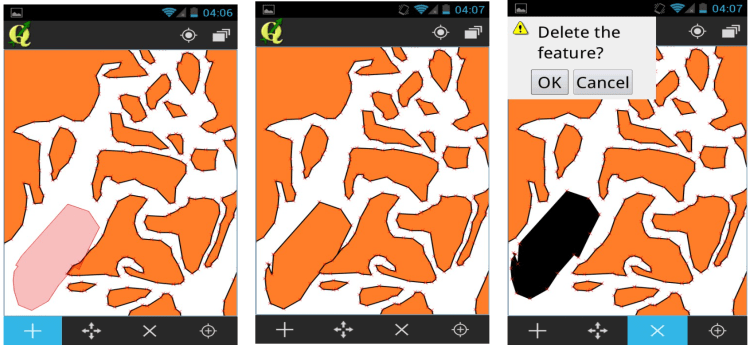Screenshots of the first QML based UI

### The Python failure
Probably the major setback in QGIS for android’s history was the non-completion of the Python support. I got really close to it multiple times but unfortunately never managed to tame the snake. Maybe something we’ll look into in future, who knows.
> [Python support in qgis is getting there](</2013/05/20/python-support-in-qgis-is-getting-there/index.html>)
> [Getting closer to taming the snake](</2013/05/21/getting-closer-to-taming-the-snake/index.html>)
> [Python support even closer](</2013/05/21/python-suport-even-closer/index.html>)
### The QGIS 2.0 release
The pivotal point of the Middle Ages was definitely 20.09.2013, when Tim Sutton presented to a full auditorium the shiny new QGIS 2.0. And along with it it introduced the general availability of QGIS 2.0 on android. The first real QGIS version for mobile devices was finally available for the broad public.
  - 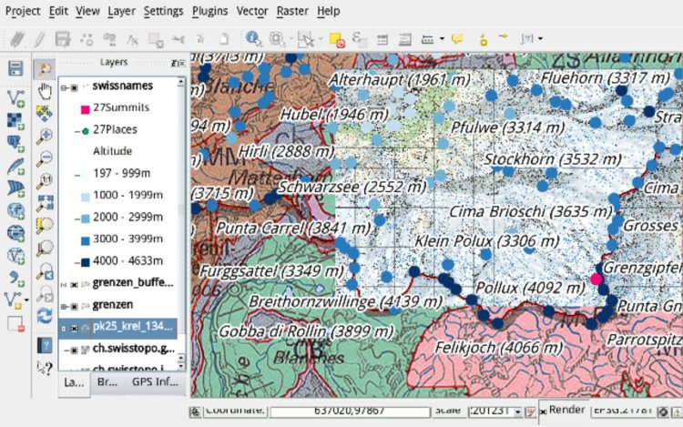
  - 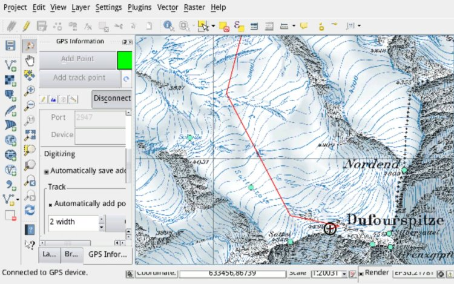
  - 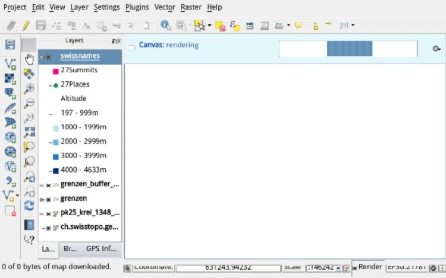
  - 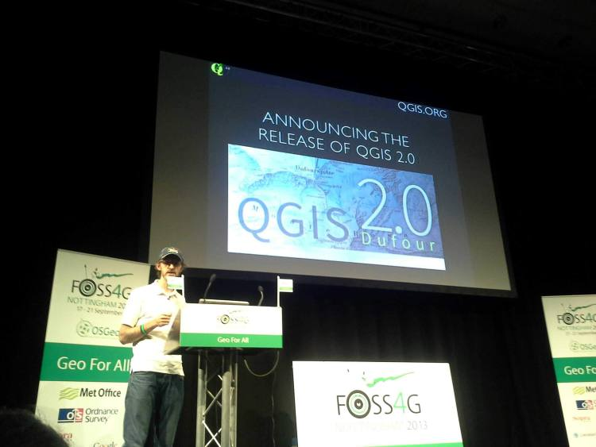Tim Sutton announcing QGIS 2.0
  - 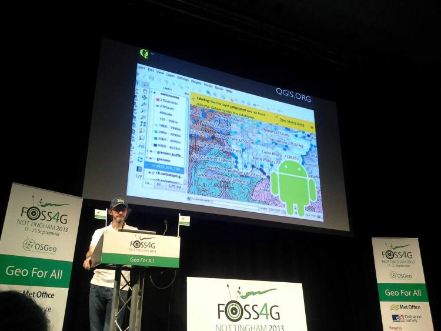Tim Sutton announcing QGIS 2.0 for Android

QGIS 2.0 general availability for Android
After the launch followed a very active time of keeping QGIS for Android on pair with the desktop versions leading to a regular release of updates on the playstore between 2013 and late 2014. This is also when Matthias Kuhn started committing to the QGIS for Android [repository](<https://github.com/qgis/QGIS-Android/graphs/contributors>).
## Early Modern – QField for QGIS is here
Humanism, Renaissance and Enlightenment are what we saw happening in the period between 2015 and early 2019. Field users were put at the centre of the design process, new ideas were explored and a new name was chosen to reflect the main goal of the application: **Make fieldwork as efficient as possible**.
Early 2015 was also when Matthias Kuhn and myself decided to join forces in OPENGIS.ch LLC.
### The rebranding
The project never had a clear name, at times it was called QGIS for Android at times QGIS mobile, we felt that to clearly convey what we were building we needed a clear, simple and poignant name.
Beginning of 2015 saw the last rebranding
> It is with great pleasure that we want to announce the new name for what was briefly known as QGIS mobile.
> **Please welcome QField for QGIS™!**
> After long thinking about various names and variants including QGIS mobile, QTouch, OPENGIS.ch QGIS mobile, QWork, and many more, we felt that QField represents best what we want to archive. A field data capture and management app fully compatible with QGIS™.
> [https://www.opengis.ch/2015/01/28/qgis-mobile-is-now-qfield/](</2015/01/28/qgis-mobile-is-now-qfield/index.html>)

> QField Experimental is out, after a couple of months of requirements gathering, private early alpha testing and foremost tons of emails requesting access to the testes group we decided today to put the current BETA version in the playstore.
> [https://www.opengis.ch/2015/06/15/qfield-in-the-wild/](</2015/06/15/qfield-in-the-wild/index.html>)
### Streamlined installation
Since the beginning of QGIS for android, to distribute the needed Qt libraries, we used a project called “ministro”. This was interesting because it allowed to download the libraries only once but on the other hand, it was a very painful experience for the user that needed to install a second app before getting QField to start. Around the end of 2015 it was so far, we finally managed to get rid of that dependency and make the installation process as streamlined as possible.

> It’s done, finally we managed to get rid of Ministro so that we finally can say, QField runs on any android from 4.0.3 (ICS). This makes as of today (according to [google](<https://developer.android.com/about/dashboards/index.html>)) 96% of the android installations worldwide.
> [https://www.opengis.ch/2015/12/01/qfield-for-android-5/](</2015/12/01/qfield-for-android-5/index.html>)
## Release candidates
In these 3.5 years, a continuous, mainly volunteer-driven iterative process led by Matthias Kuhn made QField grow to the point where we felt confident it was time to launch QField 1.0. 
After a series of release candidates with lots of feedback from the community, we felt it was time to move into a New Era.

> It was a long and winding road but we are very excited to announce the general availability of QField 1.0 Release Candidate 1.
> Packed with loads of useful features like online and offline features digitizing, geometry and attributes editing, attribute search, powerful forms, theme switching, GPS support, camera integration and much more, QField is a powerful tool for those who need to edit on the go and would like to avoid standing in the swamp with a laptop or paper charts.
> [https://www.opengis.ch/2019/01/08/qfield-1-0-rc1/](</2019/01/08/qfield-1-0-rc1/index.html>)
## Modern times – QField 1.X
Fast forward to March 28th 2019, 

> Let’s get straight to the point
> **It’s official, QField for QGIS 1.0 is out!**
> Get it while it’s hot on the Playstore ([qfield.org/get](<https://qfield.org/get>)) or on [GitHub](<https://github.com/opengisch/QField/releases>)
> We are incredibly pleased and proud of just having released such a jewel and are convinced that thanks to all its features and conscious design choices, QField will make your field digitizing work much more efficient and pleasant.
> [https://www.opengis.ch/2019/03/28/qfield-1-0-is-here/](</2019/04/12/qfield-1-0-e-qui/index.html>)
### Recent releases
In the last 2 years the development pace increased tremendously, the sponsored featured grew as never before, QField rating skyrocketed to 4.7 ⭐ we currently have 100’000 active users and we’re getting around 500 new users every day.
Our QField core team grew more and now thanks to David Signer’s lead and Mathieu Pellerin keen eye for UX we’re pushing QField even further.
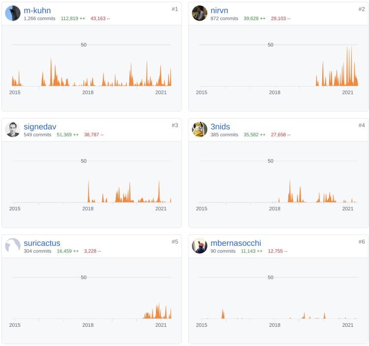
Going into all releases would be so much information that this post would turn into a 3 volumes classic, and since starting from QField 1.0 we’ve documented each new release, we’re just going to link them: [https://www.opengis.ch/category/qfield/highlights/](</category/qfield-it/highlights/index.html>)
## The future is cloudy – ehm sunny of course 😉
Yesterday we published QField 1.9.6, which is going to be the last 1.X release and will put QField 2.0 into the beta channel so that every beta tester can start using [QFieldCloud](<https://qfield.cloud/>) without having to use the [developer version](<https://play.google.com/store/apps/details?id=ch.opengis.qfield_dev>). 
But that is a different story and you can read all about it in our latest [newsletter](<https://mailchi.mp/opengis.ch/seamless-fieldwork-with-qfieldcloud-is-around-the-corner#qfieldcloud>)…



[https://vimeo.com/27793965](<https://vimeo.com/27793965>)



[https://vimeo.com/27854857](<https://vimeo.com/27854857>)



[https://vimeo.com/36862461](<https://vimeo.com/36862461>)



[https://vimeo.com/75261402](<https://vimeo.com/75261402>)



[https://vimeo.com/116231850](<https://vimeo.com/116231850>)

### _Related_
