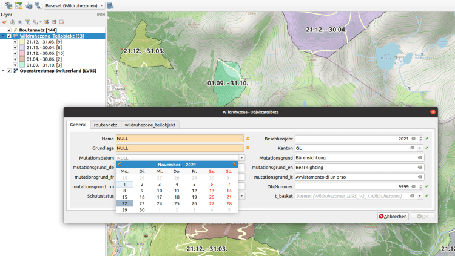

**Den QGIS Model Baker gibt’s ja schon lange. Vor mehr als vier Jahren kam die Version 1.0.0 heraus – damals noch unter dem Namen QGIS Project Generator. Seither ist viel geschehen. Und speziell in diesem Jahr ist viel betreffend Benutzbarkeit gegangen. DerUsabILIty Hub ist integriert, Baskets und Datasets werden unterstützt und dank eines Wizards verliert sich der Benutzer nicht mehr in Konfigurationen und Dialogen.**
Dieser Blogeintrag beginnt mit kurzen Einführung in Model Baker und INTERLIS.  
Falls das für dich alles schon lange bekannt ist kannst du gleich zu den Neuigkeiten wie dem Wizard springen ?
## Was ist Model Baker?
Der _Model Baker_ ist ein QGIS Plugin, mit dem sich ein QGIS Projekt schnell aus einem physikalischen Datenmodell erstellen lässt. Der _Model Baker_ analysiert die existierende Struktur und konfiguriert ein QGIS Projekt mit allen verfügbaren Informationen. Durch diese Automatisierung kann der Konfigurationsaufwand massiv gesenkt werden.
Modelle, die in INTERLIS definiert wurden, bieten zusätzliche Metainformationen wie Domains, Einheiten von Attributen oder objektorientierte Definitionen von Tabellen. Dies kann genutzt werden, um die Projektkonfiguration noch weiter zu optimieren. Der _Model Baker_ verwendet _[ili2db](<https://github.com/claeis/ili2db/blob/master/docs/ili2db.rst>)_ , um ein INTERLIS Modell in eine physikalische Datenbank zu importieren und die Metainformationen, um Ebenenbaum, Feldwidgets mit Bedingungen, Formularlayouts, Relationen und vieles mehr zu konfigurieren.
Ausserdem lässt sich der _Model Baker_ auch als Framework für andere Projekte verwenden. Das Plugin [Asistente LADM-COL](<https://github.com/SwissTierrasColombia/Asistente-LADM-COL>), das für die [kolumbianische Umsetzung des Land Administration Domain Model (LADM)](<https://www.proadmintierra.info/>) erstellt wurde, nutzt den _Model Baker_ als Library, um möglichst viel der spezifischen Lösung als QGIS Kernfunktionalität umzusetzen.
## Was ist Interlis?
[INTERLIS](<https://www.interlis.ch/>) ist eine Datenbeschreibungssprache und ein Transferformat mit besonderer Berücksichtigung von Geodaten. INTERLIS bietet die Möglichkeit, räumliche Daten genau zu beschreiben, modellkonform zu integrieren und unter verschiedenen Anwendern einfach auszutauschen. In der Geoinformationsgesetzgebung ist INTERLIS seit 2008 verbindlich verankert. Da INTERLIS seit Version 2 objektorientiert ist, lässt es sich sehr einfach erweitern. Das bedeuted, dass zBs. der Bund ein Modell definiert, dass die kantonalen Stellen nach ihren Bedürfnisse ableiten und erweitern können.
### Beispiel eines Interlis Modelles
Das INTERLIS Bundesmodell `Wildruhezonen_LV95_V2_1` sieht (stark vereinfacht) so aus:
    
    MODEL Wildruhezonen_LV95_V2_1 (de)
    VERSION "2020-04-21"  =
      IMPORTS GeometryCHLV95_V1,LocalisationCH_V1,CHAdminCodes_V1,Wildruhezonen_Codelisten_V2_1;
    
      TOPIC Wildruhezonen =
        DEPENDS ON Wildruhezonen_Codelisten_V2_1.Codelisten;
    
        DOMAIN
          Polygon = SURFACE WITH (STRAIGHTS) VERTEX GeometryCHLV95_V1.Coord2 WITHOUT OVERLAPS > 0.001
    
        CLASS Wildruhezone =
          ObjNummer : MANDATORY 0 .. 9999;
          Kanton : MANDATORY CHAdminCodes_V1.CHCantonCode;
          Name : MANDATORY TEXT*80;
          Schutzstatus : MANDATORY Wildruhezonen_Codelisten_V2_1.Codelisten.Schutzstatus_CatRef;
          Grundlage : MANDATORY TEXT*250;
          Beschlussjahr : MANDATORY INTERLIS.GregorianYear;
          Mutationsdatum : INTERLIS.XMLDate;
          Mutationsgrund : LocalisationCH_V1.MultilingualMText;
        END Wildruhezone;
    
        CLASS Routennetz =
          Geo_Obj : MANDATORY Linie;
          Wegtyp : MANDATORY Wildruhezonen_Codelisten_V2_1.Codelisten.Wegtyp_CatRef;
          Einschraenkung : TEXT*254;
        MANDATORY CONSTRAINT NOT (Wegtyp->Reference->Code == "W1") OR NOT (DEFINED (Einschraenkung));
        END Routennetz;
    
        CLASS Wildruhezone_Teilobjekt =
          TeilObjNummer : MANDATORY TEXT*30;
          Bestimmungen : MANDATORY Wildruhezonen_Codelisten_V2_1.Codelisten.Bestimmungen_CatRef;
          Bestimmungen_Kt : LocalisationCH_V1.MultilingualMText;
          Zusatzinformation : TEXT*500;
          RefKanton : INTERLIS.URI;
          Schutzzeit : MANDATORY TEXT*250;
          Geo_Obj : MANDATORY Polygon;
        MANDATORY CONSTRAINT NOT (Bestimmungen->Reference->Code == "R900" OR Bestimmungen->Reference->Code == "E900") OR DEFINED (Bestimmungen_Kt);
        END Wildruhezone_Teilobjekt;
    
        ASSOCIATION RoutennetzWildruhezone =
          WRZ_Routennetz -- {0..*} Routennetz;
          WRZ -<#> {1} Wildruhezone;
        END RoutennetzWildruhezone;
    
        ASSOCIATION Wildruhezone_TeilobjektWildruhezone =
          WRZ_Teilobjekt -- {1..*} Wildruhezone_Teilobjekt;
          WRZ -<#> {1} Wildruhezone;
        END Wildruhezone_TeilobjektWildruhezone;
      END Wildruhezonen;
    END Wildruhezonen_LV95_V2_1.
Das [Original findest du im Model Repository des BAFU](<https://models.geo.admin.ch/BAFU/Wildruhezonen_V2_1.ili>) Es ist grunsätzlich “lesbar” aufgebaut – aus Sicht eines Technikers. Ein Blick auf das UML erleichtert das Verständnis.

### Vom INTERLIS Modell zum QGIS Projekt
Oft bekommen Benutzer einfach ein paar Files mit Endungen `ili` oder `xtf` und sie wissen nicht genau, was damit anzufangen ist.
Glücklicherweise dürfen wir im Release 6.6 einen brandneuen Wizard vorstellen, der im darauf folgenden 6.7. gleich noch erweitert wurde. Die Idee ist, dass Poweruser die Kontrolle sehr wohl behalten können, man allerdings nicht zwingend wissen muss was man in welcher Reihenfolge geschehen soll. Man wird dafür automatisch durch den Prozess begleitet. Lasst uns ein Beispiel durchspielen.
## Der brandneue Wizard ?
Nehmen wir zum Beispiel Frederick. Frederick hat in seinem CV ein bisschen übertrieben. Eigentlich hat er keine Ahnung von INTERLIS Modellen. Jetzt hat ihm aber jemand einige Files geschickt, die er sich in QGIS anschauen soll:
  - Wildruhezonen_V2_1.ili
  - Wildruhezonen_Catalogues_V2_1.xml
  - wrz_bundesmodell.xtf

Würde Frederick den _Model Baker_ Wizard öffnen, hätte er verschiedene Optionen zur Auswahl:
  - Daten hinzufügen
  - Ein Projekt aufgrund einer bestehenden Datenbank erstellen
  - Daten exportieren

Tut Frederick aber nicht. Die Angst noch in der Probezeit entlassen zu werden, lähmt seinen Geist. Aber da er irgend etwas tun muss, zieht er die Files ohne zu Überlegen ins QGIS rein. Glücklicherweise werden die Files mit der Endung `xtf`, `ili` und `xml` vom _Model Baker_ erkannt und die Wizard-Seite für das Hinzufügen von Datenquellen wird geöffnet.

### Daten hinzufügen
Man kann Datenquellen auf verschiedene Weisen hinzufügen. Entweder man zieht sie wie Frederick ins QGIS oder man gelangt über die erste Wizard Option “Daten hinzufügen” auf dieselbe Seite. Dort kann man weitere Files mit Drag’n’Drop reinziehen oder über den File Browser öffnen und mit dem + Button hinzufügen. INTERLIS Modelle kann man aber auch von einem Repository laden. Einfach den Namen oben eintippen und hinzufügen.
> **Was ist denn überhaupt ein Repository?**
> Implementierte INTERLIS Modelle lassen sich automatisch übers Web finden. Dazu dient als Index die Datei ilimodels.xml auf [https://models.interlis.ch](<https://models.interlis.ch/>) und auf den mittels der Datei ilisite.xml verknüpften Repositories. Diese Repositories sind neben dem Bundesrepository auch eine Vielzahl an Kantonalen Repositories. Somit stehen uns im Model Baker die Modelle des gesamten Schweizer Geodatenkatalog zur Verfügung, die im INTERLIS Format vorhanden ist.
### Datenbank auswählen
Im nächsten Schritt konfiguriert man die Datenbankverbindung. Frederick wählt seine PostgreSQL Datenbank und ein neues Datenbankschema. Auch GeoPackage oder MSSQL werden unterstützt.
### Umsetzung der Modelle

Schliesslich sieht Frederick eine Auflistung der Modelle, die physikalisch umgesetzt werden können. Es werden einerseits die Modelle aus dem von ihm hinzugefügten `ili` File angezeigt, wie auch die Modelle, die aus dem Katalog- oder Transferfile (`xtf` oder `xml`) geparst worden sind und vom Repository geladen werden könnten. Doppelt gefundene Modelle werden angezeigt, allerdings nicht angewählt. Frederick könnte die Auswahl noch abändern, tut er aber nicht. Stattdessen schaut er, was man in den “Erweiterten Optionen” machen kann.
In den “Erweiterten Optionen” lassen sich Parameter für `ili2db` setzen, wie beispielweise die Art, wie Vererbungen umgesetzt werden (`smartInheritance`) oder ob man zusätzliche Metaattributfiles (`toml`) laden möchte. Auch das lässt Frederick wie vorgeschlagen.
Was er aber hier noch sieht ist ein Eingabefeld, das ihm erlaubt “Toppings” vom UsabILIty Hub zu laden. Er klickt drauf und findet einen Eintrag. Der Eintrag wurde aufgrund des Modells `Wildruhezonen_LV95_V2_1` gefunden und beim Anwählen werden Frederick verschiedene Konfigurationen geladen.
> **Was ist denn überhaupt der UsabILIty Hub?**
> Die Idee des UsabILIty Hub ist es, für Implementierte INTERLIS Modelle Zusatzinformationen automatisch übers Web zu empfangen. So wie wir Modelle durch die Anbindung der Datei `ilimodels.xml `von [https://models.interlis.ch](<https://models.interlis.ch/>) und den verknüpften Repositories erhalten können, können wir die Zusatzinformationen mit der Datei `ilidata.xml` auf dem UsabILIty Hub (derzeit [https://models.opengis.ch](</models.opengis.ch/index.html>)) und den verknüpften Repositories erhalten. Einstellungen für Tools werden in einer Metakonfigurationsdatei konfiguriert, ebenso wie Links zu Toppingfiles, die Informationen zu GIS Projektes enthalten (wie zBs. Symbologien oder Legendenstrukturen). Somit bestehen diese Zusatzinformationen meistens aus einer Metakonfiguration und beliebig vielen Toppings. 
In den Metakonfigurationsfiles können auch Katalogfiles verlinkt sein. Die für die Kataloge benötigten Modelle würden hier automatisch dazugefügt. Ebenso wird das `ilidata.xml` auch nach mit den Modellen verknüpften Katalogen durchsucht, und wenn dabei die Modelle, auf welchen die Kataloge basieren, sauber erfasst sind, werden diese ebenfalls der Liste hinzugefügt.
Danach werden die Modelle mit _ili2db_ physikalisch erstellt.

Die Datenbankstruktur wurde erfolgreich umgesetzt.
### Daten importieren
Anschliessend werden die zu importierenden Transferfiles aufgeführt, die Frederick hineingezogenen hat. Auch hier würden die Kataloge, die im Metakonfigurationsfile vom _UsabILIty Hub_ erfasst gewesen wären automatisch hinzugefügt.
Da Kataloge oftmals als `xml` Files vorliegen, werden `xml` Dateien standartmässig als Kataloge gekennzeichnet und somit ins Dataset der Kataloge importiert. Für das Datenfile könnte Frederick ein neues Dataset über den Dataset Manager erstellen. Ansonsten wird das Standard-Dataset (“Baseset”) verwendet.

> **Was sind Datasets?**
> Datasets sind Datensätze eines bestimmten räumlichen oder thematischen Bereichs, die aber die Modellstruktur nicht tangieren. Die Daten eines Datasets können so unabhängig von den anderen Daten verwaltet, validiert und exportiert werden. Eine kleinere Instanz sind die Baskets oder Behälter. Währenddem die Datasets meist das ganze Topic (oder sogar mehrere) umfassen, sind die Behälter meist Teil eines Topics. Oftmals sind sie sogar die Teilmenge von Topic und Dataset.
Auch hier erscheint wieder ein Eingabefeld mit dem Vermerk “Topping”. Hier werden die Kataloge aufgelistet, die im i`lidata.xml` verknüpft sind und über die Repositorien gefunden hätten werden können. In Fredericks Fall ist der einzige verlinkte Katalog allerdings schon aus seinen Files verfügbar. Auch wenn er dieses File nicht hinzugefügt hätte oder gar nicht erhalten hätte, stünde ihm der Katalog jetzt als Auswahl zur Verfügung.
Daten werden importiert und stehen jetzt in der Datenbank bereit, um gebacken zu werden.
### Und schliesslich wird alles gebacken
Im letzten Schritt kommt man zur Kernfunktion des _Model Bakers_. Der _Model Baker_ lädt die Tabellen der Datenbank in Layers, verknüpft diese mit Relationen, konfiguriert die Formulare und Feldwidgets und setzt die Bedingungen. Falls er im über den _UsabILIty_ _Hub_ geladenen Metakonfigurationsfile auch noch `qml` Files für spezifische Layers findet, werden auch diese geladen. Genauso die Legende.
Das Resultat ist ein fixfertiges, ready-to-use QGIS Projekt.

Fredericks Cheffin ist beeindruckt und entlässt ihn nicht. Zumindest nicht gleich. Frederick ist froh, war alles so einfach und er beginnt _Model Baker_ und _ili2db_ richtig gern zu benutzen. Schliesslich beginnt er sich über INTERLIS tiefgehend zu informieren. 
Doch auch später noch – als QGIS Poweruser und INTERLIS Pro – benutzt Frederick den _Model Baker_ mit all seinen Möglichkeiten.
Bon appetit!
### _Related_
