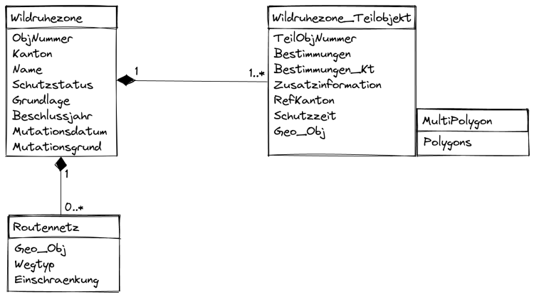
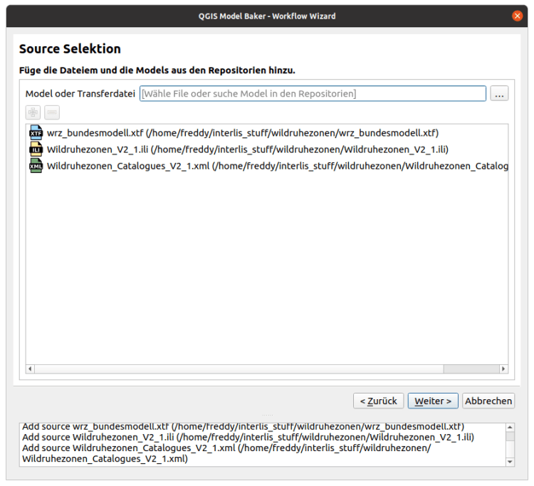
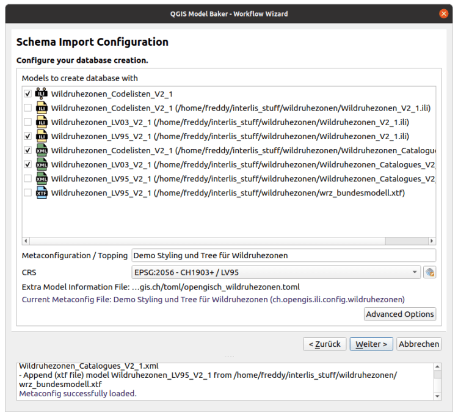
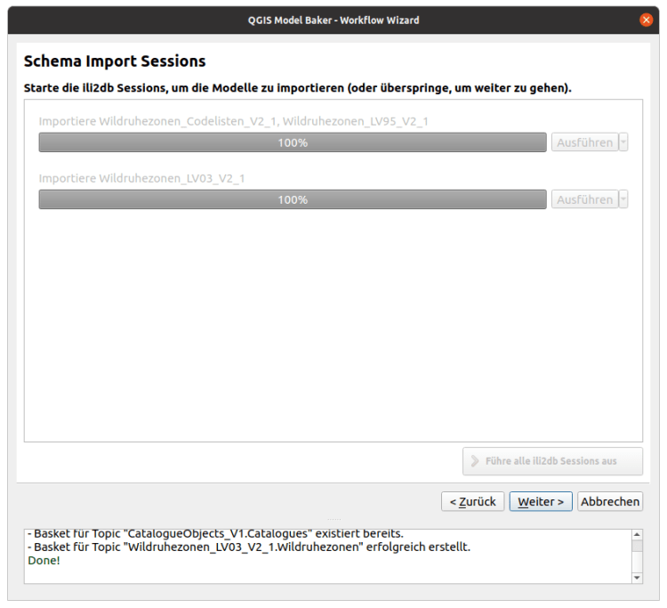
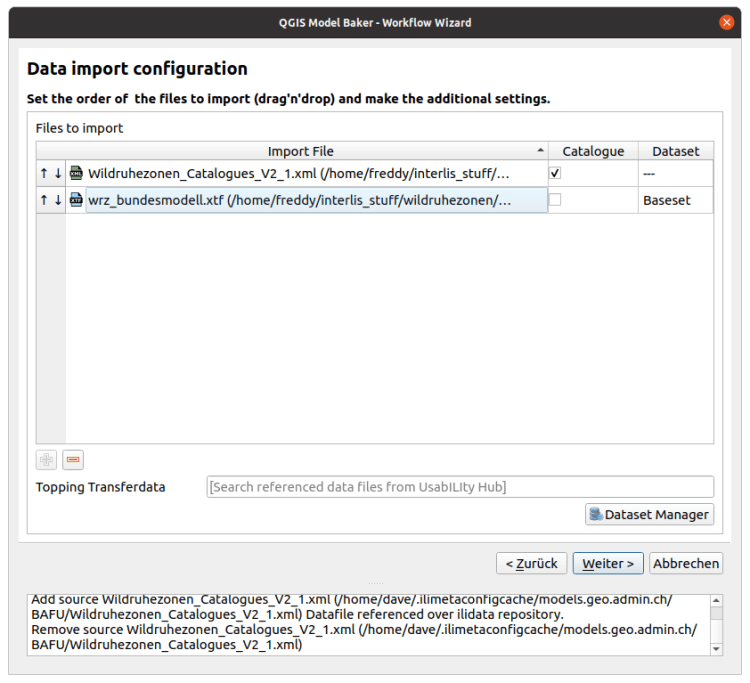

Le plugin QGIS Model Baker existe depuis longtemps. La version 1.0.0 est sortie il y a plus de quatre ans, à l’époque sous le nom de QGIS Project Generator. Depuis, il s’est passé beaucoup de choses. Et cette année en particulier, beaucoup de choses ont changé en ce qui concerne la facilité d’utilisation. L’ **UsabILIty Hub **est intégré, les **Baskets et Datasets **sont supportés et grâce à un guide, l’utilisateur ne se perd plus dans les configurations et les dialogues.
Ce blog commence par une brève introduction à Model Baker et INTERLIS. Si vous connaissez déjà tout cela, vous pouvez passer [directement aux nouveautés comme le Wizard. ](</wp-login7bcb.html?post=12398&action=edit#wizard>)?
## Qu’est-ce que Model Baker ?
Model Baker est un plugin QGIS qui permet de créer rapidement un projet QGIS à partir d’un modèle de données géographiques. _Model Baker_ analyse la structure existante et configure un projet QGIS avec toutes les informations disponibles. Cette automatisation permet de réduire massivement les efforts de configuration.
Les modèles définis dans INTERLIS offrent des méta-informations supplémentaires comme les domaines, les unités d’attributs ou les définitions orientées objet des tables. Cela peut être utilisé pour optimiser encore plus la configuration du projet. Model Baker utilise _[ili2db](<https://github.com/claeis/ili2db/blob/master/docs/ili2db.rst>)_ pour importer un modèle INTERLIS dans une base de données physique et les méta-informations pour configurer l’arborescence des couches, les widgets de champs avec conditions, les mises en page de formulaires, les relations et bien plus encore.
En outre, _Model Baker_ peut être utilisé comme cadre de travail pour d’autres projets. Le plugin [Asistente LADM-COL](<https://github.com/SwissTierrasColombia/Asistente-LADM-COL>), créé pour la mise en place du [Land Administration Domain Model (LADM) en Colombie](<https://www.proadmintierra.info/>), utilise Model Baker comme une bibliothèque afin d’implémenter autant que possible la solution spécifique comme fonctionnalité principale de QGIS.
## Qu’est-ce qu’Interlis ?
[INTERLIS](<https://www.interlis.ch/>) est un langage de description de données et un format de transfert qui tient particulièrement compte des géodonnées. INTERLIS offre la possibilité de décrire précisément des données spatiales, de les intégrer conformément au modèle et de les échanger facilement entre différents utilisateurs. INTERLIS est ancré de manière obligatoire dans la législation sur la géoinformation depuis 2008. Comme INTERLIS est orienté objet depuis la version 2, il est très facile de l’étendre. Cela signifie que, par exemple, la Confédération définit un modèle que les services cantonaux peuvent adapter à leurs besoins et élargir. Traduit avec www.DeepL.com/Translator (version gratuite)
### Exemple de modèle Interlis
Le modèle fédéral INTERLIS `Wildruhezonen_LV95_V2_1` se présente (de manière très simplifiée) comme suit :
    
    MODEL Wildruhezonen_LV95_V2_1 (de)
    VERSION "2020-04-21"  =
      IMPORTS GeometryCHLV95_V1,LocalisationCH_V1,CHAdminCodes_V1,Wildruhezonen_Codelisten_V2_1;
    
      TOPIC Wildruhezonen =
        DEPENDS ON Wildruhezonen_Codelisten_V2_1.Codelisten;
    
        DOMAIN
          Polygon = SURFACE WITH (STRAIGHTS) VERTEX GeometryCHLV95_V1.Coord2 WITHOUT OVERLAPS > 0.001
    
        CLASS Wildruhezone =
          ObjNummer : MANDATORY 0 .. 9999;
          Kanton : MANDATORY CHAdminCodes_V1.CHCantonCode;
          Name : MANDATORY TEXT*80;
          Schutzstatus : MANDATORY Wildruhezonen_Codelisten_V2_1.Codelisten.Schutzstatus_CatRef;
          Grundlage : MANDATORY TEXT*250;
          Beschlussjahr : MANDATORY INTERLIS.GregorianYear;
          Mutationsdatum : INTERLIS.XMLDate;
          Mutationsgrund : LocalisationCH_V1.MultilingualMText;
        END Wildruhezone;
    
        CLASS Routennetz =
          Geo_Obj : MANDATORY Linie;
          Wegtyp : MANDATORY Wildruhezonen_Codelisten_V2_1.Codelisten.Wegtyp_CatRef;
          Einschraenkung : TEXT*254;
        MANDATORY CONSTRAINT NOT (Wegtyp->Reference->Code == "W1") OR NOT (DEFINED (Einschraenkung));
        END Routennetz;
    
        CLASS Wildruhezone_Teilobjekt =
          TeilObjNummer : MANDATORY TEXT*30;
          Bestimmungen : MANDATORY Wildruhezonen_Codelisten_V2_1.Codelisten.Bestimmungen_CatRef;
          Bestimmungen_Kt : LocalisationCH_V1.MultilingualMText;
          Zusatzinformation : TEXT*500;
          RefKanton : INTERLIS.URI;
          Schutzzeit : MANDATORY TEXT*250;
          Geo_Obj : MANDATORY Polygon;
        MANDATORY CONSTRAINT NOT (Bestimmungen->Reference->Code == "R900" OR Bestimmungen->Reference->Code == "E900") OR DEFINED (Bestimmungen_Kt);
        END Wildruhezone_Teilobjekt;
    
        ASSOCIATION RoutennetzWildruhezone =
          WRZ_Routennetz -- {0..*} Routennetz;
          WRZ -<#> {1} Wildruhezone;
        END RoutennetzWildruhezone;
    
        ASSOCIATION Wildruhezone_TeilobjektWildruhezone =
          WRZ_Teilobjekt -- {1..*} Wildruhezone_Teilobjekt;
          WRZ -<#> {1} Wildruhezone;
        END Wildruhezone_TeilobjektWildruhezone;
      END Wildruhezonen;
    END Wildruhezonen_LV95_V2_1.
Vous trouvez [l’original dans le Model Repository de l’OFEV](<https://models.geo.admin.ch/BAFU/Wildruhezonen_V2_1.ili>) Il est fondamentalement conçu de manière « lisible » – du point de vue d’un technicien. Un coup d’œil sur l’UML facilite la compréhension.

### Du modèle INTERLIS au projet QGIS
Souvent, les utilisateurs reçoivent simplement quelques fichiers avec des extensions `ili` ou `xtf` et ils ne savent pas exactement quoi en faire.
Heureusement, nous avons le plaisir de présenter un tout nouvel assistant dans la version 6.6, qui a été étendu dans la version 6.7 suivante. L’idée est que les utilisateurs avancés peuvent garder le contrôle, mais qu’ils ne doivent pas nécessairement savoir ce qu’ils doivent faire et dans quel ordre. En revanche, on est automatiquement accompagné tout au long du processus. Prenons un exemple.
## Le tout nouveau Wizard ?
Prenons l’exemple de Frédéric. Frédéric a un peu exagéré dans son CV. En fait, il n’a aucune idée des modèles INTERLIS. Mais maintenant, quelqu’un lui a envoyé quelques fichiers qu’il doit regarder dans QGIS :
  - Wildruhezonen_V2_1.ili
  - Wildruhezonen_Catalogues_V2_1.xml
  - wrz_bundesmodell.xtf

Si Frédéric ouvrait le _Model Baker_ Wizard, il aurait le choix entre plusieurs options :
  - Ajouter des données
  - Créer un projet à partir d’une base de données existante
  - Exporter les données

Mais Frédéric ne le fait pas. La peur d’être licencié pendant sa période d’essai paralyse son esprit. Mais comme il doit faire quelque chose, il glisse les fichiers dans le QGIS sans réfléchir. Heureusement, les fichiers avec l’extension `xtf`, `ili` et `xml` sont reconnus par _Model Baker_ et la page Wizard pour l’ajout de sources de données s’ouvre.

### Ajouter des données
On peut ajouter des sources de données de différentes manières. Soit on les glisse dans QGIS comme Frédéric, soit on arrive sur la même page via la première option de l’assistant « Ajouter des données ». Là, on peut glisser-déposer d’autres fichiers ou les ouvrir via le navigateur de fichiers et les ajouter avec le bouton +. On peut également charger des modèles INTERLIS à partir d’un Repository. Il suffit de taper le nom en haut et de l’ajouter.
> **Qu’est-ce qu’un Repository ?**
> Les modèles INTERLIS implémentés peuvent être trouvés automatiquement sur le web. Les fichiers ilimodels.xml sur [https://models.interlis.ch](<https://models.interlis.ch/>) et sur les Repositories reliés par le fichier ilisite.xml servent d’index. Ces Repositories sont, outre le Repository fédéral, un grand nombre de Repositories cantonaux. Ainsi, nous disposons dans _Model Baker_ des modèles de l’ensemble du catalogue suisse de géodonnées disponibles au format INTERLIS.
### Sélectionner une base de données
L’étape suivante consiste à configurer la connexion à la base de données. Frédéric choisit sa base de données PostgreSQL et un nouveau schéma de base de données. Le GeoPackage ou MSSQL sont également pris en charge.
### Mise en place des modèles

Enfin, Frédéric voit une liste des modèles qui peuvent être transférés physiquement. Il affiche d’une part les modèles issus du fichier `ili` qu’il a ajouté, et d’autre part les modèles qui ont été extraits du catalogue ou du fichier de transfert (`xtf`ou `xml`) et qui pourraient être chargés depuis le Repository. Les modèles trouvés en double sont affichés, mais ne sont pas sélectionnés. Frédéric pourrait encore modifier la sélection, mais il ne le fait pas. Au lieu de cela, il regarde ce que l’on peut faire dans les « Options avancées ».
Dans les « Options avancées », il est possible de définir des paramètres pour `ili2db`, par exemple la manière dont les héritages sont mis en place (`smartInheritance`) ou si l’on souhaite charger des métafichiers d’attributs supplémentaires (`toml`). Là encore, Frédéric laisse faire comme proposé.
Mais ce qu’il voit encore ici, c’est un champ de saisie qui lui permet de charger des « Toppings » depuis le UsabILIty Hub. Il clique dessus et trouve une entrée. L’entrée a été trouvée sur la base du modèle `Wildruhezonen_LV95_V2_1` et en cliquant dessus, Frédéric voit différentes configurations affichées.
> **Qu’est-ce que le UsabILIty Hub?**
> L’idée de l’UsabILIty Hub est de recevoir automatiquement via le web des informations supplémentaires pour les modèles INTERLIS implémentés. De la même manière que nous pouvons recevoir des modèles en connectant le fichier `ilimodels.xml` de [https://models.interlis.ch](<https://models.interlis.ch/>) et les Repositories liés, nous pouvons recevoir les informations supplémentaires avec le fichier `ilidata.xml` sur le UsabILIty Hub (actuellement [https://models.opengis.ch](</models.opengis.ch/index.html>)) et les référentiels liés. Les paramètres des outils sont configurés dans un fichier de méta-configuration, tout comme les liens vers les fichiers d’en-tête contenant des informations sur le projet SIG (comme les symbologies ou les structures de légende). Ainsi, ces informations supplémentaires se composent généralement d’une méta-configuration et d’un nombre quelconque de Toppings.
Les fichiers de méta-configuration peuvent également contenir des liens vers des fichiers de catalogue. Les modèles nécessaires pour les catalogues seraient alors automatiquement ajoutés. De même, le fichier `ilidata.xml` est également parcouru à la recherche de catalogues liés aux modèles et si les modèles sur lesquels se basent les catalogues sont saisis proprement, ils sont également ajoutés à la liste.
Ensuite, les modèles sont créés physiquement avec _ili2db_.

La structure de la base de données a été mise en place avec succès.
### Importer des données
Ensuite, les fichiers de transfert à importer, que Frédéric a glissés dans le programme, sont énumérés. Ici aussi, les catalogues qui auraient été saisis dans le fichier de méta-configuration du _UsabILIty Hub_ seraient automatiquement ajoutés.
Comme les catalogues se présentent souvent sous forme de fichiers `xml`, les fichiers `xml` sont marqués par défaut comme catalogues et donc importés dans le dataset des catalogues. Pour le fichier de données, Frédéric pourrait créer un nouveau dataset via le Dataset Manager. Sinon, le dataset par défaut (« Baseset ») sera utilisé.

> **Que sont les datasets ?**
> Les datasets sont des ensembles de données d’un domaine spatial ou d’une thématique donnée, mais qui n’affectent pas la structure du modèle. Les données d’un dataset peuvent ainsi être gérées, validées et exportées indépendamment des autres données. Les baskets ou conteneurs constituent une instance plus petite. Alors que les datasets comprennent généralement l’ensemble du Topic (ou même plusieurs), les conteneurs font généralement partie d’un Topic. Souvent, ils constituent même le sous-ensemble du Topic et du dataset.
Ici aussi, un champ de saisie apparaît à nouveau avec la mention « Topping ». Ici sont listés les catalogues qui sont liés dans `ilidata.xml` et qui auraient pu être trouvés via les repositories. Dans le cas de Frédéric, le seul catalogue lié est toutefois déjà disponible à partir de ses fichiers. Même s’il n’avait pas ajouté ce fichier ou ne l’avait pas reçu, le catalogue serait maintenant à sa disposition sous forme de sélection.
Les données sont importées et sont maintenant prêtes à être envoyées dans la base de données.
### Et finalement, tout est passé
Dans la dernière étape, on arrive à la fonction principale du _Model Baker_. _Model Baker_ charge les tables de la base de données en couches, les relie aux relations, configure les formulaires et les widgets de champ et définit les conditions. Si, dans le fichier de méta-configuration chargé via le UsabILIty Hub il trouve également des fichiers `qml` pour des couches spécifiques, celles-ci sont également chargées. Il en va de même pour la légende.
Le résultat est un projet QGIS prêt à l’emploi.

La patronne de Frédéric est impressionnée et ne le licencie pas. Du moins, pas tout de suite. Frédéric est content, tout était si simple et il commence à utiliser _Model Baker_ et _ili2db_ avec plaisir. Enfin, il commence à s’informer en détail sur INTERLIS.
Mais même plus tard – en tant que QGIS Poweruser et INTERLIS Pro – Frédéric utilise le _Model Baker_ avec toutes ses possibilités.
Bon appétit!
### _Related_
