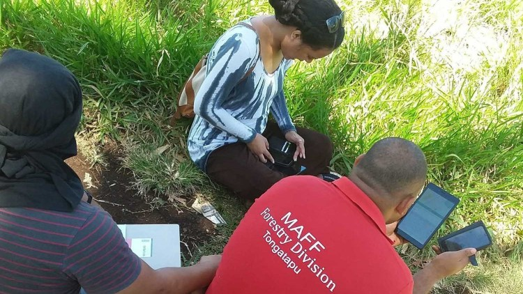
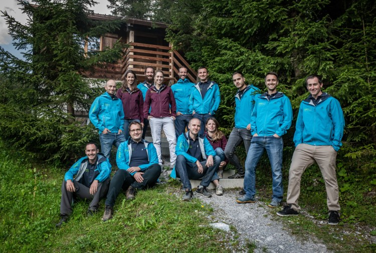

**For once, it’s not an app from the Silicon Valley, but from Laax in the Swiss Alps that made the news. By publishing QField as an open-source app, OPENGIS.ch allows companies, organisations and even countries without the necessary financial means to have the opportunity to benefit from this important data collection app. And it is being used: Over half a million downloads have already been achieved. Now, since the volcanic eruption in Tonga on 15 January 2022, the app of the small Laax-based company is playing a not-unimportant role in disaster response planning.**

We’ve only been around for seven years. We could almost pass for a start-up. But OPENGIS.ch is already a household name when it comes to field data collection. OPENGIS.ch makes its field mapping tool QField available without restrictions (i.e. open-source) so that companies or even nations can collect their geographical data. In this way, data is brought from the field to the office and provides important insights for future decisions.
This was also the case for Tonga’s volcanic eruption. There, in December 2021, many relevant agricultural datasets were captured with “QField” and “QFieldCloud”. This currently helps the Ministry of Agriculture, Food, Forests, and Fisheries to analyse the damage after the volcanic eruption and the subsequent tsunami and plan the response.
## **Swiss software in use for Tonga**
> It is a technical and ethical decision for me. I want not only the privileged nations to benefit from our work.
> Marco Bernasocchi, CEO
Co-founder Marco Bernasocchi’s credo is to focus on further developing the product (QField). OPENGIS.ch makes it freely available, so that nations like Tonga, with little financial means, can use professional software and invest their financial resources in reconstruction. “It is a technical and ethical decision for me. I want not only the privileged nations to benefit from our work. We are always developing the product and generate income mainly from support, paid developments and custom solutions. Our product, however, is publicly accessible”. This strategy is successful: the company is 90% financed by Swiss customers but the app is used all over the world. “Open source is a technological advantage for me. This way we get the input of many developers worldwide who are motivated to work out the best possible software. This leads to a superior product and is particularly valuable to me.,” adds Matthias Kuhn, co-founder of OPENGIS.ch.
> This way we get the input of many developers worldwide who are motivated to work out the best possible software.
> _Matthias Kuhn, CTO_
John Duncan, project manager at the University of Western Australia, who is working on the project in support of Tonga, explains the work done in December like this: “ _the workflow uses QField to map the extent of landscape features including agricultural fields and cropped holdings, recording detailed attributes about each feature’s farming system. QFieldCloud was used to support large teams of data collectors tasked with surveying every tax allotment across Tonga. The initiative has resulted in the detailed mapping of cropping and livestock systems for over 11,000 farms across Tonga’s three main island groups. These datasets provide actionable information for short-term decision making around food security, agricultural planning, and disaster response, and are a valuable resource for longer-term monitoring of agricultural and environmental changes in these climate-vulnerable locations._ “
> The data was originally intended for food security and agricultural planning. But now they suddenly have acquired enormous value and can be used for disaster response planning. 
> John Duncan, University of Western Australia
Further information on QField in connection with Tonga: 
  - <https://livelihoods-and-landscapes.com/use-case.html>
  - <https://www.aciar.gov.au/project/asem-2016-101>

## Media articles
  - <https://www.suedostschweiz.ch/aus-dem-leben/buendner-software-im-einsatz-fuer-tonga>
  - <https://www.inside-it.ch/buendner-open-source-app-nuetzt-der-katastrophenhilfe-in-tonga>
  - [https://epaper.somedia.ch/issue.act?issueMutation=wzbw&issueDate=20220302#Redaktionell](<https://epaper.somedia.ch/issue.act?issueMutation=wzbw&issueDate=20220302#Redaktionell>)
  - <https://www.chilitalk.ch/schweiz/technologie/katastrophenhilfe-aus-laax/>
  - <https://www.business-geomatics.com/2022/02/03/katastrophenhilfe-fuer-tonga-mit-open-source-loesungen-qfield-und-qfieldcloud/>
  - <https://www.presseportal-schweiz.ch/pressemeldungen/weltweit-fuehrendes-buendner-unternehmen-liefert-wichtige-feld-datenerfassungs-app>

## **About OPENGIS.ch**
OPENGIS.ch GmbH is a Swiss software development company based in Laax. OPENGIS.ch employs 19 people and works mainly in the field of spatial software development, geodata infrastructure deployments and professional support. Personalised open source GIS solutions are often planned and developed as desktop or mobile applications. OPENGIS.ch finances itself through tailor-made customer solutions, professional support and adaptations. Link: [https://opengis.ch](</index.html>)

## **About the OPENGIS.ch product “QField” application**
“QField” is an open-source app developed for efficient fieldwork in real-time in urban areas, with 5G connection or with offline data. The mobile GIS app combines a minimal design with sophisticated technology to conveniently bring data from the field to the office. Seamless QGIS integration, GPS centred, offline functionality, synchronisation capabilities, desktop configurable: “QField” is designed for fieldwork – simple but uncompromising. Link: [https://qfield.org](<https://qfield.org/>)
## **About the OPENGIS.ch service “QFieldCloud** “
“QFieldCloud” is a spatial cloud service integrated into “QField” that allows remote provisioning and synchronisation of geodata and projects. Although “QFieldCloud” is still in an advanced beta stage, it is already being used by many groups to significantly improve their workflows. Link: [https://qfield.cloud](<https://qfield.cloud/>)
### _Related_
