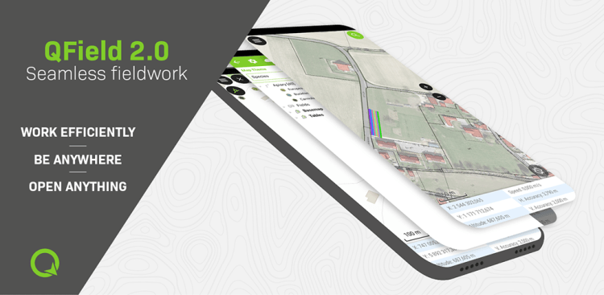
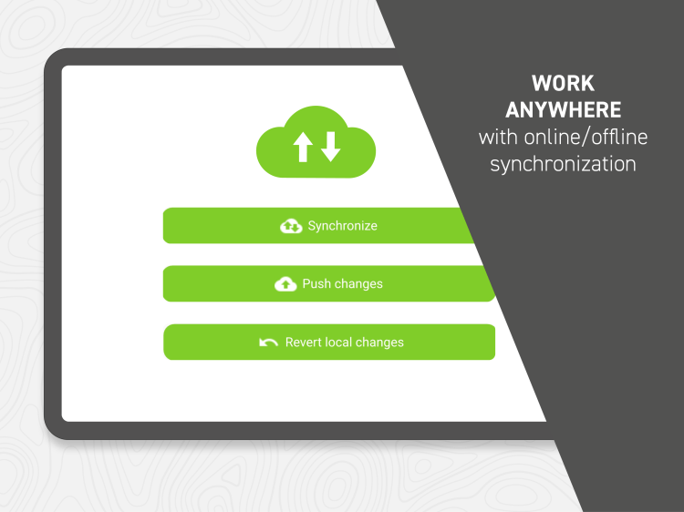

> Let’s not paraphrase it, QField 2.0 is here and it is taking professional GIS fieldwork to a completely new level.
> TL;DR

After an intense development and testing period, we are ready, QField 2.0 is out.
QField 2.0 is packed with new features that will make your professional fieldwork even more efficient. You can get a taste of all you will be getting with this major update on QField’s [changelog](<https://github.com/opengisch/QField/releases>). Be aware, it will blow your mind… ?
If you do not have it yet, [get it now](<https://qfield.org/get/>)!
## Work efficiently ? – Be anywhere ⛰️ – Open anything ?
Survey and digitise data in no time. QField is the professional mobile app for QGIS, allowing users to deploy their existing QGIS projects to the field.
Edit your data on the go. The seamless integration with [QFieldCloud](<https://qfield.cloud/>) allows your team to work on your projects anywhere anytime.
Open a wide range of spatial data formats, connect to industry-leading spatial databases and consume standardised geowebservices.
## The ? looks out of the ? and sees lots of ?
For Android, iOS and Windows tablets and mobiles. But also for Linux, macOS and Windows laptops and desktops. 
QField can be installed basically anywhere and can help thanks to its simplicity even on desktop work.  
If you do not have it yet, [get it now](<https://qfield.org/get/>)!
## What mountain is Arctic Fox?
If you have been following QFields development, you might remember that we named each release after a mountain. We are very outdoorsy and this was a sort of tribute to the places we love. With each release, we had great fun looking for places that would be meaningful for us and our community. From beautiful mountains outside our window to the remotest island mountain on Earth and even further.
After Elbrus (0.5), Finsteraarhorn (0.6), Gonnus Mons (0.7), Hiendertelltihoren (0.8), Jungfraujoch (0.9), Kesch (0.10), Lucendro (0.11), Matterhorn (1.0 – 1.2), Ben Nevis (1.3), Olavtoppen (1.4), Piz Palü (1.5), Qinling (1.6), Rockies (1.7), Selma (1.8), Taivaskero (1.9) and Uluru (1.10), we decided to change the subject and for the 2.X series we’ll name the releases after cool animals that reflect different characteristics of QField. 
.jpg/1280px-Iceland-1979445_\(cropped_2\).jpg)
The arctic fox is an incredibly hardy animal that can survive frigid Arctic temperatures as low as –50°C in the treeless lands where it makes its home. It has furry soles, short ears, and a short muzzle—all-important adaptations to the chilly clime. Arctic foxes live in burrows, and in a blizzard, they may tunnel into the snow to create shelter. 
Like an Arctic Fox, QField is perfectly adapted to the outdoors and helps you get your data in the most efficient way possible. 
Ah yes, and they seem to be pretty good navigators and tech-savvy too: <https://www.space.com/arctic-fox-epic-journey-satellite-tracking.html>
## Packed with new functionalities
Obviously, the big news in QField 2.0 is the integration with QFieldCloud BETA, but besides that, we’ve added a lot of new features and fixed plenty of bugs. If you are interested in all the details, you should go to the [changelog page](<https://qfield.org/releases>) and check out all the new goodies. If you just want the major additions, here you go:
  - – Support for the opening of projects and datasets directly from your favourite messenger app, browser, etc. on Android.
  - – Support for opening ZIP compressed projects on Android.
  - – Support for remote datasets via GDAL’s /vsicurl/ URIs
  - – Greatly improved scale bar overlay
  - – Incremental improvements to the user interface all across QField

## Cloudy ☁️ with a chance of meatballs

QFieldCloud’s unique technology allows your team to focus on what’s important, making sure you **efficiently get the best field data** possible. Thanks to the tight integration with QField, you will be able to start surveying and digitising data in no time.
Some of you may already have been part of the closed BETA testing phase. THANKS!   
For all the others, great news, [QFieldCloud is now **officially** in open BETA](<https://qfield.cloud/>).
You can register directly from QField 2.0 or simply head to [qfield.cloud](<https://qfield.cloud/>) and create your free account now.
## What is QFieldCloud? 
### Seamless synchronisation
QFieldCloud is a synchronisation platform, that we offer as a [service](<https://qfield.cloud/>), which takes the pain out of syncing data from multiple data collectors. Thanks to seamless synchronization, your surveyors will be able to push their work anytime they want. Working in the wild? Your team can continue working with no limitations and sync back their changes once back in town.
### Team management
QFieldCloud’s fine-grained permissions system allows you to efficiently define who can collaborate with you on your projects and what operations they are allowed to perform. You can for example add a junior surveyor as a reporter, a senior one as a project manager and you can even add users with read-only permissions.
### Hosted or in your own cloud – open source
QFieldCloud perfectly integrates and extends your QGIS based geodata infrastructure, you can either [subscribe](<https://qfield.cloud/#mc-form>) for a worry-free Swiss-made solution hosted on Swiss data centres or [contact us](</index.html#contact>) for your private cloud instance. 
QFieldCloud code is [open source](<https://github.com/opengisch/qfieldcloud>) so you can see what is actually happening to your data.
## Known issues
Please note that on older AMRv7 architectures, some devices are suffering from a crash at launch. As such, we have not yet updated QField to 2.0 for these devices. If you own one such device and want to manually download and install QField, please visit the [release page on GitHub](<https://qfield.org/releases>).
Also, since November 2021, Google has enforced new storage access limitations for apps published on its Play store which prohibits direct storage access on Android 11 and above forcing QField to adapt and rely on importing projects and datasets to access those. As part of the enforcement of these new policies, Google came up with an arbitrary mechanism to whitelist some apps which allows those to retain full storage access given the user explicitly allowed for it. We here at OPENGIS.ch believe QField had ample justifications to be whitelisted, however, Google’s appeal process judged otherwise after a series of email exchanges detailing our reasoning. While we have so far lost this argument with Google, we will continue fighting for our users and for their freedom to choose. If you are interested in more details, read our blog post[ about it.](</03/05/qfield-users-sit-down-we-need-to-talk-about-storage-access-on-android%ef%bf%bc/index.html>)
## Join the effort
QField is an open-source project. It is free to share, use and modify and it will stay like that. We are very happy if this app helps you in whatever creative way you may use it. If you found it useful, we will be even happier if you could give something back. You can easily [sponsor QField](<https://docs.qfield.org/get-started/sponsor/>), [contribute some help](<https://docs.qfield.org/get-started/contribute/>) or ask us to [develop a new feature](<https://docs.qfield.org/get-started/sponsor/#feature-sponsoring>).
### _Related_
