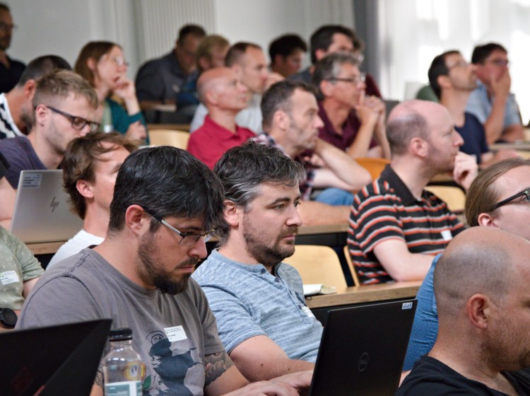
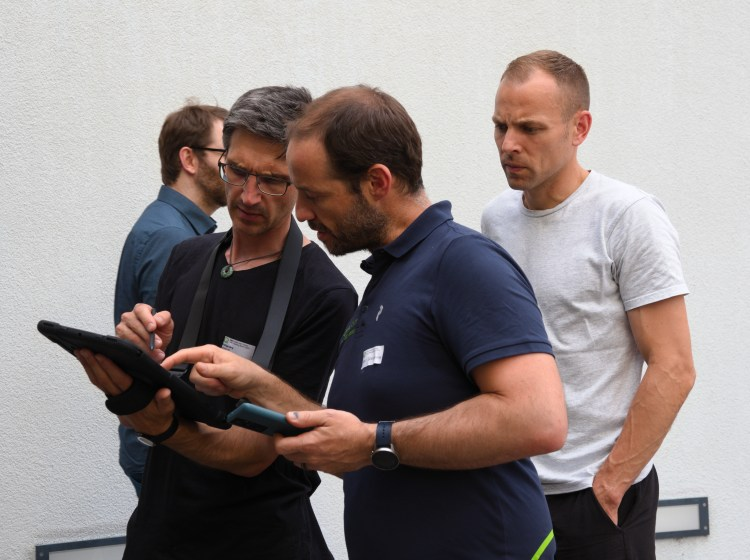
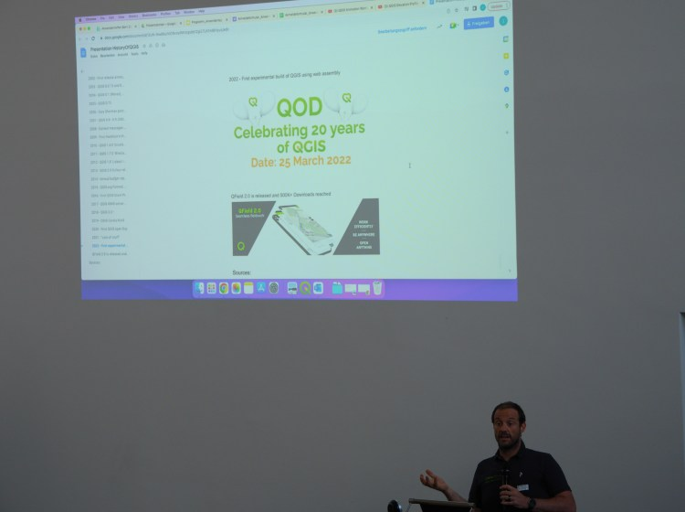

## Apprendre, présenter, discuter et SE RENCONTRER
En été 2022, après 3 ans de réunions en ligne, la communauté suisse des utilisateurs QGIS s’est enfin rencontré physiquement à l’Université de Berne. Jusqu’à 90 utilisateurs de QGIS, développeurs et techniciens ont ainsi pu discuter des dernières fonctionnalités et cas d’utilisation de QGIS.
Après un accueil chaleureux et une introduction par Isabel Kiefer d’OPENGIS.ch, les présentations ont commencé.
### QGIS Update
Marco Bernasocchi (CEO d’OPENGIS.ch et président de Qgis.org) a présenté les dernières fonctionnalités de QGIS. Il a commencé par le journal des modifications de la version actuelle, version long terme 3.22, y compris le nouvel outil Vertex pour la conversion des courbes, des améliorations dans l’édition de maillages et plus encore. Il a suivi par de nombreuses autres améliorations du mode 3D, du serveur WMS et de la génération de rapports SQL, pour n’en citer que quelques-unes.
### QGIS Animation Workbench
Le monde réel n’est pas statique. Ainsi, les informations sous forme animée sont souvent plus faciles à comprendre, comme la visualisation du trafic sur une carte avec des véhicules en mouvement. QGIS supporte désormais le rendu dynamique avec le plugin Animation Workbench. Tim Sutton (Kartoza) a présenté une vidéo Youtube montrant les mécanismes sous-jacents du plugin et son utilisation.
### QGIS Model Baker Update
En commençant par le nouveau logo, Romedi Filli (GIS-Fachstelle, canton de Schaffhouse) a montré les dernières améliorations du plugin QGIS Model Baker. En particulier, le Data Validator et le UsabILIty Hub rendent la génération de projets QGIS à partir de données Interlis encore plus simple. En outre, il existe dorénavant un package Python pour ceux qui préfèrent tout scripter avec Python.
### Utilisation de QGIS Model Baker pour le cadastre RDPPF
Adrian Weber (Dütschler + Partner) a ensuite montré comment QGIS Model Baker permet de migrer pas à pas la gestion des plans d’affectation communaux d’un logiciel propriétaire vers des processus de travail basés sur QGIS. Le temps et l’argent pour adapter le système sont limités. La difficulté de fournir ce service public réside dans le fait que les données sont juridiquement contraignantes et que les composants du système doivent répondre à ces exigences.
### Formulaires et widgets dynamiques avec les expressions QGIS
Après une pause café, Andreas Neumann (Office de l’information géographique, du canton de Soleure) a fait une présentation pratique sur les formulaires et widgets QGIS désormais plus dynamiques. Les champs de formulaire peuvent maintenant être définis par des expressions, de sorte qu’ils sont automatiquement mis à jour en fonction des valeurs dans d’autres champs du formulaire. De plus, des boutons d’action, qui appellent, par exemple, des services web externes, peuvent être intégrés dans les formulaires, des contraintes dépendant des données peuvent être définies et plus encore.
### Analyse des trajectoires de vol
Poussé par une ambition technique et l’objectif de créer une base pertinente pour les discussions politiques, Yvo Weidmann (Geoidee) a réalisé une analyse complexe des atterrissages de l’aéroport de Zurich en se basant sur des trajectoires de vol open source et des données swisstopo. Pour ce faire, il a traité les données d’opensky-network.org de l’Aeronautical Information Publication. Une grande partie du travail a consisté à valider et à nettoyer les données. Enfin, il a visualisé les résultats dans une animation soignée des atterrissages présentée sur QGIS.
### Modules d’application Teksi
Alexandre Bosshard (Ville de Pully) a présenté TEKSI, une association dont la mission est de fournir aux gestionnaires d’infrastructures publiques des outils d’aide à la décision sous forme de modules professionnels, notamment QGEP et QWAT. Les modules sont tous open source, principalement basés sur QGIS et PostgresSQL/PostGIS.
### GEP (by Teksi) et analyse hydrologique avec SWMM
Timothée Produit (Alpnetsystem SA (IG-Group)) a fait une présentation plus technique sur leur approche de la gestion d’une base de données centrale qui sert de référence à la fois à l’outil de gestion des eaux usées de Teksi, l’extension QGEP sur QGIS, ainsi qu’au logiciel de gestion des eaux de pluies SWMM pour la réalisation d’analyses hydrologiques en Suisse romande. Il a montré la configuration nécessaire de la base de données et de l’infrastructure, ainsi que leurs étapes de travail, afin de générer le résultat souhaité.
### Le nouvel outil Profil dans QGIS Core
Nyall Dawson (North Road) a présenté sa vidéo Youtube sur les données de terrain dans le projet QGIS et comment elles interagissent avec les cartes 3D et le nouvel outil de profil. Ceci n’est possible qu’à partir de la version 3.26. Cela offre de nouvelles possibilités de traitement et de visualisation des données géographiques altimétriques et 3D. Après la vidéo, Nyall a participé virtuellement à la conférence pour répondre aux questions d’un public impressionné.
### Cool Maps avec QGIS
Enfin, Marco Bernasocchi a conclu les présentations avec une collection de cartes QGIS étonnamment créatives, notamment des vœux de Noël, des statistiques sportives et la topologie de visages humains.
## Workshops
Suivant un délicieux dîner, y compris un savoureux buffet de fromages et des discussions fructueuses, les participants ont été invités à participer activement aux quatre ateliers de l’après-midi. Parmi d’autres sujets intéressants, les utilisateurs ont pu découvrir le travail avec QField et QFieldCloud ou se plonger dans le travail avec QGIS Model Baker et la validation des données, le tout enseigné par les experts et développeurs d’OPENGIS.ch.
   
### _Related_
