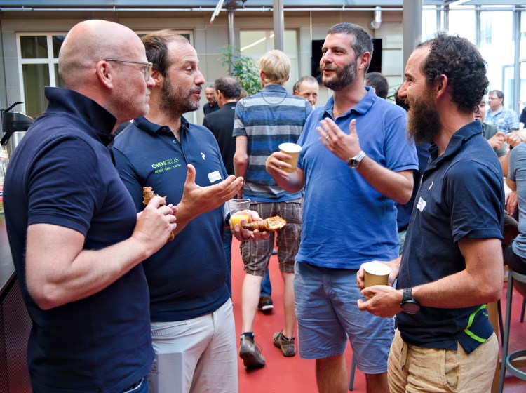

## Learn, Present, Discuss and MEET
In Summer 2022 the Swiss QGIS User community finally got together physically again to meet at the University of Berne, after 3 years of online meetings. Up to 90 QGIS users and contributors out of academia and engineering enjoyed and discussed the **newest QGIS features and use cases**.
After a warm welcome and introduction by Isabel Kiefer from OPENGIS.ch the presentations started.
### QGIS Update
Marco Bernasocchi (OPENGIS.ch CEO and Qgis.org Chair) presented recent QGIS features out of the changelogs of current [long term release 3.22](<https://changelog.qgis.org/en/qgis/version/3.22>), followed by versions [3.24](<https://changelog.qgis.org/en/qgis/version/3.24>) and [3.26](<https://changelog.qgis.org/en/qgis/version/3.26>). Among the enhancements are the new curve conversion vertex tool and improvements to the mesh editing, 3D-mode, WMS server and SQL logging, to name a few.
### QGIS Animation Workbench
The real world is not static. Thus, often information can be understood more easily in animated form, like visualizing traffic on a map with moving vehicles. QGIS now supports dynamic renderings with the Animation Workbench Plugin. Tim Sutton (Kartoza) led through a [Youtube Video](<https://www.youtube.com/watch?v=DkS6yvnuypc>) showing the underlying mechanisms of the plugin and how to use it.
### QGIS Model Baker Update
Starting with the new logo, Romedi Filli (GIS-Fachstelle, Kt. Schaffhausen) showed the latest improvements to the [QGIS Model Baker plugin](<https://opengisch.github.io/QgisModelBaker/>). Especially the data validator and [UsabILIty Hub](</usabilityhub.opengis.ch/index.html>) make QGIS project generation out of Interlis data even easier. Even more there is now a [python package](<https://pypi.org/project/modelbaker>) for those who prefer to python script it all together.
### Using QGIS Model Baker for OEREB Cadastre
Adrian Weber (Dütschler + Partner) followed up presenting the use of QGIS Model Baker in migrating their management of municipal usage plans from proprietary software to QGIS driven workflow. Though they see the potential in this approach, they lack time and money, thus doing it step by step. In providing this public service the difficulty is that data is legally binding and system components need to meet this requirements.
### Dynamic Forms and Widgets with QGIS Expressions
After a coffee break, Andreas Neumann (Amt für Geoinformation, Kt. Solothurn) gave an interesting technical speech on more dynamic QGIS forms and widgets. Form values can now be defined via expressions so they update automatically depending on other form values. Furthermore, action buttons can be included into forms and defined which can call external web-services, data dependent constraints be defined and more. 
### Analysis of Flight Trajectories
Driven by technical ambition and will to set some factual basis for [political discussion](<https://www.fluglaermforum.ch/>), Yvo Weidmann ([Geoidee](<https://www.geoidee.ch/>)) carried out a sophisticated analysis of descents to Zurich airport based on Open Source Flight Trajectories and swisstopo data. Therefore he processed data from [opensky-network.org](<https://opensky-network.org/>), [the Aeronautical Information Publication](<https://skyguide.ch/>) after a lot of initial data validation and cleaning. He finally visualized the results in a nice QGIS driven animation of flight descents.
### Teksi utilities application modules
Alexandre Bosshard (Ville de Pully) presented [TEKSI](<https://www.teksi.ch/>), an association that has set itself the task of providing the operators of public infrastructure with decision-making support in the form of professional modules for controlling their activities, namely QGEP and QWAT for the moment with more to follow. Therefore they work on open-source software built mainly on top of QGIS and PostgresSQL/PostGIS. 
### QGEP (by Teksi) and hydraulic analysis with SWMM
Timothée Produit (Alpnetsystem SA (IG-Group)) gave a more technical speech on their approach of managing a central database to serve both, Teksi’s waste water management tool and QGIS extension QGEP and Stormwater Management Software SWMM to carry out hydraulic analysis in Swiss Romandie. He showed the necessary database and infrastructure setup and workflow steps to create the desired product. 
### The new Profile Tool in QGIS Core
Nyall Dawson (North Road) led through his [Youtube video](<https://www.youtube.com/watch?v=GuL-Zst1Xcw>) about QGIS project terrain settings and how they interact with 3d maps and the new elevation profile tool, which is only possible from version 3.26. Powerfull new possibilities to process and visualize elevation and 3D geodata worth watching. Nyall joined the conference virtually after the video to answer questions from the impressed audience.
### Cool Maps made with QGIS
Finally Marco Bernasocchi closed the presentations with a collection of incredibly creative QGIS results including Xmas wishes, sports statistics and human facial topology
## Workshops
After a tasty lunch including a delicious cheese selection and fruitful conversations the lucky subscribers where asked to take action themselves in the four afternoon workshops. Among other interesting topics the users could get hands on working with [QField](<https://qfield.org/>) and [QFieldCloud](<https://app.qfield.cloud/>) or could get started with QGIS Model Baker and data validation, all tought by the experts and developers of OPENGIS.ch. 
Learn Discuss Present MEET
### _Related_
