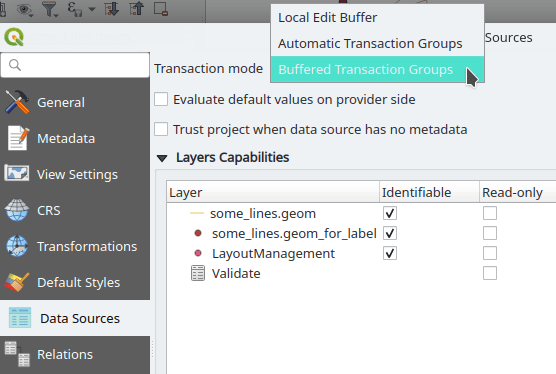

**Tired of start/stop editing for every single layer in your project with mixed data sources?  
Starting from version 3.26, QGIS has a new transaction mode called “Buffered Transaction Groups”.**

Within this mode, **all layers** which are not read-only are put in one “transaction group” and **handled together** when the actions “Toggle Editing” or “Save Layer Edits” are activated. It doesn’t matter if the layers come from different providers like GeoPackage, PostgreSQL or Shapefile. Edits are buffered locally and saved within one single transaction on all layers per provider. With this, you can store all edited layers with a single click. And in comparison to the well-known “Automatic Transaction Groups” mode you have better performance during editing and fewer problems with locking of the database when multiple users edit the same table in parallel.
To try it out; go to **_Project - > Properties -> Data Sources -> Transaction mode_**
Enjoy and let us know what you think!
##### Limitations:
In databases, transactions are atomic. That is, the data can be completely and correctly written, or it will be completely rolled back. With buffered transactions, QGIS tries to do the same but has less control. When writing to different providers it could happen that, if an error occurs when writing to PostgreSQL, but some data were already written in a Shapefile the rollback will be only partial. This only applies to data from different data sources.
_This feature was sponsored by Canton Glarus._
### _Related_
