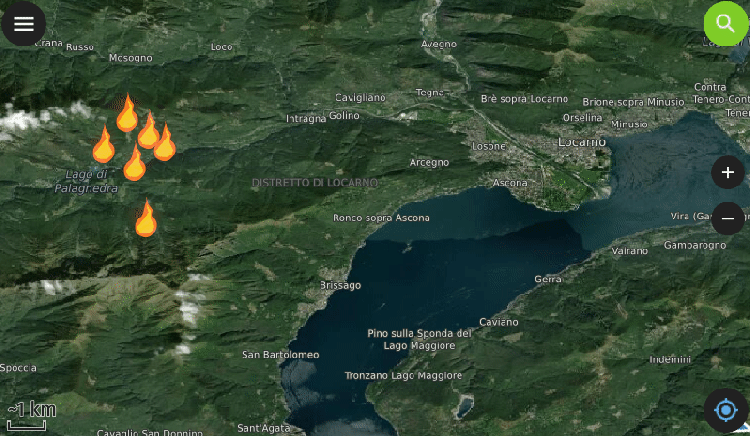

**Starting with QField 2.2, users can fully rely on animation capabilities that have made their way into QGIS during its last development cycle. This can be a powerful mean to highlight key elements on a map that require special user attention.**
The example below demonstrates a scenario where animated raster markers are used to highlight active fires within the visible map extent. Notice how the subtle fire animation helps draw viewers’ eyes to those important markers.

[_Animated raster markers_ is a new symbol layer type in QGIS 3.26](<https://www.qgis.org/en/site/forusers/visualchangelog326/index.html#feature-new-animated-marker-symbol-type>) that was developed by [Nyall Dawson](<https://north-road.com/>). Supported image formats include GIF, WEBP, and APNG.
The second example below showcases more advanced animated symbology which relies on expressions to animate several symbol properties such as marker size, border width, and color opacity. While more complex than simply adding a GIF marker, the results achieved with data-defined properties animation can be very appealing and integrate perfectly with any type of project.
You’ll quickly notice how smooth the animation runs. That is thanks to OPENGIS.ch’s own ninjas having spent time improving the map canvas element’s handling of layers constantly refreshing. This includes automatic skipping of frames on older devices so the app remains responsive.
Oh, we couldn’t help ourselves but take the opportunity to demonstrate how nice the QField feature form layout is these days in the video above ? To know more about [other new features in QField 2.2, go and read the release page](<https://github.com/opengisch/QField/releases/tag/v2.2.0>).
Happy field mapping to all!
_The lovely animal markers used in the zoo example above were made by Serbian artist[Arsenije Vujovic](<https://www.behance.net/gallery/38312723/Animals>)._

  <iframe
    src="https://player.vimeo.com/video/732691644"
    title="Vimeo video 732691644"
    loading="lazy"
    allow="autoplay; encrypted-media; picture-in-picture; fullscreen"
    allowfullscreen>
  </iframe>

[https://vimeo.com/732691644](<https://vimeo.com/732691644>)

### _Related_
