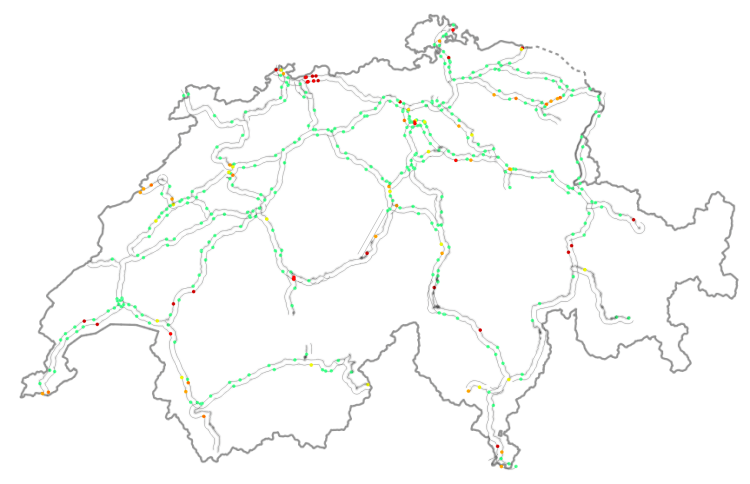
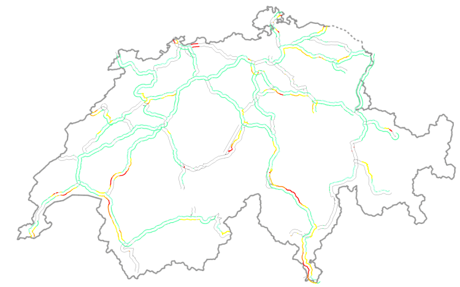
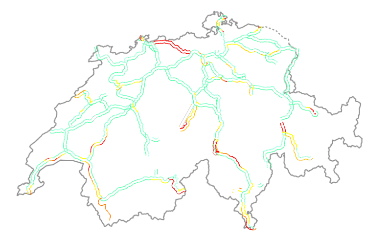
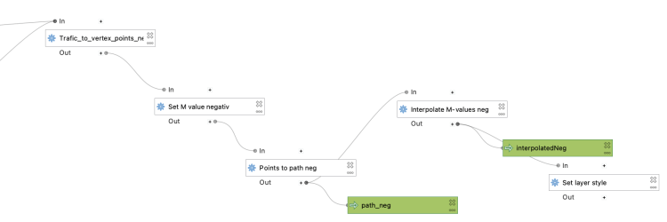

Amongst all the processing algorithms already available in QGIS, sometimes the one thing you need is missing. 
This happened not a long time ago, when we were asked to find a way to continuously **visualise traffic on the Swiss motorway network** (polylines) using frequently measured traffic volumes from discrete measurement stations (points) alongside the motorways. In order to keep working with the existing polylines, and be able to attribute more than one value of traffic to each feature, we chose to work with the M-values. M-values are a per-vertex attribute like X, Y or Z coordinates. They contain a measure value, which typically represents time or distance. But they can hold any numeric value.
In our example, traffic measurement values are provided on a separate point layer and should be attributed to the M-value of the nearest vertex of the motorway polylines. Of course, the motorway features should be of type _LineStringM_ in order to hold an M-value. We then should **interpolate the M-values for each feature over all vertices** in order to get continuous values along the line (i.e. a value on every vertex). This last part is not yet existing as a processing algorithm in QGIS.
This article describes how to write a **feature-based processing algorithm** based on the example of M-value interpolation along LineStrings. 
## Feature-based processing algorithm
The pyqgis class **[`QgsProcessingFeatureBasedAlgorithm`](<https://qgis.org/pyqgis/3.22/core/QgsProcessingFeatureBasedAlgorithm.html>) **is described as follows: “ _An abstract QgsProcessingAlgorithm base class for processing algorithms which operates “feature-by-feature”._
_Feature based algorithms are algorithms which operate on individual features in isolation. These are algorithms where one feature is output for each input feature, and the output feature result for each input feature is not dependent on any other features present in the source. […]_
_Using QgsProcessingFeatureBasedAlgorithm as the base class for feature based algorithms allows shortcutting much of the common algorithm code for handling iterating over sources and pushing features to output sinks. It also allows the algorithm execution to be optimised in future (for instance allowing automatic multi-thread processing of the algorithm, or use of the algorithm in “chains”, avoiding the need for temporary outputs in multi-step models)._ ”
In other words, when connecting several processing algorithms one after the other – e.g. with the graphical modeller – these feature-based processing algorithms can easily be used to fill in the missing bits. 
Compared to the standard **[`QgsProcessingAlgorithm`](<https://qgis.org/pyqgis/3.22/core/QgsProcessingAlgorithm.html>)** the feature-based class implicitly iterates over each feature when executing and avoids writing wordy loops explicitly fetching and applying the algorithm to each feature. 
Just like for the `QgsProcessingAlgorithm` (a template can be found in the _Processing Toolbar > Scripts > Create New Script from Template_), there is quite some boilerplate code in the `QgsProcessingFeatureBasedAlgorithm`. The first part is identical to any `QgsProcessingAlgorithm`.
After the description of the algorithm (name, group, short help, etc.), the algorithm is initialised with **_`def initAlgorithm`_** , defining input and output. 
_In our M-value example:_
    
        def initAlgorithm(self, config=None):
            self.addParameter(
                QgsProcessingParameterFeatureSource(
                    self.INPUT,
                    self.tr('Input layer'),
                    [QgsProcessing.TypeVectorAnyGeometry]
                )
            )
            self.addParameter(
                QgsProcessingParameterFeatureSink(
                    self.OUTPUT,
                    self.tr('Output layer')
                )
            )
While in a **regular processing algorithm** now follows **`def processAlgorithm(self, parameters, context, feedback)`** , in a **feature-based algorithm** we use **_`def processFeature(self, feature, context, feedback)`_**. This implies applying the code in this block to each feature of the input layer. 
! Do not use _**`def processAlgorithm`**_ in the same script, otherwise your feature-based processing algorithm will not work !  
---  
## Interpolating M-values
This actual processing part can be copied and added almost 1:1 from any other independent python script, there is little specific syntax to make it a processing algorithm. Only the first line below really. 
_In our M-value example:_
    
        def processFeature(self, feature, context, feedback):
            
            try:
                geom = feature.geometry()
                line = geom.constGet()
                vertex_iterator = QgsVertexIterator(line)
                vertex_m = []
    
                # Iterate over all vertices of the feature and extract M-value
    
                while vertex_iterator.hasNext():
                    vertex = vertex_iterator.next()
                    vertex_m.append(vertex.m())
    
                # Extract length of segments between vertices
    
                vertices_indices = range(len(vertex_m))
                length_segments = [sqrt(QgsPointXY(line[i]).sqrDist(QgsPointXY(line[j]))) 
                    for i,j in itertools.combinations(vertices_indices, 2) 
                    if (j - i) == 1]
    
                # Get all non-zero M-value indices as an array, where interpolations 
                  have to start
    
                vertex_si = np.nonzero(vertex_m)[0]
                
                m_interpolated = np.copy(vertex_m)
    
                # Interpolate between all non-zero M-values - take segment lengths between 
                  vertices into account
    
                for i in range(len(vertex_si)-1):
                    first_nonzero = vertex_m[vertex_si[i]]
                    next_nonzero = vertex_m[vertex_si[i+1]]
                    accum_dist = itertools.accumulate(length_segments[vertex_si[i]
                                                                      :vertex_si[i+1]])
                    sum_seg = sum(length_segments[vertex_si[i]:vertex_si[i+1]])
                    interp_m = [round(((dist/sum_seg)*(next_nonzero-first_nonzero)) + 
                                first_nonzero,0) for dist in accum_dist]
                    m_interpolated[vertex_si[i]:vertex_si[i+1]] = interp_m
    
                # Copy feature geometry and set interpolated M-values, 
                  attribute new geometry to feature
    
                geom_new = QgsLineString(geom.constGet())
                
                for j in range(len(m_interpolated)):
                    geom_new.setMAt(j,m_interpolated[j])
                    
                attrs = feature.attributes()
                
                feat_new = QgsFeature()
                feat_new.setAttributes(attrs)
                feat_new.setGeometry(geom_new)
    
            except Exception:
                s = traceback.format_exc()
                feedback.pushInfo(s)
                self.num_bad += 1
                return []
            
            return [feat_new]
    
In our example, we get the feature’s geometry, iterate over all its vertices (using the [`QgsVertexIterator`](<https://qgis.org/pyqgis/3.0/core/Vertex/QgsVertexIterator.html>)) and extract the M-values as an array. This allows us to assign interpolated values where we don’t have M-values available. Such missing values are initially set to a value of 0 (zero).
We also extract the length of the segments between the vertices. By gathering the indices of the non-zero M-values of the array, we can then **interpolate between all non-zero M-values** , considering the length that separates the zero-value vertex from the first and the next non-zero vertex.
For the iterations over the vertices to extract the length of the segments between them as well as for the actual interpolation between all non-zero M-value vertices we use the library _[itertools](<https://docs.python.org/3/library/itertools.html>)_. This library provides different iterator building blocks that come in quite handy for our use case. 
Finally, we create a new geometry by copying the one which is being processed and setting the M-values to the newly interpolated ones.
And that’s all there is really!
Alternatively, the interpolation can be made using the `interp` function of the `numpy` library. Some parts where our _manual_ method gave no values, [`interp.numpy`](<https://numpy.org/doc/stable/reference/generated/numpy.interp.html>) seemed more capable of interpolating. It remains to be judged which version has the more _realistic_ results.  
---  
## Styling the result via M-values
The last step is styling our output layer in QGIS, based on the M-values (our traffic M-values are categorised from 1 [a lot of traffic -> dark red] to 6 [no traffic -> light green]). This can be achieved by using a **_Single Symbo_ l symbology with a _Marker Line_ type „on every vertex“**. As a marker type, we use a simple round point. _Stroke style_ is „no pen“ and _Stroke fill_ is based on an expression:
    
    with_variable(
    
    'm_value', m(point_n($geometry, @geometry_point_num)),
    
    	CASE WHEN @m_value = 6
    		THEN color_rgb(140, 255, 159)
    
    		WHEN @m_value = 5
    			THEN color_rgb(244, 252, 0)
    
    		WHEN @m_value = 4
    			THEN color_rgb(252, 176, 0)
    
    		WHEN @m_value = 3
    			THEN color_rgb(252, 134, 0)
    
    		WHEN @m_value = 2
    			THEN color_rgb(252, 29, 0)
    
    		WHEN @m_value = 1
    			THEN color_rgb(140, 255, 159)
    
    		ELSE
    			color_hsla(0,100,100,0)
    
    	END
    )
And voilà! Wherever we have enough measurements on one line feature, we get our motorway network continuously coloured according to the measured traffic volume.
Motorway network – the different lanes are regrouped for each direction. M-values of the vertices closest to measurement points are attributed the measured traffic volume. The vertices are coloured accordingly. Trafic on motorway network after „manual“ M-value interpolation.  Trafic on motorway network after M-value interpolation using numpy.
_One disclaimer at the end_ : We get this seemingly continuous styling only because of the combination of our „complex“ polylines (containing many vertices) and the zoomed-out view of the motorway network. Because really, we’re styling many points and not directly the line itself. But in our case, this is working very well.
If you’d like to make your custom processing algorithm available through the processing toolbox in your QGIS, just put your script in the folder containing the files related to your user profile:
    
    profiles > default > processing > scripts 
You can directly access this folder by clicking on _Settings_ > _User Profiles_ > _Open Active Profile Folder_ in the QGIS menu. 
That way, it’s also available for integration in the graphical modeller.

Extract of the _Graphical_ _Modeler_ sequence. „Interpolate M-values neg“ refers to the custom feature-based processing algorithm described above.
  
You can download the above-mentioned processing scripts (with numpy and without numpy) **[here](<https://github.com/opengisch/qgis-resourse-sharing-content/tree/master/collections/swiss_knife/processing>)**.
Happy processing!
### _Related_
