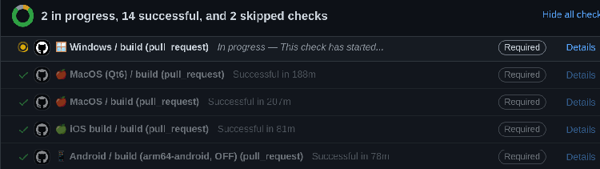

_In the past year,**the build system behind QField has been ported to[vcpkg, a modern C++ dependency management system](<https://vcpkg.io/en/index.html>)**. It has been a great success for QField and considerably helped to streamline efforts, improve the development experience and to guarantee an outstanding stability of the application. In this blog post we will look at the history of building QGIS based applications for mobile systems and how it has become what it is today._
When [Marco Bernasocchi (CEO of OPENGIS.ch and chair of QGIS.org) started working on **QGIS for Android** in Google Summer of Code](</2011/08/24/gsoc-2011-final-report/index.html>) a decade ago, the main job was to also build all QGIS dependencies for Android. This includes well-known libraries like **proj** and **gdal** and less-known ones like libxml2 or iconv. Each of them has its particularities and specific build flags. Working on this appears to be an endless iterative trial-and-error journey where you hope each day that eventually you will see the [QGIS splash screen on your Android phone](</2021/06/08/qfieldcloud-now-opensource-happy-10-years-of-field-mapping-with-qgis/index.html>) while all you see are endless lines of code and compiler errors.
As we know nowadays QGIS for Android has eventually seen the sunlight and its achievements are still the base for [QGIS-based mobile apps like QField](<https://qfield.org/>).
Sometime later we decided to modernize the build infrastructure into OSGeo4A a set of scripts where each dependency was built with a “recipe”. Modularized this way, it was easier to maintain, and general build code common for all libraries could be isolated. It was good enough to help drive QField for a couple of years, and a copy of it is still in use **as the base for nowadays[QGIS builds for macOS](<https://github.com/qgis/QGIS-Mac-Packager/tree/master/qgis_deps>)**.
When we decided to make QField also available on other platforms like **iOS, Windows and macOS** we quickly realized that duplicating build chains scales really bad and maintaining this is an immense effort we wanted to avoid. There are a couple of existing C++ dependency management systems, none of which convinced us ultimately. Lucky for us a mail on the [QGIS mailing list mentioned a new one called vcpkg](<https://www.mail-archive.com/qgis-developer@lists.osgeo.org/msg52302.html>) which looked very promising.
A couple of days later we had a build for Windows and later in the same year for macOS. With many dependencies already available in modern versions. Cheers.
What’s left to do than just enable it for Android, and all our problems are suddenly solved? Alas, it’s not so easy. **Cross-compiling is always a bit trickier.** And so we started another journey to improve the situation. After a while, we had a working build chain based on vcpkg for Android in our R&D labs. Interestingly, this added a couple of features just because the community around vcpkg had already added them. For example using [COG](<https://www.cogeo.org/>)-based raster data via HTTP was suddenly working _(for the record: thanks to the availability of curl which we never took care of adding ourselves in OSGeo4A)_.
Soon after we also wanted to try building for **iOS with vcpkg** , which after a few attempts also was successful, and even managed to resolve some weird crashes and other issues we had experienced with the old buildchain.

The main benefit was that we could upgrade the QGIS base libraries in one single place for every platform, in an isolated branch without playing the Jenga game on each upgrade. 
The only unfinished business we still had was that support for iOS and Android was still available only in our own vcpkg fork.
So the last few weeks and months **we have been working closely with upstream** to bring building for Android and iOS up to the same level as desktop platforms. The relevant parts are now in a clean state. 
Advantages of this approach:
  - • Mutualized efforts on all the base libraries, also with programmers outside the geoverse
  - • A vibrant community that ensures a noticeably fast upgrade of libraries
  - • A clean dependency management system
  - • A consistent set of dependency versions (gdal, geos, libpq, …) across all platforms
  - • A clean caching system that will only recompile reverse dependencies on updates
  - • We can upgrade a dependency in an isolated branch and only release it when it works on all platforms
  - • We can optimize the code for a given set of dependency versions and if a bug is fixed in a certain dependency version, we are sure we can ship this fix on all platforms promptly
  - • We maintain the QField source code as well as dependency versions in a single repository, what makes development more streamlined

Big thanks go to Alexander Neumann and Kai Pastor who both stand out for doing things the right and future-proof way.
As always, things come at a price, there was a steep learning curve involved, and some edge cases require attention. However, we are thrilled by the simplification this has brought us.
If you are maintaining a customized fork of QField, it is now a good time to **start upgrading to vcpkg** , since [OSGeo4A has been archived](<https://github.com/opengisch/OSGeo4A>) and will no longer be maintained. The [developer documentation of QField](<https://github.com/opengisch/QField/blob/master/doc/dev.md>) has been updated with relevant instructions.
If you have time to test the new build system, [we will be happy to read about your experiences](<https://github.com/opengisch/QField/discussions>) with it.
### _Related_
