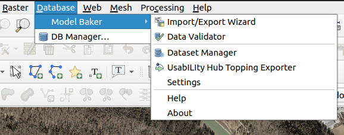
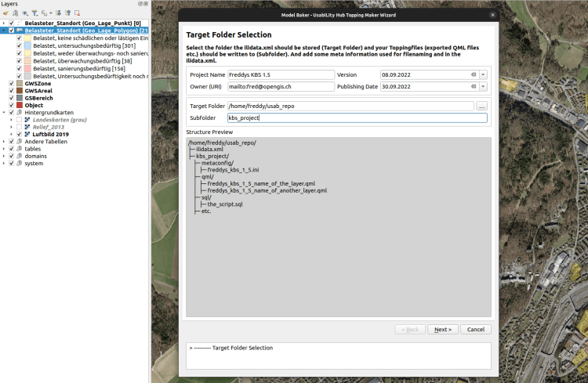
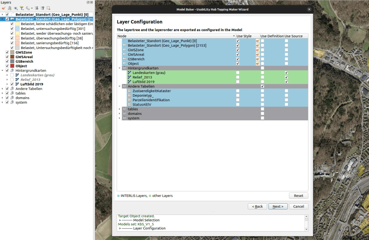
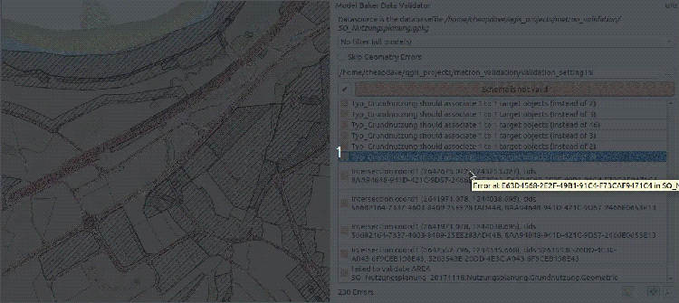

**Der neue Release vom QGIS Model Baker Plugin ist draussen, mit weiteren Verbesserungen des Import/Export Wizards, mehr Möglichkeiten in der INTERLIS Validierung der Daten und einem super-komfortablen Exporter für UsabILIty Hub Toppingfiles**.
## Was ist Model Baker?
Dieser erste Abschnitt kann wohl von den meisten Leser:innen übersprungen werden. Trotzdem hier eine kleine Zusammenfassung, was _Model Baker_ überhaupt ist.
_Model Baker_ ist ein QGIS Plugin, mit dem sich ein QGIS Projekt schnell aus einem physikalischen Datenmodell erstellen lässt. _Model Baker_ analysiert die existierende Struktur und konfiguriert ein QGIS Projekt mit allen verfügbaren Informationen.
Modelle, die in INTERLIS definiert wurden, bieten zusätzliche Metainformationen wie Domains, Einheiten von Attributen oder objektorientierte Definitionen von Tabellen. Dies kann genutzt werden, um die Projektkonfiguration noch weiter zu optimieren. _Model Baker_ verwendet _[ili2db](<https://github.com/claeis/ili2db/blob/master/docs/ili2db.rst>)_ , um ein INTERLIS Modell in eine physikalische Datenbank zu importieren und die Metainformationen, um Legende, Formularlayouts, Relationen und vieles mehr zu konfigurieren.
## Neuigkeiten
Schon über ein Jahr bietet _Model Baker_ die Möglichkeit, mit dem _UsabILIty Hub_ sogenannte Toppingfiles von den Repositorys zu holen und damit komplexere QGIS Projekte bis ins Detail automatisch und mit einem Klick zu konfigurieren. 
### UsabILIty Hub
Die Idee des _UsabILIty Hub_ ist es, für implementierte INTERLIS Modelle Zusatzinformationen automatisch übers Web zu empfangen. So wie wir Modelle durch die Anbindung der Datei `ilimodels.xml `von [https://models.interlis.ch](<https://models.interlis.ch/>) und den verknüpften Repositorys erhalten können, können wir die Zusatzinformationen mit der Datei `ilidata.xml` auf dem _UsabILIty Hub_ (derzeit [https://models.opengis.ch](</models.opengis.ch/index.html>)) und den verknüpften Repositorys erhalten. Einstellungen für Tools werden in einer Metakonfigurationsdatei konfiguriert, ebenso wie Links zu Toppingfiles, die Informationen zu GIS Projekte enthalten (wie zBs. Symbologien oder Legendenstrukturen). Somit bestehen diese Zusatzinformationen meistens aus einer Metakonfiguration und beliebig vielen Toppings.

Für die Endanwender:innen einfach – aber natürlich nur, wenn es jemand für sie initial aufgesetzt hat. Doch der Export der Styledateien, das manuelle Schreiben des Layertrees und vor allem dann die Verknüpfung der Dateien im betreffenden Metakonfigurationsfile und dem `ilidata.xm`l war bisher relativ mühsam und setzte tiefe technische Kenntnisse voraus. 
Doch damit ist jetzt Schluss! ?
#### Topping Exporter
Mit dem Release 7.2 ist ein Wizard aufrufbar, mit dem man durch den Exportprozess geleitet wird, ohne gross hinter die Kulisse sehen zu müssen. 

Grundsätzlich wird die Konfiguration des aktuell geöffneten QGIS Projekts exportiert. Alles, was aber spezifisch für den UsabILIty Hub gebraucht wird, wird im Wizard angeboten.

Beispielsweise die Ordnerstruktur, wie sie im Online Repository dann aussehen soll. Die Toppingfiles werden alle lokal gespeichert. Genauso das „Index-File“ `ilidata.xml` wird lokal erstellt. Dies, damit die Benutzer:innen ihre Toppings lokal exportieren und testen können, bevor sie das Repository der Firma bzw. Amtsstelle beeinträchtigt müssen.

Ein weiterer wichtiger Bestandteil ist die Konfiguration, welche Layereigenschaften in Styledateien (QML) exportiert werden sollen sowie, wie die Quelle von Layern ermittelt werden soll, die nicht aus einem INTERLIS Schema kommen, wie zum Beispiel WMS Hintergrundlayer.
#### Selbsterklärend und doch kommt noch mehr
Der _UsabILIty Hub Topping Exporter Wizard_ enthält viel Beschreibung und ist somit grundsätzlich selbsterklärend. Dennoch wird in einigen Wochen ein weiterer Blogpost mit einer Schritt-für-Schritt-Anleitung folgen. Ausserdem wird darin auch eine kleine Einführung in die Benutzung der Backend-Library `ilitoppingmaker` enthalten sein. Bleibt dran.
#### Sponsoren
Übrigens wurde der UsabILIty Exporter von den Kantonen [Schaffhausen](<https://agi.sh.ch/>), [Appenzell Innerrhoden](<https://geo.ai.ch/>) und [Schwyz](<https://www.sz.ch/behoerden/vermessung-geoinformation/agi-startseite.html/72-416-414-1729>) kofinanziert. ?
### Live Daten Validator
Ebenfalls seit fast einem Jahr bietet _Model Baker_ die Möglichkeit, Daten direkt im QGIS gegen ihr INTERLIS Modell zu validieren. Nun wurde das Bedürfnis laut, dass man die Validierung etwas einschränken kann, damit man sich zuerst den einen Fehler annehmen kann und später den anderen.
#### Skip Geometry Errors und Konfigurationsdatei
Es besteht nun die Möglichkeit, Geometriefehler in der Validierung zu ignorieren. Dies führt zu einer schnelleren Validierung im Backend mit _ili2db_ anhand des Parameters `--skipGeometryErrors` und `--disableAreaValidation` und listet nur alle anderen Fehler auf.
Etwas komplizierter, aber umso mächtiger, ist dann die Konfigurationsdatei. Diese kann per Dateiauswahl hinzugefügt werden und so die Validierung steuern. Beispielsweise können folgende Bedingungen in der Validierung ignoriert werden.
  - Pflichtfelder: `multiplicity="off"`
  - Referenzbedingungen: `target="off"`
  - Type Bedingungen (zBs. Zahlenbereich): `type="off"`
  - Logische Bedingungen (zBs. Pflichtfeld, abhängig vom Wert eines anderen Attributs): `constraintValidation="off"`

Finde hier die komplette Dokumentation <https://github.com/claeis/ilivalidator/blob/master/docs/ilivalidator.rst#konfiguration>. Wir werden aber auch zu diesem Thema in den nächsten Wochen ein Blogpost veröffentlichen.
#### Navigation

Weiter ist die Navigation, sowie die Ortung des Fehlers vereinfacht worden. Mittels den Icons, die man aus der Attributtabelle kennt, kann man durch die Fehlermeldungen klicken und mittels Animation oder Zoom wird auf der Karte in QGIS auf das betreffende Feature oder die betreffende Geometrie gezeigt.
#### Sponsoren
Übrigens wurde diese Anpassungen von [Metron Raumentwicklung AG](<https://www.metron.ch/>) finanziert. ?
### _Related_
