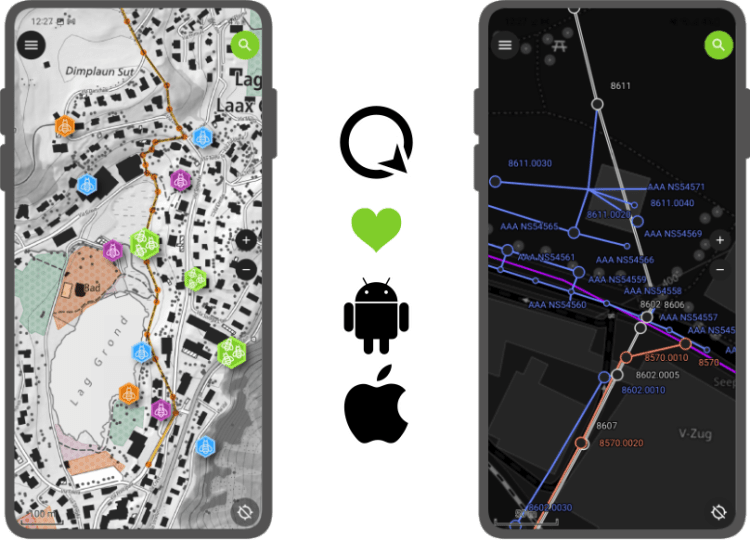
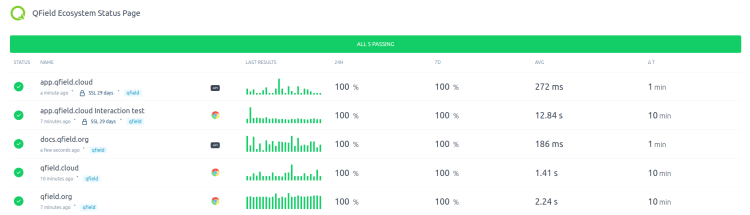

Yes, QField for QGIS, the leading fieldwork app, was released on the iOS App Store!
> 
> Get It now for [Android, iOS, MacOS, Windows and Linux](<https://qfield.org/get>)
Good things take time (and [sponsors](<https://docs.qfield.org/get-started/sponsor/>)), and we wanted our Apple users to enjoy the same solid and seamless experience as our Android users. So we took the time needed and ran beta testing of QField for multiple months. Thanks to all the community feedback and to the uncountable work hours put in by our development team, today we released QField on the iOS Appstore.
Following the naming scheme for the 2.X series, we decided to name QField 2.4 Ecstatic Elk (Cervus Canadensis), honouring « the land of maple leaf ?? », the home country of Mathieu (QField lead UX designer) and origin of some recent funding.
## New features, improvements and demo projects
Releasing for iOS is the main news for QField 2.4, but we also added some new features as well as fixed some annoying bugs we had.
_New demo projects showing many new QField features. We merged the Bee simple and Bee advanced projects into one bees project and added a wastewater management project that comes with beautiful dark and light themes._
The new features include atlas-driven print layouts that can now be printed through the main menu’s print to PDF item and dragging files onto an iOS device via USB Cable with iTunes support.
Some more UX improvements can be noticed when sending or exporting datasets via the project folder. All sidecars will now be considered so that, for example, you can send your edited shapefiles via your favourite email or messenger app.
Finally, QFieldCloud’s projects are better sorted, and its community tab is now functional.
## Bugfixes
During the last sprint, we greatly improved QField’s automated testing framework, greatly decreasing the risks of regressions slipping into future releases. We also ensured that QGIS-shipped SVG markers will now render properly within QField.
Finally, we fixed freehand toggling when using a stylus and ensured the changelog popup doesn’t overlap with the OS’ status bar.

## Best of Swiss Apps Nomination
We put a lot of effort into ensuring that QField, is of the highest possible quality, so being nominated as a finalist for the BestOfSwissApps award was even sweeter ???
Beginning of November, we’ll know more about the outcome of the votes ?
## QFieldCloud
[QFieldCloud](<https://qfield.cloud/>) has been in Free BETA for half a year now. Thanks to the precious help of the many early adopters (we already have over 30K users), we were able to identify and fix plenty of issues. In the last months, our [service status page](<https://status.qfield.org/>) has been consistently looking super-green 😉 
We are extremely happy with how the system is behaving and are even happier with the feedback we are receiving!

As of today, we’ve implemented all the functionality that we want to have for the GA release. All we are missing is finishing testing the billing and payment system and rolling the drums ?
So keep on enjoying our fantastic fieldwork ecosystem, and let us know the [amazing things you do with it!](<https://docs.qfield.org/success-stories/>)
## Support QField
We put a lot of effort into ensuring that QField, is of the highest possible quality and invest a lot of developer time in QField, QFieldCloud and QGIS. Plenty of it is sponsored by OPENGIS.ch because we believe in giving back to the OS geo community; part is sponsored by the clients that ask us to [develop features](</developpement/index.html>), and part is financed through our [support contracts](</support-qgis/index.html>) that come with a [sustainability initiative](</qgis-sustainability-initiative/index.html>).
If you think that helping QField is a good thing, go to our [donate page](<https://docs.qfield.org/get-started/sponsor/>) to find out more or [immediately start sponsoring QField](<https://github.com/sponsors/opengisch>).
### _Related_
