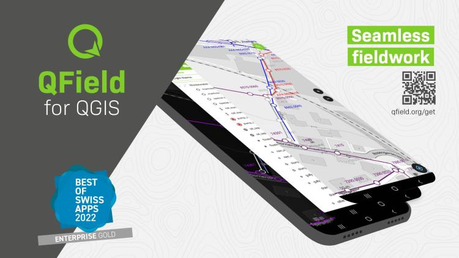
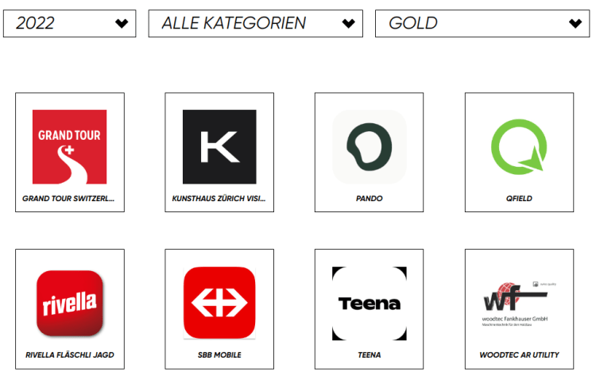
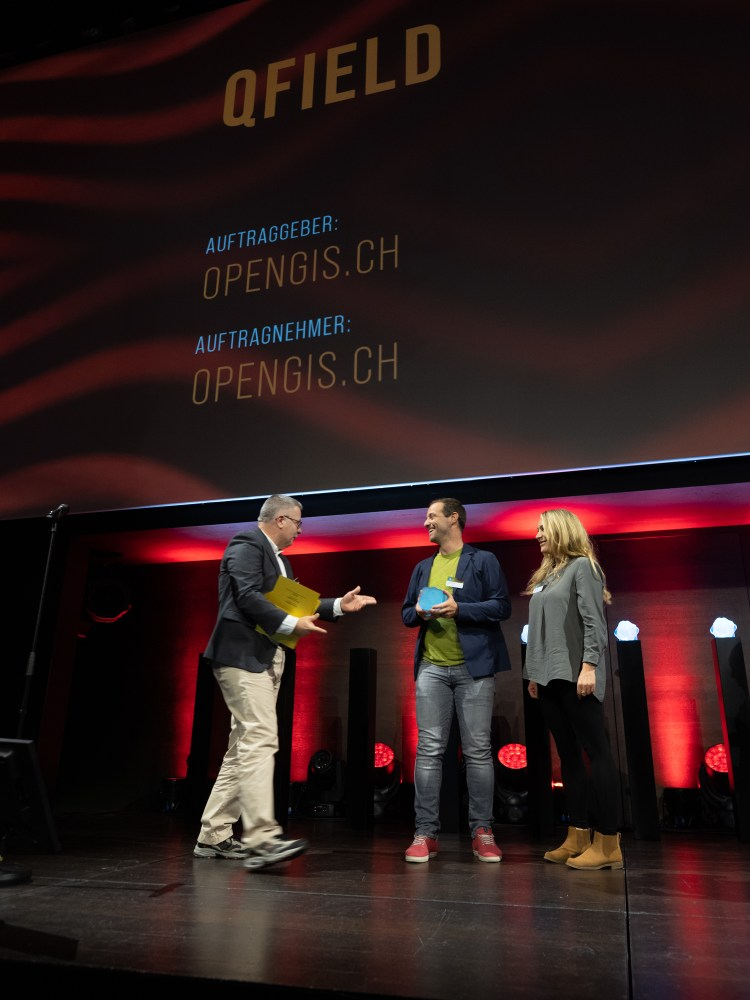
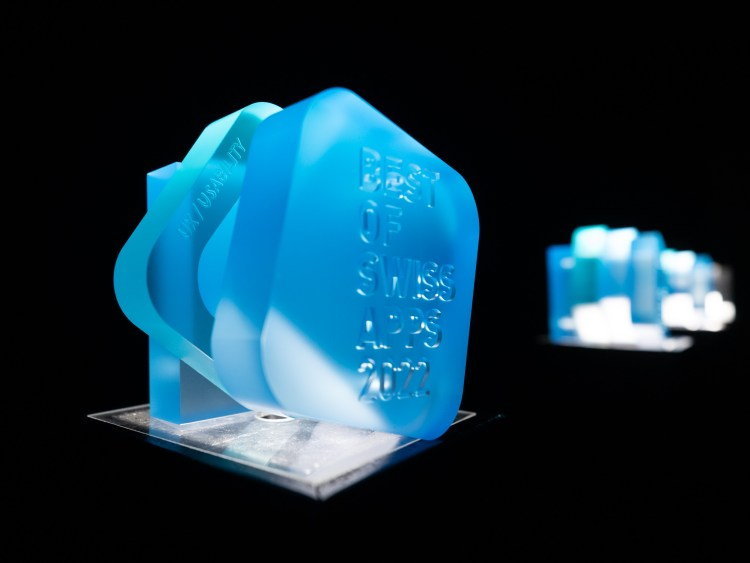
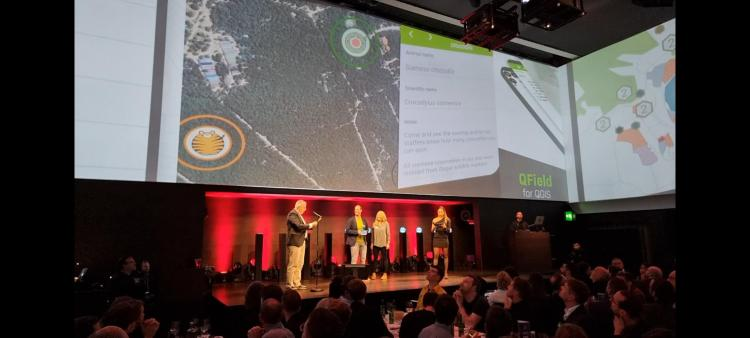
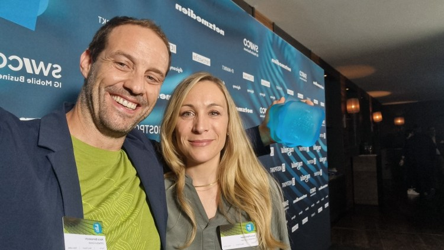
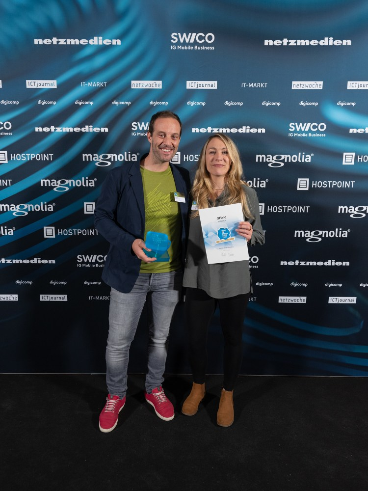
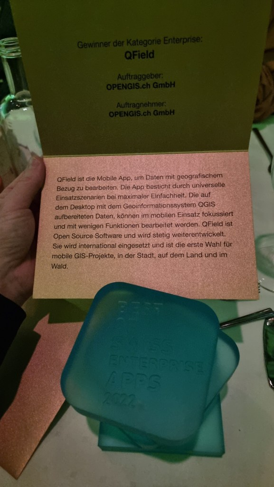

**What a night it was. The „Best of Swiss Apps Awards“ took place in Zurich yesterday, November 2, 2022. We were also nominated with[QField](<https://qfield.org/>). And in the enterprise category, the app was so convincing, that it was awarded the highest possible price. So it brought the award „Best of Swiss Enterprise App“ home to Graubünden. And as cherry on the cake: QField was also nominated as finalist in the UX/UI category!**

We are extremely proud and happy about the received award. And even more when we look at the contendants that won in the other categories. We’re talking companies like SBB, Swiss Life, Switzerland Tourism and, yes, Rivella ?. 
You can check out all results at [https://www.bestofswissapps.ch/bosa/hall-of-fame ](<https://www.bestofswissapps.ch/bosa/hall-of-fame>)

If you are interested in more details, we released a press release [in German](</wp-content/uploads/2022/11/20221103_Medienmitteilung_Best-of-Swiss-App-Awards-QField.pdf>) and in English.
QField is an open source mobile app. The app is designed to use and edit geographically referenced data. In urban environments with 5G connectivity, but also with offline data. The mobile GIS app combines minimal design for simplicity with sophisticated technology for a versatile range of uses to bring data conveniently from the field to the offices. The app was started in 2011 and received a major rebuild in 2022. 
QField is mainly [funded by customer feature requests, support contracts](<https://qfield.org/contribute>) and [sponsoring](<https://qfield.org/donate>) and is continuously improved an released for Android, iOS, Windows, MacOS and Linux.
It offers a seamless [QGIS](<https://qgis.org/>) integration and is GPS-centric, with offline functionality, synchronisation options and desktop configuration. QField is designed for fieldwork: simple, but uncompromising. The app is used internationally and is the first choice for mobile GIS projects. In the city, in the countryside and in the forest. 
Soon, [QFieldCloud](<https://qfield.cloud/>) will also be launched. QFieldCloud is a cloud service integrated into QField that enables the remote provision and synchronisation of geodata and projects.
And here some moments of the award night. It was a blast!
Michael Quade enterprise jury chair congratulates on the win one of the BOSA2022 trophy 360° QField projections! Happy chappies and formally happy 🙂 Laudatio

  <iframe
    src="https://videopress.com/embed/c95KEqlR"
    title="VideoPress video"
    loading="lazy"
    allow="autoplay; encrypted-media; picture-in-picture; fullscreen"
    allowfullscreen>
  </iframe>

[https://videopress.com/embed/c95KEqlR](<https://videopress.com/embed/c95KEqlR>)

### _Related_
