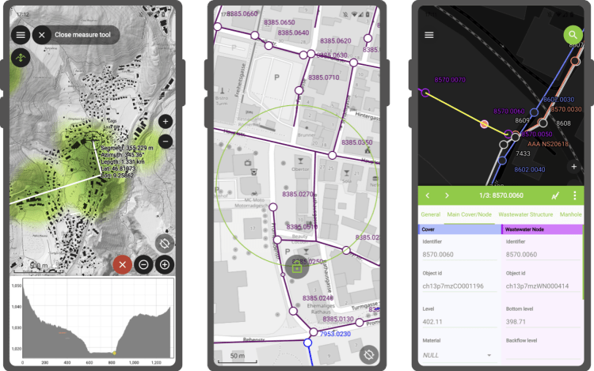

Our ninjas have been so busy that less than a month after we released QField 2.4, we find ourselves with so many new features we simply can’t wait any longer to present to you the latest version of QField: 2.5 „Fancy Flamingo ?”.
**Exciting new features**

QField’s main new feature of this 2.5 release cycle is its brand new elevation profiling functionality which has been added to the measuring tool. Users are now able to dynamically build and analyze elevation profiles wherever they are – in the field or on their desktop – by simply drawing paths onto their maps and projects.
This is a great example of QField’s capability at bringing the power of QGIS through a UI that keeps things simple and avoids being in your way until you need it. Oh and while we’re speaking of the measuring tool, check out the new azimuth measurement!
This new version also brings multi-column support to feature forms. QField now respects the number of columns set by users in the attributes’ drag and drop designer while building and tweaking projects in QGIS. The implementation will take into account the screen availability and on narrow devices will revert to a one-column setup. Pro tip: try to change the background color of your individual groups to ease understanding of the overall feature form.
Another highlight of this release is a brand new screen lock action that can be triggered through QField’s main menu found in the side dashboard or in the map canvas menu shown when long pressing on the map itself. Once activated, QField will become unresponsive to touch and mouse events while keeping the display turned on. When locked, QField also hides tool buttons which results in a more complete view of the map extent.
**Stability improvements**
As with every release, our ninjas have been spending time hunting nasty bugs and improving stability and QField 2.5 is no exception. In particular, the feature form should feel more reliable and even more polished.
### _Related_
