**Der voll integrierte Daten Validator, mit dem du deine Daten direkt im QGIS gegen das INTERLIS Modell prüfen kannst, existiert nun seit fast einem Jahr. Nach vielen Benutzerfeedbacks und einigen Investitionen ist er nun toller denn je. Zeit für ein Update und eine kleine Schritt-für-Schritt Anleitung.**
## Why is it so awesome?
Der Model Baker Daten Validator hat zwei grosse Vorteile.
Erstens **musst du deine Daten nicht exportieren, bevor du sie validierst**. Dank der Option `--validate` kann Model Baker die Daten mit [ili2db](<https://github.com/claeis/ili2db>) direkt in der Datenbank prüfen.
Zweitens kannst du die Ergebnisliste interaktiv nutzen und **auf die Koordinaten des Fehlers zoomen oder den Kartenausschnitt darauf schieben**. Ebenso kannst du **das betreffende Feature direkt öffnen oder selektieren**. So ist es viel einfacher, die Fehler zu beheben.
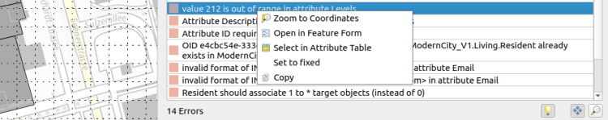
## Schritt-für-Schritt Anleitung
Obwohl die Validierung auf der Datenbank durchgeführt wird, beginnen wir mit dem Import eines ungültigen Transferfiles. Damit haben wir die komplette End-to-End Demo ?‍?.
### Import invalider Daten
Je nach Qualität der Daten musst du das Schema bereits mit weniger strickten Constraints in der Datenbank erstellen. Wenn zum Beispiel einige Mandatory Constraints (NOT NULL) verletzt werden, musst du die Datenbank so erstellen, dass diese Constraints nicht aktiviert sind.
Um in dieser Anleitung unnötige Komplexität zu vermeiden, verwenden wir ein [Beispielmodell](</models.opengis.ch/demo_data/ModernCity_V1.ili>) und ein [invalider Demo-Datensatz](</models.opengis.ch/demo_data/invalid_data.xtf>).
In _Datenbank > Model Baker > Import/Export Wizard_ wähle in der Import Session: _Ausführen ohne Constraints_
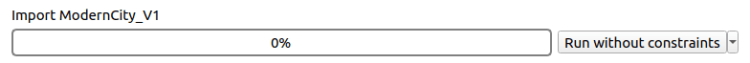
Und beim Import der Transferdaten wähle _Ausführen ohne Validierung_.
Die Datenbank ist erstellt und die invaliden Daten vom Transferfile sind importiert.
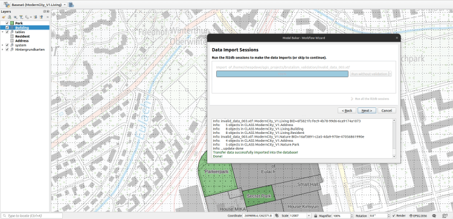
> Mehr Informationen wie man Modelle und Transferfiles im Allgemeinen importiert findest du in der [offiziellen Model Baker Dokumentation](<https://opengisch.github.io/QgisModelBaker/user_guide/import_workflow/>) oder in diesem [Blog-Post.](</2021/12/07/model-baker-6-7-noch-nie-wars-so-einfach/index.html>)
### Lasst uns validieren
Öffne nun das Daten Validator Panel mit _Datenbank > Model Baker > Daten Validator_.
Dort wurde die aktuelle Datenbank gemäss dem aktiven Layer gefunden. In unserem Beispiel haben wir nur eine Datenbank. Falls du aber mehr als eine Datenquelle im gleichen QGIS Projekt verwendest, wird der Daten Validator sie immer anhand des aktuellen Layers erkennen.
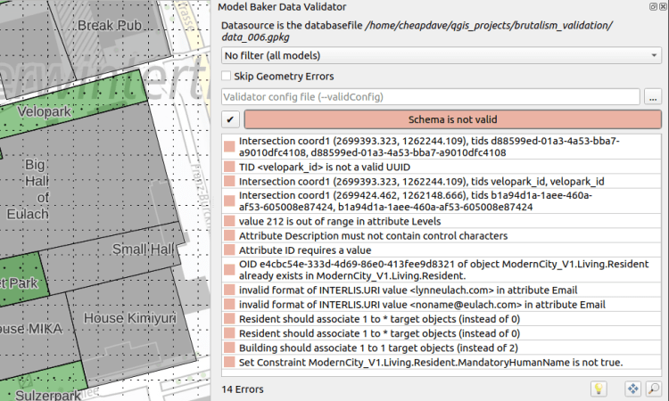
Nach dem Ausführen der Validierung erhalten wir 14 Fehler. Geometrieüberschneidungen (Intersections), falsch formatierte TIDs, Werte ausserhalb des zugelassenen Bereiches und andere. Tatsächlich sind dies nicht so viele Fehler. Trotzdem möchte man manchmal die Fehlerarten separieren, um die Übersicht zu behalten.
### Datenfilterung
Beginnen wir nun mit dem Separieren der Daten und erst später separieren wir nach Fehlerarten. Dies kannst du mit der Filterung gemäss _Modelle_ oder _Datasets_ oder _Behälter_. Du kannst mehrere anwählen, aber nur eine Art des Filters. Lasst uns mal die Daten für den Behälter ausführen, der das TOPIC `nature` abdeckt.
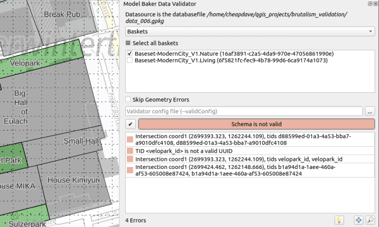
Wer haben drei Überschneidungen und ein Typenfehler.
### Geometriefehler überspringen
Wenn die Checkbox aktiviert ist, werden Geometriefehler ignoriert und die Validierung der Topologie ist deaktiviert. Folgende Fehler werden nicht aufgelistet:
  - Geometrieüberschneidungen
  - Doppelte Koordinaten
  - Überlagernde Geometrien

> Im Backend werden die Parameter `--skipGeometryErrors` und `--disableAreaValidation` ili2db übergeben.
Nach dem Ausführen der Validierung ist nur noch der Fehler mit der TID übrig.
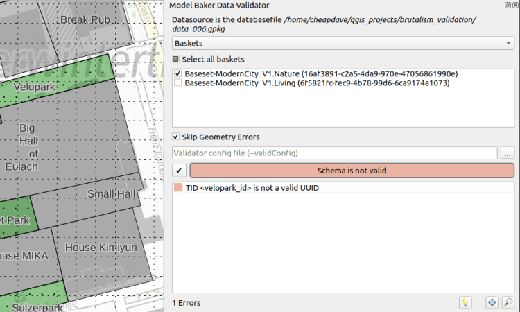
### Analyse der Fehler
Bevor wir die Fehlermeldungen weiter Eingrenzen indem wir einzelne Constraints deaktivieren, werfen wir einen Blick auf die Behebung der Fehler. Der Fehler, den wir oben sehen, sagt uns, dass die TID eine UUID sein soll, währenddem sie ein Text-String „velopark_id“ ist.
Die TID ist die OID, die im Model folgendermassen definiert ist:
    
    OID AS INTERLIS.UUIDOID;
Im physischen Modell wird sie in der Spalte `t_ili_tid` repräsentiert.
Mit  _Rechtsklick_ im Daten Validator auf die Fehlermeldung wird ein Menu geöffnet mit den folgenden Optionen:
– Auf Koordinaten zoomen (falls Koordinaten verfügbar sind) mit einem Extent von 10 Karteneinheiten – Öffne im Feature-Formular (falls eine stabile `t_ili_tid` verfügbar ist) – Selektieren in der Attributtabelle (falls eine stabile `t_ili_tid` verfügbar ist) – Setze auf fixed (markiert den Eintrag grün, um den Fehlerbehebungs-Prozess zu organisieren) – Kopieren (kopiert den Meldungstext)
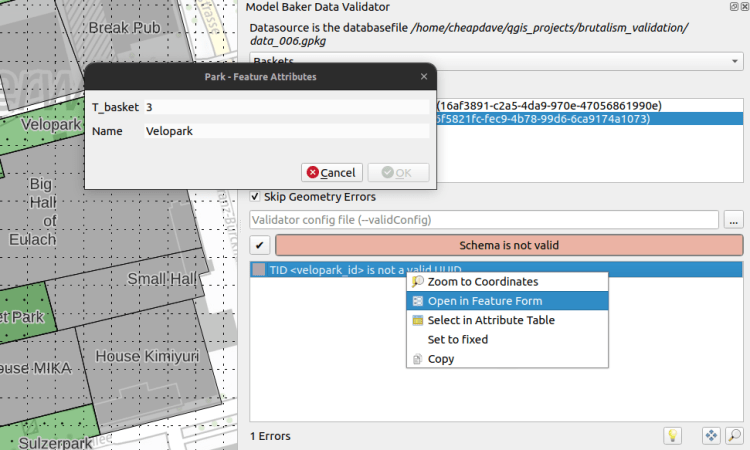
Nach öffnen des Formulars sehen wir, dass wir hier keine Möglichkeit haben, die `t_ili_tid` zu ändern. Da der Wert automatisch generiert wird, hat Model Baker das Feld nicht im Formular berücksichtigt.Wir könnten es sichtbar setzen mit  _Layer > Eigenschaften… > Attributformular_ oder wir nutzen die andere Option um es in der _Attributtabelle zu selektieren_.
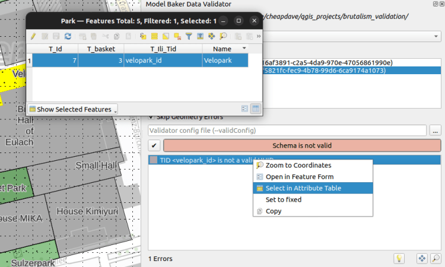
Nun können wir den QGIS Feldrechner nutzen, um eine gültige UUID als `t_ili_tid` vom aktuell selektierten Feature (dem Feature mit dem Fehler) zu setzen.
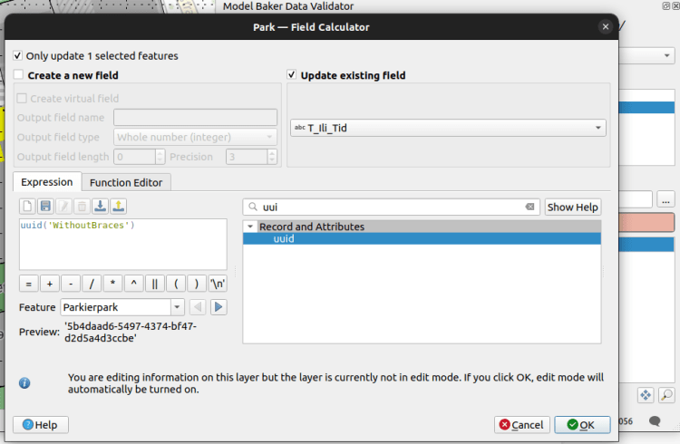
Nach erneuter Validierung verschwindet der Fehler.
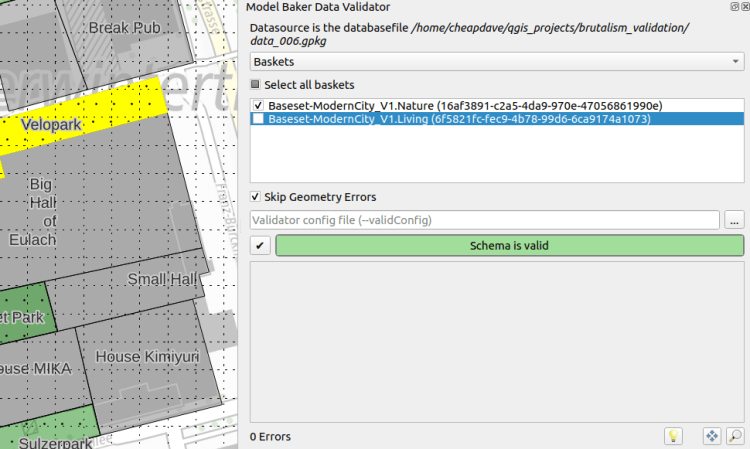
Valid. Aber natürlich sind da noch alle Geometriefehler und diese des anderen TOPIC `living`.
### Geometriefehler beheben
Lasst uns einen Blick auf die Geometriefehler werfen.
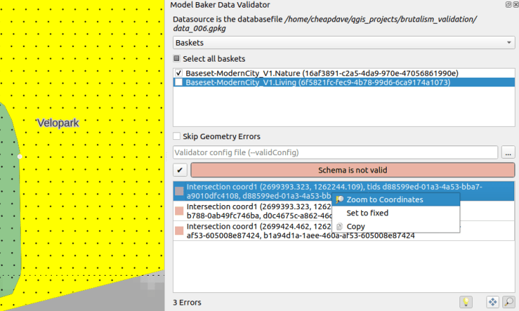Mit _Rechtsklick > Zoom auf Koordinate_ wird in der Karte auf die Koordinaten gezoomt und die Koordinate leuchtet auf.
Um Überschneidungen und Duplikate zu beheben kann das QGIS _Stützpunkwerkzeug_ verwendet werden. 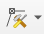
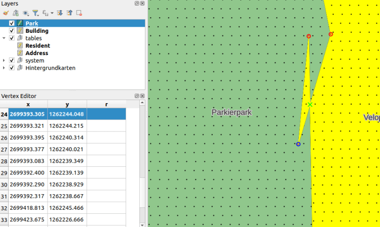
### Durch die Fehler navigieren
Mit den drei Symbolen unten rechts, lässt es sich durch die Features und Koordinaten navigieren, wie du es dir schon von der Attributtabelle in der Formularansicht gewohnt bist. 
Die meisten Fehler, die einen Wert betreffen, können komfortabel mit den zur Verfügung stehenden Tools behoben werden. Mit _Rechtsklick_ _> Öffne im Featureformular / Selektiere in der Attributtabelle_.
### Nutzen des Config Files mit Metaattributen
Die Option um Geometriefehler zu ignorieren ist sehr präsent. Aber es gibt auch noch weitere Möglichkeiten die Fehler einzugrenzen indem man spezifische Checks deaktiviert.
Um alle Funktionalitäten zur Verfügung zu haben, kannst du ein Config File (INI) im Daten Validator laden, der dieses dann ili2db übergibt. Im Config File können Metaattribute definiert werden um spezifische Checks zu aktivieren / deaktivieren. Ebenso können Constraints benannt und beschrieben werden. Die Basics sind [hier](<https://opengisch.github.io/QgisModelBaker/user_guide/validation/#using-of-meta-attributes-in-the-validation>) beschrieben. Lasst uns in diesem Post hier mit einem Beispiel fortfahren.
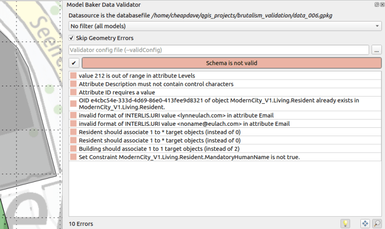
#### Globale Parameter
    
    ["PARAMETER"]
    multiplicity="off"
    constraintValidation="off"
Über `multiplicity` deaktivieren wir Mandatory Constraints (NOT NULL) und Prüfungen der Kardinalität von ASSOCIATIONS (Beziehungen). Mit `constraintValidation` können wir alle logischen (benutzerdefinierten) Constraints ausschalten.
> Für alle möglichen Metaattribute, schau in der offiziellen [Dokumentation des ilivalidators](<https://github.com/claeis/ilivalidator/blob/master/docs/ilivalidator.rst#interlis-metaattribute>) nach.
#### Spezifische Attribut-Parameter
Die übrigen Fehler sind Typenfehler. Ein Wert in `Levels`, der zu hoch ist (siehe im Modell: `Levels: 0 .. 200;`), dann ein Fehler mit einem Kontrollzeichen (meistens wegen eines Absatzes in einem `TEXT`) im Attribut `Description` und die Werte in `Email`, die nicht im verlangten `INTERLIS.URI` Format sind.
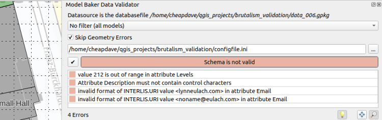
Wir können die betreffenden Attribute ansteuern mit `Model.Topic.Attribute`:
    
    ["ModernCity_V1.Living.Building.Levels"]
    type="off"
    ["ModernCity_V1.Living.Building.Description"]
    type="off"
    ["ModernCity_V1.Living.Resident.Email"]
    type="off"
> Siehe alle möglichen Konfigurationen in der offiziellen [Dokumentation des ilivalidators](<https://github.com/claeis/ilivalidator/blob/master/docs/ilivalidator.rst#ini-globale-konfigurationen>) nach.
#### Setzen von Beschreibungen und Namen von Constraints mit Metaattributen
Zum Schluss schauen wir uns noch etwas speziell schönes an.
Dieser Constraint hier im Modell ist ein logischer Constraint. Er ist weder im physischen Datenmodell implementiert, noch kann der Validator beschreiben, was er bedeutet:
    
              Name: TEXT;
              IsHuman: BOOLEAN;
              SET CONSTRAINT WHERE IsHuman:
                DEFINED(Name);
Es bedeutet, dass wenn der Boolean `IsHuman` wahr ist, darf `Name` nicht leer sein. Trotzdem gibt uns der Validator den folgenden Output:
`Set Constraint ModernCity_V1.Living.Resident.Constraint1 is not true.`
Da wir in unserem Beispiel bereits im Modell ein Metaattribut für den Namen definiert haben, sagt es nicht Constraint1, sondern:
`Set Constraint ModernCity_V1.Living.Resident.MandatoryHumanName is not true.`
Die Definition im Model sieht so aus:
    
          !!@ name = MandatoryHumanName
          SET CONSTRAINT WHERE IsHuman:
            DEFINED(Name);
Um eine verständlichere Meldung auszugeben, kann `!!@ ilivalid.msg` verwendet werden.
Da aber meistens die Personen, welche die Daten Validieren, nicht dieselben sind wie die, welche das Modell schreiben, sind diese Meldungen nicht im Modell. Damit aber jeder selbst diese Meldungen definieren kann, geht das im Meta Config File so:
    
    ["ModernCity_V1.Living.Resident.Constraint1"]
    msg = "When the resident with the id {ID} is human, then it needs a name."
Werte anderer Attribute kannst du in geschweiften Klammern hinzufügen.
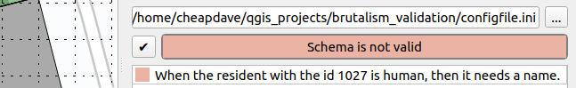
## Also. Das war’s.
Für mehr Informationen, schau in der [Model Baker Dokumentation.](<https://opengisch.github.io/QgisModelBaker/>)
Und mittlerweilen wünschen wir frohes Backen. Und: Frohes Validieren! ?‍?
### _Related_
