_**This blog post is about QGIS relations and how they are edited in the attribute form with widgets in general, as well as some plugins that override the relations editor widget to improve usability and solve specific use cases. The start is quite basic. If you are already a relation hero, thenjump directly to the plugins.**_
## QGIS Relations in General
Let’s have a look at a simple example data model. We have four entities: Building, Apartment, Address and Owner. In UML it looks like this:
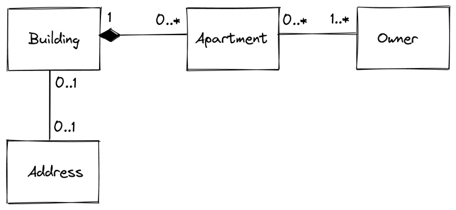
  - A building can have none or multiple apartments, but an apartment must to be related to a building. This black box on the left describes the relation strength as a composition. An apartment cannot exist without a building. When a building is demolished, all apartments of it are demolished as well.
  - An apartment needs to be owned by at least one owner. An owner can own none or more apartments. This is a many-to-many relation and this means, it will be normalized by adding a linking (join) table in between.
  - A building can have an address (only one – no multiple entrances in this example). An address can refer to one building.   
Why not making one single table on a one-to-one relation? To ensure their existence independently: When a building is demolished, the address should persist until the new building is constructed.

### Creating Relations in QGIS
In QGIS we have now five layers. The four entities and the linking table called “Apartment_Owner”.
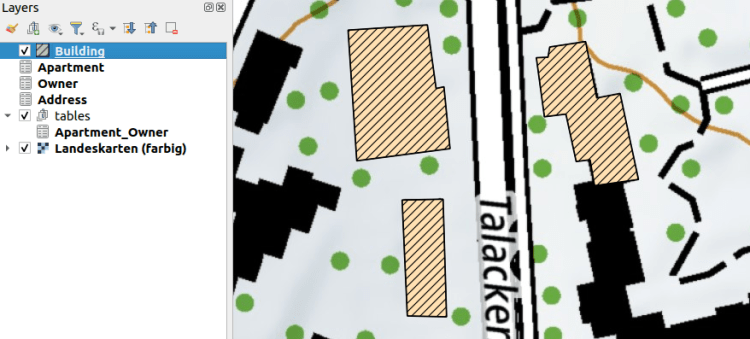
Open  _Project > Properties… > Relations_
With  _Discover Relations_ the possible relations are detected from the existing layers according to their foreign keys in the database. In this example no CASCADE is defined in the database what means that the relations strength is always “Association”.
#### Where would “Composition” make sense?
Of course in the relation “Apartment” to “Building”, to ensure that when a feature of “Building” is deleted, the children (“Apartment”) are deleted as well, because they cannot exist without a building. Also a  _duplication_ of a feature of “Building” would duplicate the children (“Apartment”) as well.
But as well on the linking (join) table “Apartment_Owner” and its relation to “Apartment” and “Owner” a composition would make sense. Because when a feature of “Apartment” or “Owner” is deleted, the entry in the linking table should be deleted as well. Because this connection does not exist anymore and otherwise this would lead to orphan entries in the linking table.
### Walk through the widgets
To demonstrate the relation widgets  _Relation Editor_ ,  _Relation Reference_ and  _Value Relation_ we make a walk through the digitizing process.
#### Relation Editor
First we create a “Building” and call it “Garden Tower”. Then we add some “Apartments”.
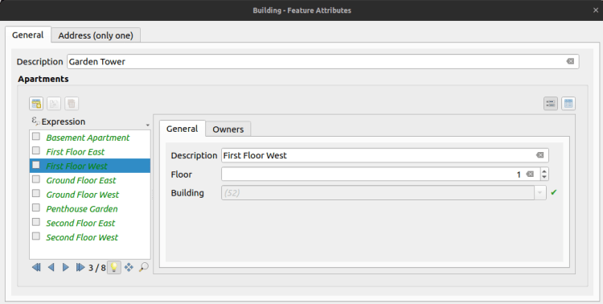
The “Apartments” are created in the widget called Relation Editor. This shows us a list (similar to the _QGIS Attribute Table_) of all children (“Apartment”) referencing to this “Building”. We have here activated the possibilities to  _add_ ,  _delete_ and  _duplicate_ child-features.
In the widget settings (_Right-click on the layer > Properties… > Attribute Form_) we see that there are other possibilities to  _link_ and  _unlink_ child-features as well as  _zoom_ to the current child-feature (what only would make sense when they have a geometry).
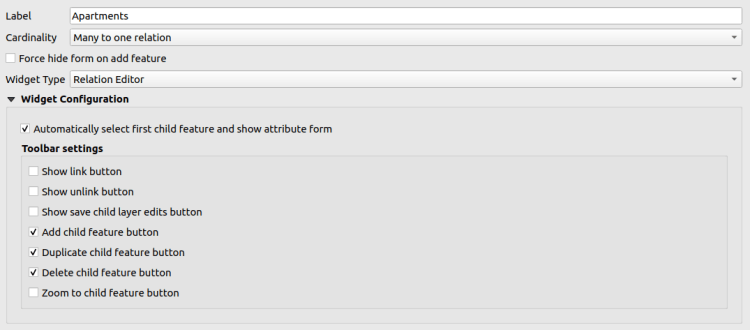
As well we can set here the cardinality. This will become interesting when we go to the “Owner” to “Apartment” relation. But let’s first have a look at the opposite of what we just did.
#### Relation Reference
When we open now a feature of “Apartment”, we see that we have a drop down to select the “Building” to reference to.
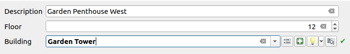
On the right of this drop down we can see some buttons. Those are for the following functionalities (from left to right):
  - Open the form of the current parent feature (in our case the “Building” feature called “Garden Tower”)
  - Add a new feature on the parent layer (in our case “Building”)
  - Highlight the parent layer (in our case “Building”) on the map
  - Select the parent feature (in our case “Building”) on the map to reference it

In the settings (_Right-click on the layer > Properties… > Attribute Form_) we see that we choose the configured relation to connect the child (“Apartment”) to the parent (“Building”). This won’t be needed with the widget  _Value Relation_.
#### Value Relation
The  _Value Relation_ does not require a relation at all. We simply choose the “parent” layer (“Building”) its primary key as the key (“t_id”) and a descriptive field as the value (“Description”).
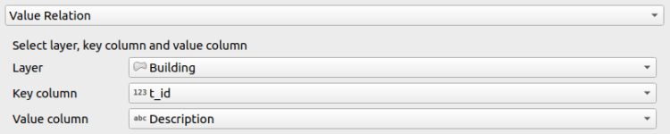
The result shows us a drop down as well to select the parent.
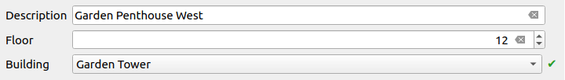
It is much easier to configure, but you can see the limitations. There are no such functionalities to control the parent feature like  _add_ ,  _identify on map_ etc. As well you need to be careful to fulfill the foreign key constraint (you have to choose the correct field to link with). All this is given, when you build a  _Relation Reference_ on an existing relation.
#### Many-to-Many Relations
Now we link some “Owner” to our “Apartment”. We could create new ones like we did it for the “Apartment” in “Building” or we can  _link_ existing ones. For linking we choose the yellow link-button on the top of the  _Relation Editor_.
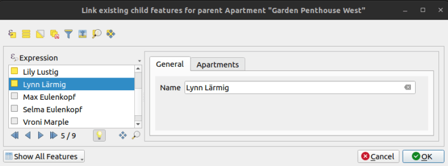
This dialog looks similar to the  _Relation Editor_ widget. You have just to select the “Owner” you want to link to the “Apartment” by checking the yellow box. It’s a very powerful tool, but people are often confused about the load of functionality here and the selection that can be difficult to get used to (yellow boxes vs. blue index selection). For this case we extended the  _Relation Editor_ widget with a plugin.
Anyway after that we linked our features of the layer “Owner”.
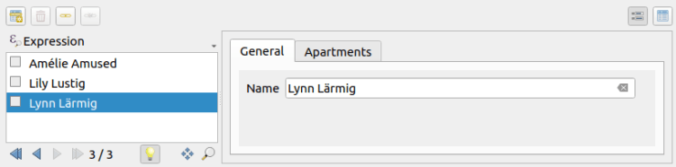
Have you seen the linking table in between? Well, me neither. It’s completely invisible for the end user. This because of the cardinality setting I mentioned already. When we choose the linked table “Owner” instead of “Many to one relation”, then we can create and link the other parent (“Owner”) directly.
#### One-to-One Relation
A one-to-one relation like we have here between “Building” and “Address” is created in the database more or less like a normal one-to-many relation. This means one of the tables (in our case “Address”) has a foreign key pointing to the parent table (“Building”). There are tricks to fulfill the one-to-one maximum cardinality (like e.g. by setting a UNIQUE constraint on this foreign key column) but still in the QGIS user interface it looks like a one-to-many relation. It’s displayed in a normal  _Relation Editor_ widget.
Solutions could be so called “Joins”. Go to the settings (_Right-click on the layer > Properties… > Joins_)
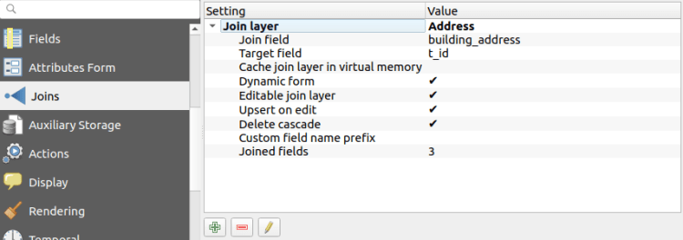
Here you can join a layer of your choice and add the fields of this other layer (in our case “Address”) to your current feature form (of “Building”). So it appears to the user that it’s the same table containing fields of “Building” and “Address”.
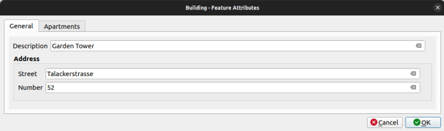
Negative point about those joins are, that they are fault prone. You have to be careful with default values (e.g. on primary keys) of the joined layer. You cannot expect a fully reliable feature form like you have it in the  _Relation Editor_. Here as well, we extended the  _Relation Editor_ widget with a plugin.
## Plugins for Relation Editor Widgets
Since QGIS 3.18 the base class of the _Relation Editor Widgets_ became abstract, what opened the possibility to use it in PyQGIS and derive it to super nice widgets handling specific use cases and improving the usability.
### Linking Relation Editor Widget
As mentioned before, the QGIS stock dialog to link children is full of features but it can be overwhelming and difficult to use. Mostly because of the two selection possibilities in the list. A blue selection is for the currently displayed feature, and a yellow checkbox selection is for the features to be actually linked.
In collaboration with the Model Baker Group we wanted to improve the situation. But as we where unsure how the end solution should look like, so we decided to experiment in a plugin. The result is a _link manger dialog,_ in which features can be _linked_ and _unlinked_ by moving them left and right. The effective link is created or destroyed when the dialog is accepted.
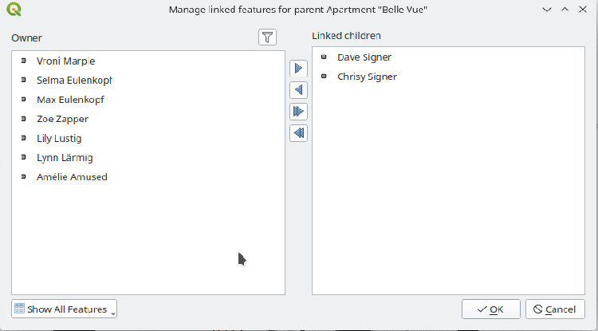
Find more information on the repository <https://github.com/opengisch/qgis-linking-relation-editor>
### Ordered Relation Editor Widget
Sometimes the order of the children play a role on the project, and you want to have them displayed following that. For that there is the _Ordered Relation Editor Widget_. You can configure a field in the children to be used to order them. In the given example the field _Floor_ was used to order _Apartments_. Reordering the fields by Drag&Drop would change the value of the configured field. Display name and optionally a path to an icon to be shown on the list can be configured by expression in the _Attribute Form_ tab in the layer properties (_Right-click on the layer > Properties… > Attribute Form_).
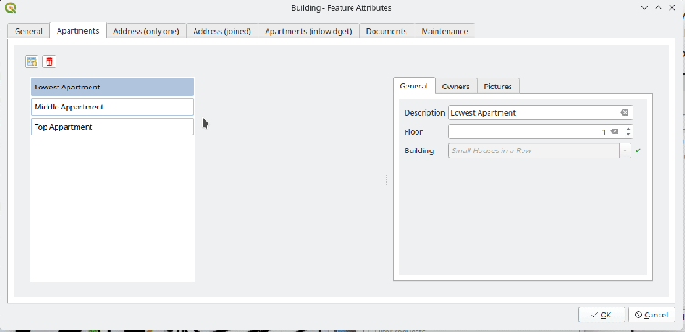Find more information on the repository <https://github.com/opengisch/qgis-ordered-relation-editor>
### Document Management System Widgets
Often in QGIS projects there is the need to deal with external documents. This could be for example pictures, documentations or reports about some features. To support that we added two new tables in the project:
  - **Documents** each document is represented by a row in this table. The table has following fields:
    - **id**
    - **path** is the filename of the document.
  - **DocumentsFeatures** this is a linking (join) table and permits to link a document with one or more features in more layers. The table has following fields:
    - **id**
    - **document_id** id of the document.
    - **feature_id** id of the feature.
    - **feature_layer** layer of the feature.

Thanks to a QGIS feature named _[Polymorphic Relations](<https://www.qgis.org/en/site/forusers/visualchangelog318/index.html?highlight=polymorph#id48>)_ we can link a document with features of multiple layers. The polymorphic relation can evaluate an expression to decide in which table will be the feature to link. Here a screenshot of the relation configuration:
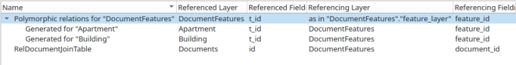
After this configuration in the layers “Apartment” and “Building” it will be possible to link children from the “Documents” table. The document management plugin provides two widgets to simplify the handling of the relation. In the feature side widget the documents are displayed as a grid or list. If possible a preview of the contend is shown and you can add new documents via Drag&Drop from the system file manager. _Double-click_ on a document will open it in the default system viewer.
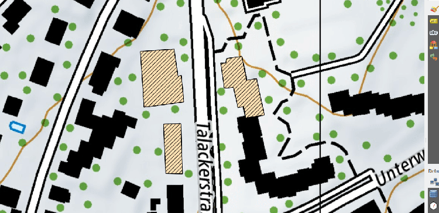
The second widget is meant to be used in the _Feature Form_ of the “Documents” table, and it permits to handy see, for each document, with which feature from which layer it is linked.
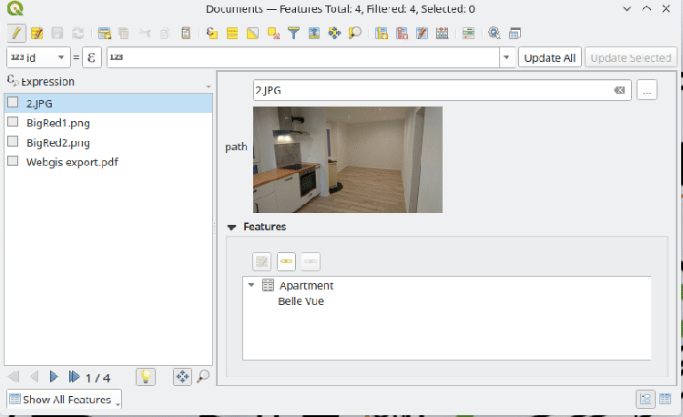
Find more information on the repository <https://github.com/opengisch/qgis-document-management-system-plugin>
## That’s it
Well then. We hope that all the beginners reading this article received some light on QGIS Relations and all the advanced user some inspiration on the immense possibilities you have with QGIS ?
### _Related_
