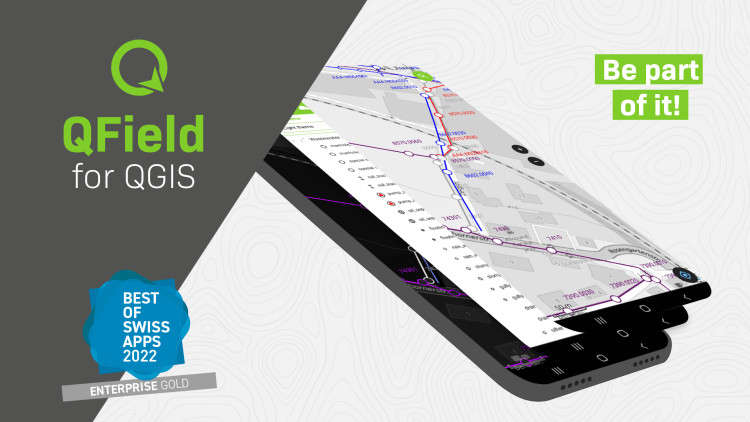

QField is a community-driven open-source project. It is free to share, use and modify and it will stay like that. The very essence of a community is to help and support each other. And that’s where YOU come into play. To make it work we need your support!

For those who don’t know much about the concept of open source projects, a bit of background. Investing in open-source projects is a technical and ethical decision for OPENGIS.ch. Open source is a technological advantage, as we receive input from many developers worldwide who are motivated to work out the best possible software. It prevents our customers from vendor lock-in and allows complete ownership and control of the developed software. And finally, not only financially independent businesses and people should benefit from professional software but also those who might not have the financial means to pay for features, and licences. 
You are not a developer, but you still like to use QField and support it? Good news. You don’t have to be a developer to use, contribute or recommend the app. There are plenty of things that need to be done to help QField to remain the powerful software it is right now and become even better. Here are a few suggestions on how you can give something back.
  1. **Review the app** ★★★★★ in [google’s play store](<https://play.google.com/store/apps/details?id=ch.opengis.qfield&hl=en#details-reviews>) or [apple’s app store](<https://apps.apple.com/app/qfield-for-qgis/id1531726814>). 
  2. **Let the world know about it!** It doesn’t matter if you’re on Twitter, LinkedIn, Instagram or any other social media platform. Show and tell about where QField helped you. We appreciate every post and we promise to like, share and comment.
  3. **Write about your experience** and please let us know. Be it in your blog or as a new success story. Insights into field projects are extremely valuable. It helps us to make the app even more efficient for your work, and it helps others to understand the range of applications for QField.
  4. Register for a **[paid QFieldCloud account](<https://qfield.cloud/beta-pricing.html>)**. **QFieldCloud** allows to synchronize and merge the data collected in QField. QFieldCloud is hosted by the makers of QField and by getting an account you help QField too.

Do you want to do something that is more hands-on and directly linked to the app? No problem. 
  4. **Help with the[documentation](<https://docs.qfield.org/>)**. You can document features, or improve the documentation in English. Read the [how-to guide](<https://github.com/opengisch/QField-docs#documentation-process>) to get started.
  5. And if you are multilingual you might consider [**translating** the documentation or the app in your language](<https://github.com/opengisch/QField-docs#translation-process>).
  6. **Become a beta tester** and be the first to report a bug! When something doesn’t work properly it might be a bug. The quicker we know about it, the faster it can be resolved.
  7. You can **ask and answer questions** on [gis.stackexchange](<https://gis.stackexchange.com/questions/tagged/qfield?sort=newest>) and help others on the [user discussions platform](<https://github.com/opengisch/QField/discussions>).
  8. If you are a developer and you want to **get involved in QField development** , please refer to the individual documentation for [QField](<https://github.com/opengisch/QField/blob/master/doc/dev.md>), [QFieldCloud](<https://github.com/opengisch/qfieldcloud>) and [QFieldSync](<https://github.com/opengisch/QFieldSync>).

And now finally for those of you who have the financial means, you can either **[sponsor](<https://docs.qfield.org/get-started/sponsor/#feature-sponsoring>)a feature** or subscribe to one of the [**monthly sponsorships**](<https://docs.qfield.org/get-started/sponsor/#recurring-sponsoring>). By doing so you help get freshly baked QField versions straight to everyone’s devices.
Nothing in it for you? In that case, just drop by to say thank you or have a hot or cold beverage with us next time you meet OPENGIS.ch at a conference and you might **make our day**!  
Want to know more about the idea of community-driven open-source projects and the QGIS project in particular? Check out Nyall Dawson’s [blog post about how to effectively get things done in open source](<https://nyalldawson.net/2016/08/how-to-effectively-get-things-changed-in-qgis/>)!
### _Related_
