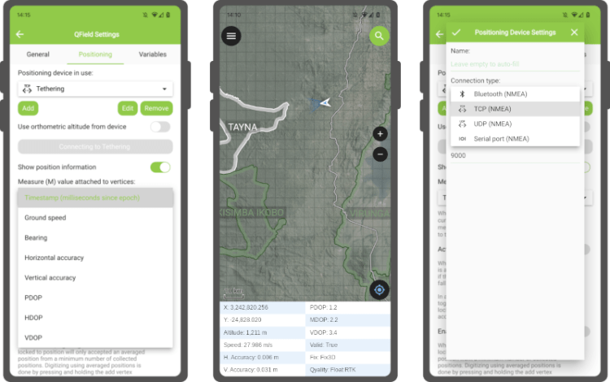

It’s only been a few weeks into the new year, but we’ve got great news for you: a brand new QField 2.6 “Geeky Gecko ?” has been released with a focus on positioning improvements, including Bluetooth support for Windows. And with that, we are delighted to remove the ‘beta’ status from QField for Windows.
## New positioning features

**Let’s open with a bang: QField 2.6 now supports NMEA streaming from external GNSS devices over TCP, UDP, and serial ports, in addition to preexisting Bluetooth connectivity.** This new functionality means that QField is now compatible with a much larger range of GNSS devices out there.
These new receivers unlock NTRIP-driven centimetre accuracy for devices that use the Bluetooth connection to a manufacturer’s application to connect to NTRIP servers. In this scenario, QField could not initiate a Bluetooth connection since it was already taken. With the new TCP and UDP receivers – provided the manufacturer’s application offers NMEA streaming over either of those Internet protocols – QField can connect and consume high-accuracy positioning.
The presence of a serial port receiver provides support for external GNSS devices using Bluetooth on Windows via the virtual serial port created by the operating system. The lack of Bluetooth support on Windows was a long-wanted enhancement from QField users on that platform and was the last blocker for the ‘beta’ status to go away.
**In addition, QField 2.6 allows users to pick from half a dozen metrics a value to attach to the measure (M) dimension of geometries being digitized when locked to the current position.** This functionality is available to both users digitizing and the positioning tracker. The measurement values available as of 2.6 are timestamp, ground speed, bearing, horizontal accuracy and vertical accuracy, as well as PDOP, HDOP and VDOP values.
## Growing Continuous Integration (CI) testing framework now covers positioning
Starting with version 2.6, **QField ships with increased quality assurances** thanks to the addition of tests covering positioning functionalities in its growing CI framework.
Practically speaking, this means that every single line of QField code changed is now being tested against positioning-related regression, significantly decreasing the risks of shipping a new version of QField with broken functionality in the area of antenna height, vertical grid shift, and ellipsoidal height adjustments.
We would like to commend [Deutsche Bahn](<https://www.bahn.com/en>) for funding the required work here. This could not have come in soon enough as more and more people are opting for QField and relying on it for their crucial day-to-day fieldwork.
### _Related_
