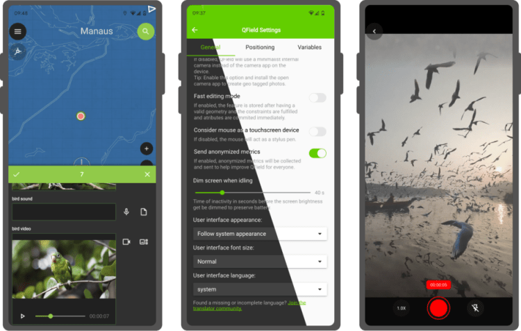

A brand new version of QField has been released, **packed with features** that will make you fall in love with this essential open source tool all over again with a focus on capturing more while you are in the field. QField 2.7 nicknamed “Heroic Hedgehog” also includes a number of worthy fixes making it a crucial update to get.
## New recording capabilities

The highlight of QField 2.7 is the **new audio and video recording capability straight from the feature form**. In addition to preexisting still photo capture, this functionality allows for video motion and audio clips to be added as attachments to feature attributes.
The audio recording capability can come in handy in the field when typing on a keyboard-less device can be challenging. Simply record an audio note of observations to process later.
The experience wouldn’t be complete without **audio and video playback support** , which we took care of in this version too. Playback of such media content within the feature form gives an immediate feedback and saves time. For those interested in full screen immersion, simply click on the video frame to open the attached in your favorite media player. We also took the opportunity to implement audio and video playback on QGIS so people can easily consume the fruits of their labor in the field at their workstation.
We would be remiss if we didn’t mention **map canvas rotation functionality** added in this version. This is a long-requested functionality which we are happy to have packed into QField now. Pro-tip: when positioning is enabled, double tapping on the lower-left positioning button will have the map canvas follow both the device’s current location as well as the compass orientation.
Finally – some would argue « most importantly » 😉 – QField is **now equipped with a beautiful dark theme** which users can activate in the settings panel. By default on Android and iOS, QField will follow the system’s dark theme setting. In addition to the new color scheme, users can also **adjust the user interface font size**.
Big thanks to [Deutsches Archäologisches Institut](<https://www.dainst.org/dai/meldungen>) who funded the majority of the new features in this release cycle. Their investment in making QField the perfect tool for them has benefited the community as a whole.
## A ton of bug fixing across all platforms
Important stability improvements and fixes to serious issues are also part of this release. Noteworthy fixes include WFS layer support on iOS, much better Bluetooth connectivity on Android, and vertical grid improvement on Windows.
For users facing reliability issues with the native camera on Android, we have spent time supersizing the camera we ship within QField itself. During this development cycle, it has gained zoom and flash controls, as well as a ton of usability improvements, including geo-tagging.
To know more about this release, read the full change log on [QField’s github release page](<https://github.com/opengisch/QField/releases>).
### _Related_
