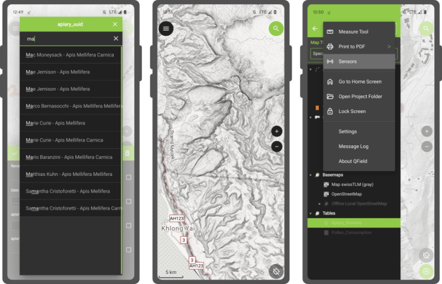

The latest version of QField is out, featuring as its main new feature sensor handling alongside the usual round of user experience and stability improvements. We simply can’t wait to see the sensor uses you will come up with!

## **The main highlight: sensors**
QField 2.8 ships with **out-of-the-box handling of external sensor streams** over TCP, UDP, and serial port. The functionality allows for data captured through instruments – such as geiger counter, decibel sensor, CO detector, etc. – to be visualized and manipulated within QField itself.
Things get really interesting when sensor data is utilized as default values alongside positioning during the digitizing of features. You are always one tap away from adding a point locked onto your current position with spatially paired sensor readings saved as point attribute(s).
Not wowed yet? Try pairing sensor readings with QField’s tracking capability! 😉 Head over [QField’s documentation on this](<https://docs.qfield.org/how-to/sensors/>) as well as [QGIS’ section on sensor management](<https://docs.qgis.org/testing/en/docs/user_manual/introduction/qgis_configuration.html#sensors-properties>) to know more.
The development of this feature involved the addition of a sensor framework in upstream QGIS which will be available by the end of this coming June as part of the 3.32 release. This is a great example of the synergy between QField and its big brother QGIS, whereas development of new functionality often benefits the broader QGIS community. Big thanks to [Sevenson Environmental Services](<https://sevenson.com/>) for sponsoring this exciting capability.
## **Notable improvements**
A couple of refinements during this development cycle are worth mentioning. If you ever wished for QField to **directly open a selected project or reloading the last session on app launch** , you’ll be happy to know this is now possible.
For heavy users of value relations in their feature forms, QField is now a tiny bit more clever when displaying string searches against long lists, placing hits that begin with the matched string first as well as visually highlighting matches within the result list itself.
Finally, feature lists throughout QField are now sorted. By default, it will sort by the display field or expression defined for each vector layer, unless an advanced sorting has been defined in a given vector layer’s attribute table. It makes browsing through lists feel that much more natural.
### _Related_
