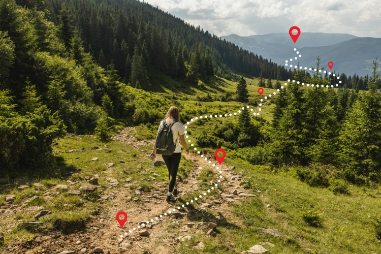

Years ago, the QField community and its users showed their love for their favourite field app by supporting a successful crowdfunding to improve camera handling.
Since then, OPENGIS.ch has continued to lead the development of QField with the regular support of sponsors. We couldn’t be prouder of the progress we have made, with plenty of new features added in every major release. This includes major improvements to positioning including location tracking, integration of external GNSS receivers through not only Bluetooth but TCP/UDP and serial port connections, accuracy indicator and constraints, and most recently sensors reading to list a few.
We are now calling for the community to help further better QField and unlock an important milestone: **background location tracking service**.
Pledge now

## Main goal: background location tracking on Android – 25’000€
Currently, QField requires users to keep their devices’ screen on and have the app in the foreground to keep track of the device’s positioning location. On mobile devices, this can drain batteries faster than many would want to, in environments where charging options are limited.
This crowdfunding aims at removing this constraint and **allow QField – via a background service – to constantly keep tracking location** even while the device is suspended (i.e., when the screen is turned off / locked). 
To achieve this, a significant amount of work is required as the positioning framework on Android will need to be relocated to a dedicated background service. Recent work we’ve done adding a background service to synchronize captured image attachments in [QFieldCloud projects](<https://qfield.cloud/>) armed us with the assurances that we can achieve our goal while giving us an appreciation of the large amount of work needed.
### _Some of the benefits_
Running out of battery is the nightmare of most field surveyors. By moving location tracking to a background service, users will be able to improve their battery life considerably and keep focusing on their tasks even if it involves switching to a different app.
Furthermore, while OPENGIS.ch ninjas remain busy squashing reported QField crashes all year long, there will always be unexpected scenarios leading to abrupt app shutdowns, such as third-party apps, systems running out of battery, etc. To address this, the background service framework will also **act as a safeguard to avoid location data loss** when QField unexpectedly shuts down and offer users means to recover that data upon re-opening QField.
## Stretch goal 1: background navigation audio feedback 5’000€
The second stretch goal builds onto QField’s nice fly-to-point navigation system. If the QField community meets this threshold, a new **background navigation audio feedback informing users in the field of their proximity to their target** will be implemented. 
The audio feedback will use text-to-speech technology to state the distance to target in meters for a given time or distance interval.
## Stretch goal 2: iOS 15’000€
The main goal will cover the Android implementation only. Due to being a very low level work we will have to replicate the work for each platform we support. If we reach stretch goal 2 we will also implement this for iOS.
# Pledge now:
In case you do not see the embedded form you can open it directly [here](<https://forms.clickup.com/2192114/f/22wqj-26041/KCQACZWJ84G4MJJ2XR>).
Thanks for supporting our crowdfunding and keep an eye on our blog for updates on the status.
### _Related_
