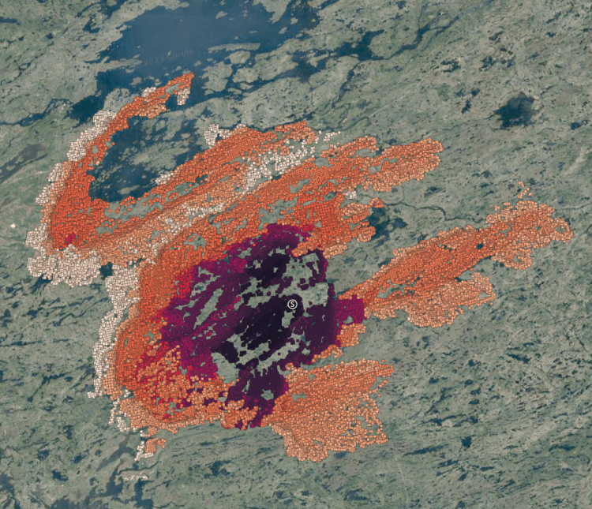
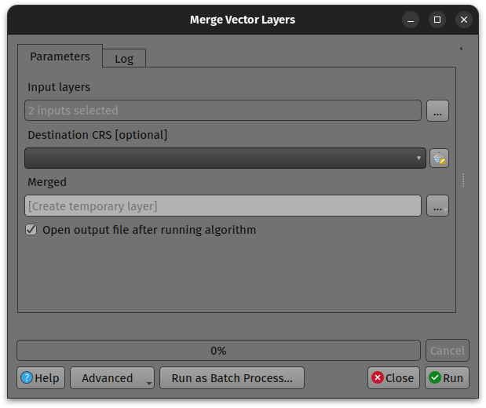
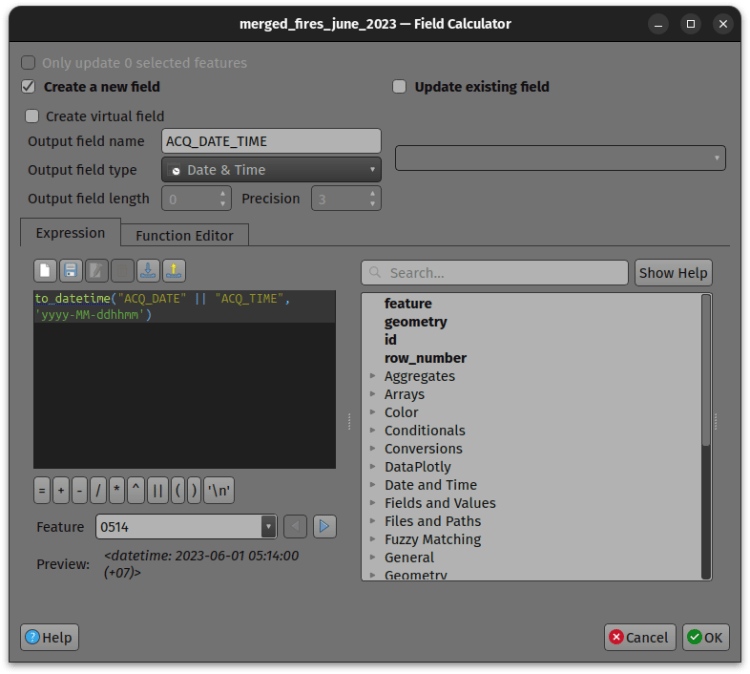
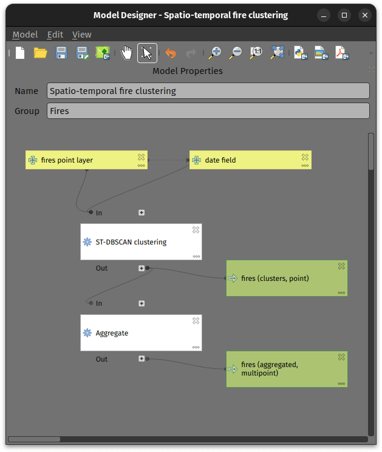
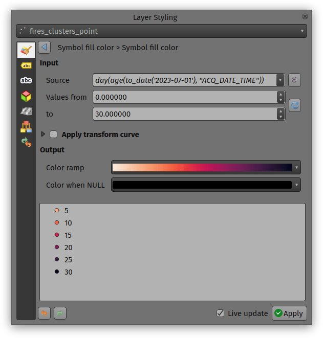
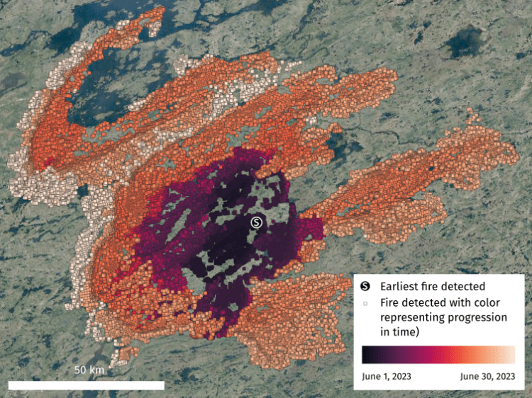
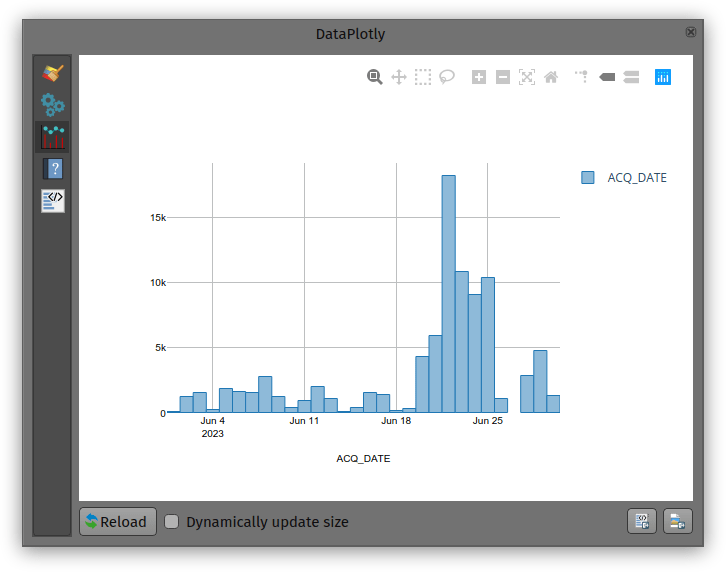

A while back, one of our ninjas added a **new algorithm in QGIS** ’ processing toolbox named ST-DBSCAN Clustering, short for **spatio temporal density-based spatial clustering of applications with noise**. The algorithm regroups features falling within a user-defined maximum distance and time duration values.
This post will walk you through one practical use for the algorithm: large-scale fire event analysis and visualization through remote-sensed fire detection. More specifically, we will be looking into one of the larger fire events which occurred in Canada’s Quebec province in June 2023.

## Fetching and preparing FIRMS data
NASA’s [Fire Information for Resource Management System (**FIRMS**)](<https://firms.modaps.eosdis.nasa.gov/>) offers a fantastic worldwide archive of all fire detected through three spaceborne sources: MODIS C6.1 with a resolution of roughly 1 kilometer as well as VIIRS S-NPP and VIIRS NOAA-20 with a resolution of 375 meters. Each detected fire is represented by a point that sits at the center of the source’s resolution grid.
Each source will cover the whole world several times per day. Since detection is impacted by atmospheric conditions, a given pass by one source might not be able to register an ongoing fire event. It’s therefore advisable to rely on more than one source.
To look into our fire event, we have chosen the two fire detection sources with higher resolution – VIIRS S-NPP and VIIRS NOAA-20 – covering the whole month of June 2023. The datasets were downloaded from [FIRMS’ archive download page](<https://firms.modaps.eosdis.nasa.gov/download/>).
After downloading the two separate datasets, we combined them into one merged geopackage dataset using QGIS processing toolbox’s **Merge Vector Layers algorithm**. The merged dataset will be used to conduct the **clustering analysis**.

In addition, we will use QGIS’s field calculator to create a new Date & Time field named ACQ_DATE_TIME using the following expression:
    
    to_datetime("ACQ_DATE" || "ACQ_TIME", 'yyyy-MM-ddhhmm')
This will allow us to calculate precise time differences between two dates.

## Modeling and running the analysis
The large-scale fire event analysis requires running two distinct algorithms:
  - a **spatiotemporal clustering of points** to regroup fires into a series of events confined in space and time; and
  - an **aggregation of the points within the identified clusters** to provide additional information such as the beginning and end date of regrouped events.

This can be achieved through QGIS’ modeler to sequentially execute the [ST-DBSCAN Clustering algorithm](<https://docs.qgis.org/3.28/en/docs/user_manual/processing_algs/qgis/vectoranalysis.html#st-dbscan-clustering>) as well as the [Aggregate algorithm](<https://docs.qgis.org/3.28/en/docs/user_manual/processing_algs/qgis/vectorgeometry.html#aggregate>) against the output of the first algorithm.

The above-pictured model outputs two datasets. The first dataset contains single-part points of detected fires with attributes from the original VIIRS products as well as a pair of new attributes: the CLUSTER_ID provides a unique cluster identifier for each point, and the CLUSTER_SIZE represents the sum of points forming each unique cluster. The second dataset contains multi-part points clusters representing fire events with four attributes: CLUSTER_ID and CLUSTER_SIZE which were discussed above as well as DATE_START and DATE_END to identify the beginning and end time of a fire event.
In our specific example, we will run the model using the merged dataset we created above as the “fire points layer” and select ACQ_DATE_TIME as the “date field”. The outputs will be saved as separate layers within a geopackage file.
_Note that the maximum distance (0.025 degrees) and duration (72 hours) settings to form clusters have been set in the model itself. This can be tweaked by editing the model._
## Visualizing a specific fire event progression on a map
Once the model has provided its outputs, we are ready to start **visualizing a fire event on a map**. In this practical example, we will focus on detected fires around latitude 53.0960 and longitude -75.3395.
Using the multi-part points dataset, we can identify two clustered events (CLUSTER_ID 109 and 1285) within the month of June 2023. To help map canvas refresh responsiveness, we can filter both of our output layers to only show features with those two cluster identifiers using the following SQL syntax: CLUSTER_ID IN (109, 1285).
To show the **progression of the fire event over time** , we can use a data-defined property to graduate the marker fill of the single-part points dataset along a color ramp. To do so, open the layer’s styling panel, select the simple marker symbol layer, click on the data-defined property button next to the fill color and pick the Assistant menu item.
In the assistant panel, set the source expression to the following: `day(age(to_date('2023-07-01'),”ACQ_DATE_TIME”))`. This will give us the number of days between a given point and an arbitrary reference date (2023-07-01 here). Set the values range from 0 to 30 and pick a color ramp of your choice.

When applying this style, the resulting map will provide a visual representation of the spread of the fire event over time.

Having identified a fire event via clustering easily allows for identification of the “starting point” of a fire by searching for the earliest fire detected amongst the thousands of points. This crucial bit of analysis can help better understand the cause of the fire, and alongside the color grading of neighboring points, its directionality as it expanded over time.
## Analyzing a fire event through histogram
Through [QGIS’ DataPlotly plugin](<https://github.com/ghtmtt/DataPlotly#readme>), it is possible to **create an histogram of fire events**. After installing the plugin, we can open the DataPlotly panel and configure our histogram.
Set the plot type to histogram and pick the model’s single-part points dataset as the layer to gather data from. Make sure that the layer has been filtered to only show a single fire event. Then, set the X field to the following layer attribute: “ACQ_DATE”.
You can then hit the Create Plot button, go grab a coffee, and enjoy the resulting histogram which will appear after a minute or so.

While not perfect, an histogram can quickly provide a good sense of a fire event’s “peak” over a period of time.
### _Related_
